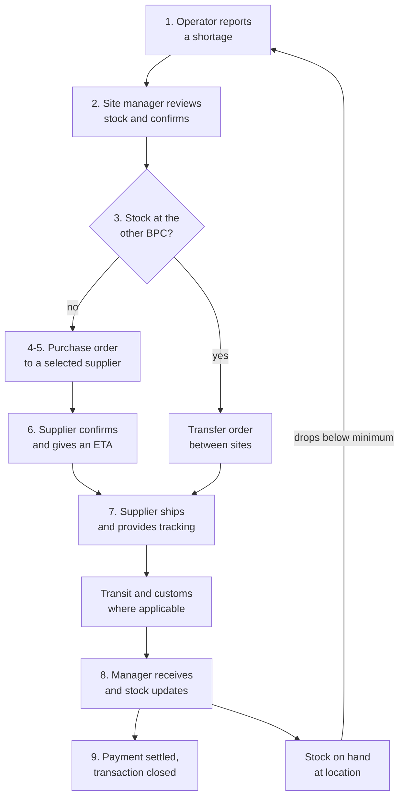
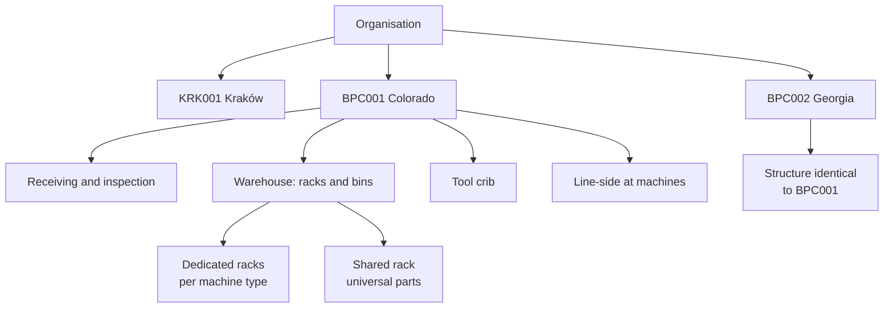
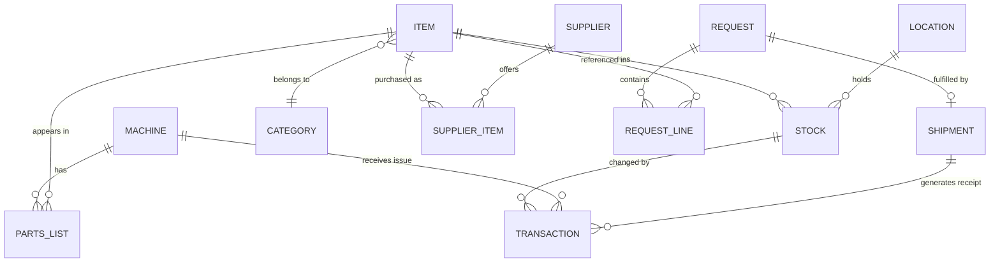
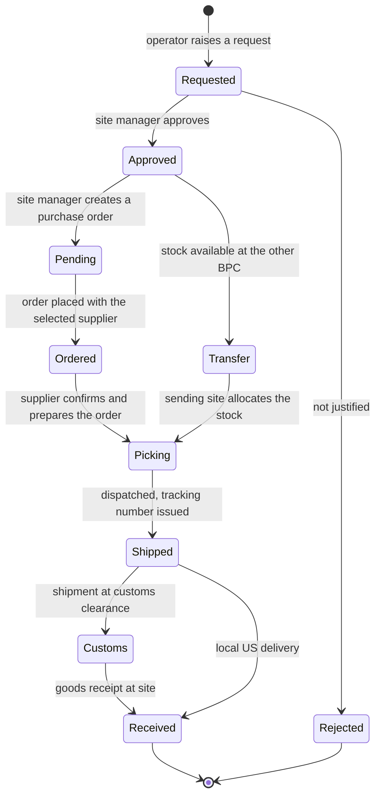
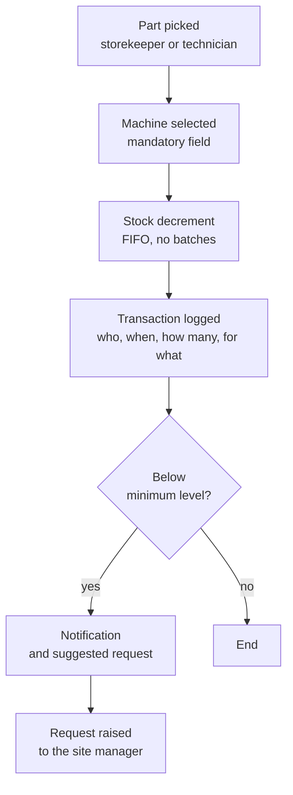
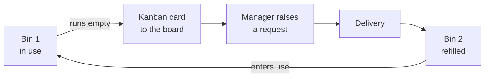
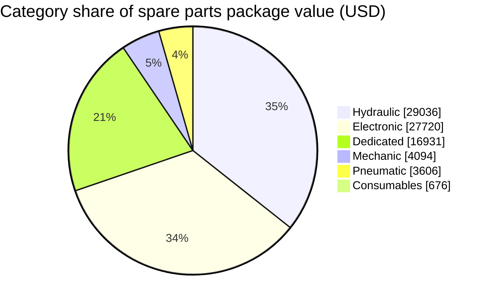
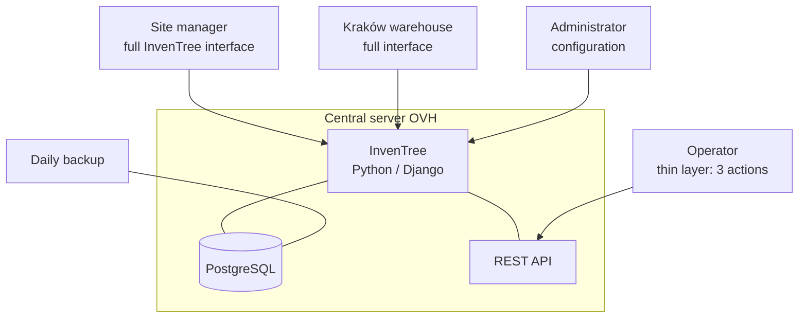
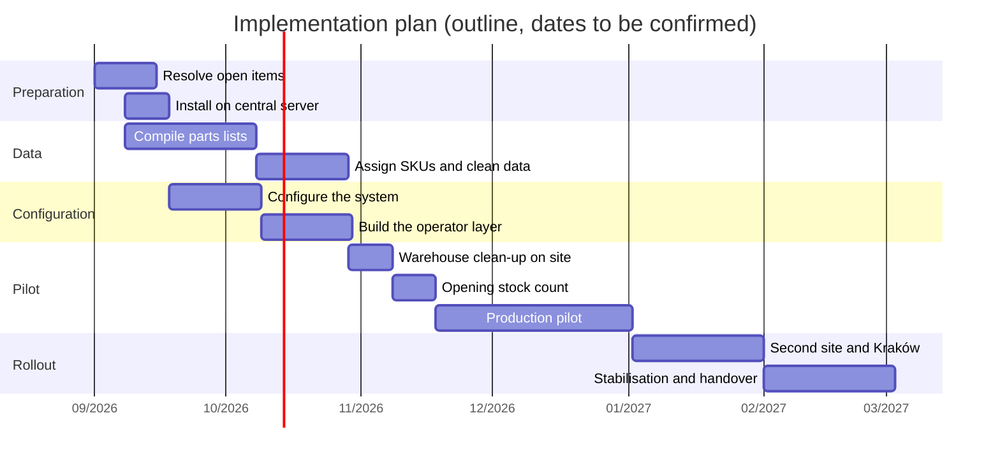

# IMS/AM System for US Manufacturing Sites
## Project and Business Documentation

| | |
|---|---|
| Version | 1.1 (draft for review) |
| Date | 28 August 2026 |
| Status | scope pending approval |
| Document type | project documentation with project-charter elements |
| System scope | IMS / WMS / AM — no ERP, no MRP |
| Sources | technical consultation 27 Aug 2026; "Spare Parts List — Machine A" spreadsheet dated 14 Jul 2026; scope decisions from August 2026; InvenTree documentation source, release 1.5.2 (25 Aug 2026) |

---

## Table of contents

1. [Executive summary](#1-executive-summary)
2. [Context and business case](#2-context-and-business-case)
3. [Objective, success criteria and scope](#3-objective-success-criteria-and-scope)
4. [Stakeholders and responsibilities](#4-stakeholders-and-responsibilities)
5. [Logical architecture](#5-logical-architecture)
6. [Inventory item taxonomy](#6-inventory-item-taxonomy)
7. [Processes](#7-processes)
8. [Stocking policy](#8-stocking-policy)
9. [Functional requirements](#9-functional-requirements)
10. [Non-functional requirements](#10-non-functional-requirements)
11. [Technical architecture](#11-technical-architecture)
12. [InvenTree assessment](#12-inventree-assessment)
13. [Source data and data quality](#13-source-data-and-data-quality)
14. [Metrics and dashboard](#14-metrics-and-dashboard)
15. [Implementation plan](#15-implementation-plan)
16. [Risks](#16-risks)
17. [Assumptions, constraints and decision log](#17-assumptions-constraints-and-decision-log)
18. [Open items](#18-open-items)
19. [Glossary](#19-glossary)

---

## 1. Executive summary

Two manufacturing sites in the United States operate without any inventory records. Spare parts, tools and consumables are registered neither on receipt nor on consumption. The consequences are unplanned machine downtime, disappearing tools, duplicated purchase orders and no factual basis for setting stock levels.

This project delivers a simple inventory management system with basic asset-management elements, built on the open-source InvenTree platform, covering three nodes: the two US sites and the Kraków warehouse, which acts as one of their suppliers. The system deliberately excludes accounting, production planning and MRP.

The definition of success was stated directly by the business decision maker: **know how much of what we have, and get a notification when something is running out.** The entire phase 1 scope is subordinated to that sentence.

Problem size in figures: the spare parts package for a single machine is roughly USD 82,000, and with freight and duty roughly USD 100,000 — about 25% of the machine's value. Ten items account for 56% of that value. Close to a third of all items have a lead time of 20 to 60 days and a single source of supply.

---

## 2. Context and business case

### 2.1 Current state

| Area | Current state |
|---|---|
| Inventory records | none |
| SKU numbering | agreed in principle, but absent from source documents |
| Requests | raised verbally by the operator to the local manager |
| Purchase orders | the manager prepares an order that waits for release; they do not send it to the supplier themselves |
| Supply source | the Kraków warehouse and external suppliers |
| Warehouse organisation | being cleaned up; shelving without an agreed labelling scheme |
| Shipment tracking | none; tracking numbers shared ad hoc and late |
| Tools | bought as needed and shipped from Kraków, never registered, and they disappear |
| Failure and consumption history | none |

### 2.2 Identified problems

- **Machine downtime caused by a missing part.** With lead times of 20–60 days on single-source items, the failure of a component everyone assumed would never break means weeks of downtime. Failures nobody anticipated have already occurred, for example cables damaged while setting up the track.
- **Loss of visibility over shipments in transit.** A shipment of dedicated components was held at customs and the US site received the tracking number too late to act on it. This escalated, even though the delay was outside the sender's control.
- **No basis for setting stock levels.** The parts list for one machine was built intuitively, as a compromise between "what might break" and cost. There is no consumption data, so it cannot be optimised.
- **Tool attrition.** Hand tools and power tools bought repeatedly and shipped from Kraków have no assigned owner and no record.
- **Incomplete technical data.** Parts lists exist for machine type A and for the saw; for the remaining types they are incomplete or missing. The existing spreadsheets lack some prices, drawings and supplier names.

### 2.3 Business case

| Item | Value |
|---|---|
| Value of the spare parts package for one machine type A | ~USD 82,000 |
| Value including freight and duty | ~USD 100,000 |
| Share of machine value | ~25% |
| Share of the 10 most expensive items in package value | 56% |
| Number of suppliers in the package | 26 |

The expected benefit is not a reduction in inventory value but better placement of it. When the parts package equals a quarter of the machine's value, even a moderate improvement in deciding what to hold on site versus in Kraków outweighs the implementation cost. The second source of benefit is reduced downtime; the hourly cost of downtime should be added in the next revision of this document.

---

## 3. Objective, success criteria and scope

### 3.1 Objective

Give the local managers at both US sites current, reliable visibility of spare parts, tools and consumables stock, plus automatic notification when critical levels are approached — while keeping the system as simple to operate as possible.

### 3.2 Success criteria

| ID | Criterion | Metric | Target |
|---|---|---|---|
| S-01 | The system answers "how much of what do we have" | catalogue coverage: items with a recorded stock level / items physically present | ≥ 95% after the opening stock count |
| S-02 | The system warns about items running out | items with a minimum stock level set | 100% of class A items and all consumables |
| S-03 | Data stays reliable | inventory record accuracy from cycle counting | ≥ 95% after 6 months |
| S-04 | Transactions are captured | share of receipts and issues recorded in the system | ≥ 90% within 3 months of go-live |
| S-05 | Shipment visibility | shipments with a tracking number visible to the recipient on the day of dispatch | 100% |
| S-06 | Ease of use | number of operator steps to record a pick | ≤ 3 |

### 3.3 Scope

**In scope for phase 1**

- item catalogue with categories, minimum stock levels and machine assignment
- location tree covering three nodes: BPC001, BPC002, Kraków
- machine register with parts lists
- supplier register
- requests raised by operators
- purchase orders with statuses, tracking number and customs status, and site-to-site transfer orders
- goods receipt with quantity correction
- issues with a mandatory machine reference
- simplified tool records with assignment to a person
- transaction history
- dashboard listing stockouts and items below minimum
- cycle counting
- roles and permissions scoped by node

**Out of scope for phase 1**

- accounting, inventory valuation, integration with finance systems
- production planning, MRP, production orders
- batch and serial number tracking
- preventive maintenance schedules and work orders
- failure and downtime logging
- tool calibration
- barcode scanning in day-to-day operation
- production materials in the full cycle; material receipt is possible but low priority

**Trade-offs accepted deliberately.** Dropping batch tracking means the system cannot answer which delivery of a given component turned out to be defective — only how many units went into which machine and when. This decision is one-directional: introducing batches later requires a recalculation of stock. The absence of a maintenance module means the system will not quantify how much downtime was caused by missing parts, so the strongest argument for holding critical stock will only become available in phase 2.

---

## 4. Stakeholders and responsibilities

| Role | Responsibility |
|---|---|
| Business sponsor | approves scope and budget, arbitrates scope disputes |
| Project owner (Kraków) | process design, system configuration, training, handover to support |
| Technical owner / IT | server installation, backups, updates, access management |
| Technical data owner | compiling and verifying parts lists for each machine type |
| Site manager (BPC001, BPC002) | confirming shortages, choosing between site transfer and purchase, selecting the supplier, placing and receiving orders, setting minimum levels, enforcing recording discipline, stock counts |
| Kraków warehouse | acting as one of the suppliers: confirming orders, giving delivery dates, shipping, transport documents, tracking numbers |
| Operator / technician on site | raising requests, recording picks |
| Report consumers | reviewing metrics, deciding stocking policy |

Permission model: write access limited to one's own node, read access across nodes allowed. Making Kraków stock visible to US managers is intentional — it prevents ordering something that is already sitting in Poland.

---

## 5. Logical architecture

### 5.1 Replenishment logic

Decision authority sits with the site manager at the BPC where the shortage occurs. The manager checks their own stock, then the other site, and only then places an order externally. Kraków is one of the suppliers available in the system, not a mandatory routing point.

**Logical steps**

| # | Step | Actor | System object |
|---|---|---|---|
| 1 | Report a shortage | operator at BPC | request |
| 2 | Review stock levels and confirm the shortage | site manager | stock view across nodes |
| 3 | If stock exists at the other BPC, request a transfer between sites | site manager | transfer order |
| 4 | If no stock exists at either BPC, place a purchase order | site manager | purchase order |
| 5 | Select the supplier — Kraków warehouse or any other supplier in the system able to fulfil | site manager | supplier record |
| 6 | Confirm receipt of the order and provide an estimated delivery date | supplier | order status, target date |
| 7 | Ship the order and provide tracking information | supplier | tracking link, customs status |
| 8 | Receive the shipment and update stock | site manager | goods receipt |
| 9 | Settle payment and close the transaction | finance | order closed |

**Rules that follow from this logic**

1. **The other site is checked before the supplier.** With lead times of 20–60 days on single-source items, a part already sitting at the other BPC is the fastest source available. This makes cross-node read visibility a functional requirement, not a convenience.
2. **Kraków is a supplier, not a gatekeeper.** It competes with external suppliers on availability and lead time. For off-the-shelf items a US distributor will usually win, and the process must allow that without an exception.
3. **Steps 6 and 7 are supplier obligations, not system events.** The system records the estimated delivery date and the tracking reference; it does not generate them. Where a supplier does not provide them, the fields stay empty and that is visible on the dashboard.
4. **Step 9 is out of system scope.** This documentation excludes accounting, so payment is reflected only as the order reaching a closed state. No invoice, payment record or ledger entry is held here.

**Implementation note.** Kraków appears twice in the system and the two records must not be confused: as a supplier company for step 5, and as a stock location node if its inventory is tracked in the same instance. These are separate objects. If Kraków stock is tracked here, a movement from Kraków is technically a transfer order rather than a purchase order, because a purchase order does not decrement the sender's stock. Open item O-02 must be resolved before this step is configured.

### 5.2 Location structure

The location tree is the only carrier of node separation. Item categories are global; stock is always local.

Rack layout mirrors the catalogue split: parts dedicated to one machine type sit on the rack assigned to that machine, parts that fit several machines sit on the shared rack. The same pattern applies at both sites — uniformity outranks local optimisation, because it lets a single process serve both places.

### 5.3 Data model

Without batches and without a maintenance module, the model reduces to a handful of entities.

Key modelling decisions:

- **The catalogue is global.** The same bearing carries one SKU in Kraków, in Colorado and in Georgia. Without this there is no way to compare consumption between sites or consolidate purchasing.
- **The machine-to-item relationship is many-to-many.** One item can fit several machine types. A "dedicated / universal" attribute on the item record drives rack placement.
- **In phase 1 the machine is a reference list.** No meters, no maintenance schedules, no work orders — but the machine field on an issue is mandatory from day one. This is the only cost incurred now for the benefit of phase 2, and without it future metrics will have no data to build on.
- **Transaction history is the only traceability carrier.** It answers who, when, how much and for what — not from which delivery.

### 5.4 Item record attributes

| Attribute | Mandatory | Notes |
|---|---|---|
| SKU | yes | shared numbering across all nodes |
| Name | yes | English |
| Category | yes | per the taxonomy in section 6 |
| Unit of measure | yes | piece, set, litre, bin |
| Manufacturer and part number | yes for class A | |
| Drawing number | where applicable | for dedicated components |
| Suppliers | at least one | flag single-source items |
| Lead time | indicative | informational field, not a calculation parameter |
| Minimum level per location | yes | basis for notifications |
| Criticality class | yes | A / B / C by impact and availability |
| Stocking location policy | yes | US / Kraków / no stock |
| Dedicated or universal | yes | drives rack placement |
| Kanban flag and bin quantity | where applicable | for consumables |
| Attachments | optional | drawing, datasheet, manual |

---

## 6. Inventory item taxonomy

A three-category split proved insufficient, because dedicated components — punches, blades, dies — wear out like consumables but are purchased like spare parts: single-source, expensive, with 25–30 day lead times. Filing them under consumables understates the required stock; filing them under spare parts overstates the stock of low-value items.

| Category | Operational definition | Examples | Ordering regime | Recording regime |
|---|---|---|---|---|
| Spare part | replaced after a failure or during maintenance | hydraulic power unit, sensors, cylinders, bearings | minimum level, monthly review | by item, per unit |
| Wear part | wears out in normal operation, but dedicated and slow to source | punches, die blades, dies | higher minimum level, forecast from consumption | by item, per unit |
| Consumable | consumed regularly, low cost, off-the-shelf | saw blades, filters, oil, O-rings, fittings | two-bin kanban | by bin |
| Tool | reusable tool | drivers, wrenches, gauges | ad hoc purchase | assigned to a person |
| Raw material | production material | per bill of materials | out of scope in phase 1 | receipt, bulk issue |

**Tie-breaker rule:** the method of consumption decides, not the item's position in the existing spreadsheet. If an item wears out predictably in normal operation it is a wear part or a consumable; if it is replaced after damage it is a spare part. The line between wear part and consumable runs along availability: single source and more than two weeks' lead time means wear part.

**Criticality classification.** Without it, "critical level" on the dashboard is an arbitrary term. Proposed matrix:

| | Short availability (up to 10 days) | Long availability (over 20 days) |
|---|---|---|
| Failure stops the machine | class B — minimum stock in the US | class A — stock in the US, monthly review |
| Failure does not stop the machine | class C — ordered as needed | class B — stock held in Kraków |

---

## 7. Processes

### 7.1 Process catalogue

| No. | Process | Trigger | Owner | Phase |
|---|---|---|---|---|
| P1 | Create and maintain catalogue items | request for a new SKU | project owner | 1 |
| P2 | Raise a request | shortage at the workstation or minimum level reached | operator | 1 |
| P3 | Decide the source: site transfer or purchase order | confirmed shortage | site manager | 1 |
| P4 | Shipping, transit and customs | order confirmed by supplier | supplier, tracked by site manager | 1 |
| P5 | Goods receipt at site | delivery arrives | BPC storekeeper | 1 |
| P6 | Issue and consumption | part is picked | storekeeper or technician | 1 |
| P7 | Line-side stock and kanban | bin runs empty | operator | 1 |
| P8 | Tool records | tool purchased or issued | site manager | 1 |
| P9 | Cycle counting | schedule by class | site manager | 1 |
| P10 | Return to stock and scrapping | surplus or damage | storekeeper | 1 |
| P11 | Metrics review and level revision | daily and monthly rhythm | site manager | 1 |
| P12 | Failure and downtime logging | operator report | technician | 2 |
| P13 | Preventive maintenance scheduling | date or meter reading | technician | 2 |

### 7.2 P2–P5: from request to receipt

The process mirrors the current way of working with one change: the request stops being verbal, and the shipment status stops being a mystery.

**Key process rules**

1. "Pending" is a legitimate state, not an error. The site manager creates an order that waits for release — that is current practice, and the system must mirror it rather than force a change.
2. The tracking number is issued at dispatch and immediately visible to the recipient. This is the direct response to the incident with the held shipment of dedicated components.
3. "Customs" is separated from "Shipped" because it is a stage outside the organisation's control and, with shifting customs regulations, the most frequent cause of delay.
4. Quantity in transit is displayed next to stock on hand but excluded from availability. With 25–40 day lead times, this is the main safeguard against duplicate ordering.
5. The request closes automatically on receipt, so the operator sees the outcome of their action.

### 7.3 P6: issue and level check

This is the only discipline mechanism in phase 1. If issues are not recorded, the data will diverge from reality within weeks.

Every issue names a recipient: a machine, a department or scrap. If a part is not going to a specific machine, the site as a whole is named — but that is an exception, not the default path, and it is subject to monthly review.

### 7.4 P7: line-side stock and two-bin kanban

Line-side stock is handled differently depending on value, not on convenience:

| Group | Accounting model | Rationale |
|---|---|---|
| Class A: hydraulics, electronics, dedicated components | line-side as a separate location with its own stock | high value and long lead time; their whereabouts must be known |
| Mid-value mechanical and pneumatic | separate location, counted less often | worth visibility, without rigour |
| Consumables and low-value items | consumed at the moment of issue from the warehouse, controlled by kanban | the cost of recording exceeds the value of the item |

**Bin quantity** = average daily consumption × lead time in days × (1 + buffer). A 20% buffer where consumption is stable and the supplier reliable; 50% where it is variable. Since no consumption history exists yet, initial bin quantities come from the suggested-quantity column and the technicians' judgement, then get recalculated after a quarter from system data. This is the fastest return the implementation will produce.

**Kanban eligibility test:** the item is consumed at least a few times a year, purchased in packs, and its absence does not stop a machine for weeks. Single-unit, single-source items with lead times above 20 days stay outside kanban and are managed individually.

**How it is represented in the system:** for kanban items the unit of record is the bin, not the piece. A stock level of "2" means two full bins, and the minimum level is 1. One field in the system corresponds to one physical signal.

**Discipline:** whoever empties a bin hangs the card on the board immediately; the manager collects the board once a day at a fixed time. Without that rhythm, kanban degenerates into two bins that will eventually both be empty.

### 7.5 P8: tool records

Minimum scope, addressing the specific problem of disappearing tools:

1. A tool purchased or shipped from Kraków is entered as an item in the Tool category.
2. Issuing a tool requires naming the person responsible, not a machine.
3. Once a quarter the manager reviews the list of assigned tools and confirms they are present.
4. No calibration, no return deadlines, no hourly check-out — those come only once basic records prove sustainable.

### 7.6 P9: cycle counting

| Class | Frequency | Method |
|---|---|---|
| A | monthly | by item, full recount |
| B | quarterly | by item |
| C and kanban | quarterly | count bins, verify bin quantity |
| Tools | quarterly | confirm assignment |

The opening stock count is a precondition for go-live and a separate project task, not a post-implementation activity.

---

## 8. Stocking policy

### 8.1 Value distribution of the machine type A package

| Category | Value USD | Share |
|---|---|---|
| Hydraulic | 29,036 | 35.4% |
| Electronic | 27,720 | 33.8% |
| Dedicated | 16,931 | 20.6% |
| Mechanic | 4,094 | 5.0% |
| Pneumatic | 3,606 | 4.4% |
| Consumables | 676 | 0.8% |
| **Total** | **82,063** | **100%** |

The package covers 235 items, roughly 610 units and 26 suppliers. Hydraulics and electronics account for close to 69% of value across roughly 48% of items. The ten most expensive items — the hydraulic power unit, laser sources, controllers and galvo scanners, intermediate plates and cylinders — represent 56% of package value.

> Methodological note: figures come from the analysis of the spreadsheet dated 14 Jul 2026. The source spreadsheet is denominated in PLN; all amounts in this document are converted to USD at a fixed rate of 3.75 PLN/USD and reported in USD only. Category amounts are rounded individually, which produces a difference of a few dollars against the converted total. Item counts per category should be confirmed at import, since the spreadsheet contains blank rows and gaps in its numbering.

### 8.2 Lead time distribution

| Band | Items (approx.) | Character |
|---|---|---|
| up to 3 days | ~45 | off the shelf, domestic distributors |
| around 10 days | ~73 | standard catalogue components |
| 20–60 days | ~65 | dedicated components and special assemblies, mostly single-source |
| no data | 7 | to be completed |

The entire dedicated components category (41 items) comes from a single supplier with a 25–30 day lead time. Laser components run around 40 days, carry high unit value and have a single source. These, rather than item counts, drive downtime risk.

### 8.3 Decision matrix: where to hold stock

Where stock is held is not decided by item value but by the product of criticality and realistic delivery time, which must include freight and customs.

| Situation | Decision | Rationale |
|---|---|---|
| Failure stops the machine, single source, lead time over 20 days | hold stock physically in the US | no logistics scenario saves the situation; with customs added, two weeks is an optimistic figure |
| Failure stops the machine, off-the-shelf within 10 days | order from a US distributor, no stock or token stock | shipping an item available locally across the Atlantic is not justified |
| Failure does not stop the machine, long lead time | hold stock in Kraków | a buffer without duplicated carrying cost |
| Consumable item, predictable consumption | kanban in the US | controlled by signal, not by forecast |

One budget question must be settled: whether funding exists to build critical stock in the US in one move. The answer changes the meaning of minimum levels — without funding, the system will generate notifications nobody can act on.

---

## 9. Functional requirements

MoSCoW priorities: M — must have in phase 1, S — should have, C — could have, W — won't have in this phase.

| ID | Requirement | Priority |
|---|---|---|
| F-01 | Item catalogue with categories, attributes and attachments | M |
| F-02 | Shared SKU numbering across all nodes | M |
| F-03 | Location tree covering three nodes and their zones | M |
| F-04 | Minimum level defined per item and location | M |
| F-05 | Notification when stock drops below the minimum level | M |
| F-06 | Machine register with assigned parts lists | M |
| F-07 | Issue with mandatory recipient (machine, department, scrap) | M |
| F-08 | Transaction history with user, date, quantity and recipient | M |
| F-09 | Request raised by an operator | M |
| F-10 | Request approval by the site manager | M |
| F-11 | Purchase order with "pending" as a legitimate state | M |
| F-12 | Tracking number visible to the recipient from the moment of dispatch (External Link field on the transfer order) | M |
| F-13 | Customs clearance as a distinct status (Custom State mapped onto a built-in in-progress status) | M |
| F-14 | Goods receipt with quantity correction and discrepancy note | M |
| F-15 | Quantity in transit shown next to stock, excluded from availability | M |
| F-16 | Supplier register with indicative lead times | M |
| F-17 | Tool records with assignment to a person | M |
| F-18 | Dashboard: items below minimum, zero-stock items, shipments in transit | M |
| F-19 | Roles and permissions with edit controls limited to own node via Stock Ownership Control | M |
| F-20 | Operator interface with a maximum of three steps | M |
| F-21 | Cycle counting with adjustment records and reason codes | S |
| F-22 | "Dedicated / universal" attribute and assignment to multiple machines | S |
| F-23 | Kanban items recorded in bins as the unit of measure | S |
| F-24 | Inter-node transfer with in-transit stock (native Transfer Orders) | M |
| F-25 | Export to spreadsheet and reporting by category and node | S |
| F-26 | Barcode labels for items and locations | C |
| F-27 | Barcode scanning on issue and receipt | C |
| F-28 | Failure and downtime log with reason codes | C |
| F-29 | Preventive maintenance schedule | C |
| F-30 | Batch and serial number tracking | W |
| F-31 | Inventory valuation and accounting integration | W |
| F-32 | MRP, production orders, planning | W |

---

## 10. Non-functional requirements

| Area | Requirement |
|---|---|
| Ease of use | the operator completes a record in at most three steps; optional fields hidden; no access to modules outside their role |
| Tolerance to user error | quantity validation, no issuing below zero, no manual editing of transaction history |
| Hosting | central server (OVH); no component may be hosted on hardware located at the US sites |
| Availability | browser access, no client-side installation |
| Backups | scheduled backup enabled in global settings, plus a database-level backup with at least 30 days' retention; restore test before production go-live |
| Security | individual accounts, no shared accounts in production, HTTPS; multi-factor authentication enforced on staff and superuser accounts |
| Language | English as the only interface language |
| Time zones | daily reports account for the difference between Mountain and Eastern time |
| Compliance | no ISO or FDA requirements; no electronic signature and no system validation |
| Scalability | the data model supports adding further machine types and prefabrication materials without rebuilding the catalogue |
| Support | a named technical owner responsible for updates; documented update procedure |

The simplicity requirement outranks feature completeness. Experience with the target users indicates a high risk of inaccurate data entry, so every additional field in the operator interface is a cost, not a benefit.

---

## 11. Technical architecture

### 11.1 Phase 1 target solution

Splitting the interfaces is the key architectural decision. The full InvenTree interface is dense and an operator will get lost in it, which — given the known risk of inaccuracy — translates directly into poor data quality. Managers and the warehouse work in the full system; the operator gets a minimal layer over the API with three actions: picked, shortage, received. The capability to build that layer exists in house.

### 11.2 InvenTree configuration

| Element | Decision |
|---|---|
| Version | 1.5.2, released 25 Aug 2026 (verify the current release before installation) |
| Installation | Docker on the central server |
| Modules disabled | build orders and manufacturing, sales orders, return orders, pricing |
| Modules active | Parts, Stock, Locations, Companies, Purchase Orders, Transfer Orders, Stocktake, Notifications |
| Licence | MIT — no licence fees, no user limits |
| Permissions | functional roles assigned to groups; node separation via Stock Ownership Control, with the owner set to a group on each location branch |
| Extensions | custom layer over the API for the operator interface and the request workflow; custom states for customs visibility |

### 11.3 Development path

Phase 2 adds failure and downtime logging plus preventive maintenance scheduling. It remains to be decided whether this is built as an InvenTree plugin using the same API and user session, or as a separate tool integrated over the API. The plugin route yields one system and one dashboard but requires a permanent Python capability.

---

## 12. InvenTree assessment

> Disclaimer: this assessment is based on product knowledge up to spring 2026 and on a local demonstration instance. InvenTree evolves quickly, so the current release should be verified before a final decision.

### 12.1 Requirements coverage

| Area | Coverage | Comment |
|---|---|---|
| Item catalogue, categories, parameters, variants | very good | a strength of the product; attachments and documentation per item |
| Location tree and bins | very good | arbitrary depth, ready for three nodes |
| Minimum levels and shortage list | good | no automatic order generation; there is an order wizard from the shortage list |
| Purchase orders and receipts | good | suppliers, partial receipts, quantity corrections |
| Transaction history | good | full record of stock changes with user and date |
| Issue to a machine | adequate | "issue recipient" is not a native concept; needs a custom field or workaround |
| Data separation per node | adequate | roles are functional, not location-scoped. Stock Ownership Control assigns a group as owner of a location branch, but it only hides edit controls in the interface, does not restrict the API, and leaves unowned records editable by anyone holding the role |
| Cycle counting | adequate | the feature exists, without a developed counting workflow |
| Requests with approval | weak | no native request workflow; to be built in the custom layer |
| Inter-node transfers | good | Transfer Orders are native since the 1.x line: source and destination location, line items, target date, responsible user, calendar view |
| Shipment status and customs clearance | adequate | achievable with Custom States on Transfer and Purchase Order status, plus the External Link field for the tracking URL. Caveat: custom states are display-only and map onto a built-in state; they add no workflow logic |
| Machine register as an asset | weak | no asset module; machines modelled as items. Terminology note: the "machines" feature in InvenTree refers to label-printer drivers, not production machines |
| Parts list assigned to a machine | good | achievable through the BOM structure on an assembly item |
| Tool records assigned to a person | adequate | via a location representing the person, or a custom field |
| Maintenance scheduling | absent | outside the product |
| Failure and downtime log | absent | outside the product |
| Dashboard and metrics | weak to adequate | configurable widgets, but no operational metrics out of the box |
| Barcodes and labels | very good | built in, label templates, printers via plugins |
| Mobile app | good | official app with scanning, responsive interface |
| API and extensibility | very good | full REST API and a plugin framework — the realistic route to closing the gaps |
| Licence and cost | very good | MIT, no fees, self-hosted |

### 12.2 Conclusion

InvenTree covers roughly three quarters of the inventory layer and does so solidly. Release 1.5.2 closes two gaps identified earlier: Transfer Orders handle Kraków-to-US movements natively, and Custom States give customs and transit visibility without custom code. It still covers virtually nothing of the maintenance-management layer and has no request-and-approval workflow. On its own it will not deliver the full scope — but for the phase 1 scope, defined by "how much of what we have and a warning when it runs out", it is sufficient, and for an organisation starting from zero it represents a significant step.

### 12.3 Options considered

| Option | Description | Advantage | Disadvantage |
|---|---|---|---|
| A | InvenTree plus a separate maintenance tool, integrated over the API | each tool does what it is good at | two systems, two logins, risk of data divergence |
| B | InvenTree plus a custom layer and plugin for requests, shipments and phase 2 | one system, full fit, simple operator interface | requires Python capability at implementation and in support |
| C | A platform such as Odoo Community with inventory, purchasing and maintenance modules | native request workflow and maintenance scheduling, multi-company support | heavier than the scope requires, shallower parts catalogue, drift towards ERP |

**Recommendation: option B.** Python capability and experience in building layers over APIs are available in house, and the three-click operator interface requirement forces a custom layer regardless. Option C remains available if purchasing, costing and production enter scope within two years — noting that the accounting transformation in Kraków follows its own track and should not be coupled to this system.

---

## 13. Source data and data quality

### 13.1 Available sources

| Source | State | Notes |
|---|---|---|
| Parts list — machine type A | reasonably complete, dated 14 Jul 2026 | the template for all other lists |
| Parts list — saw | exists | needs checking for consistency with the master list |
| Parts lists — other machine types | incomplete or missing | some prices zeroed, drawings and suppliers missing |
| Master list from earlier workshops | exists in correspondence | reference point for the dedicated / universal split |

The structure of the machine A spreadsheet — name, unit price, suggested quantity, lead time, supplier, drawing number — is adequate as a template and should be replicated for the remaining machine types.

### 13.2 Defects to fix before import

| Defect | Consequence | Action |
|---|---|---|
| No SKU column | import impossible without mapping | assign internal numbers |
| 4 items with no price | no basis for ABC classification | complete pricing |
| 7 items with no lead time | no basis for the stocking location decision | complete |
| Supplier entered in the drawing-number column (2 rows) | corrupt supplier record | fix the structure |
| Supplier names mixing manufacturer with reseller | duplicates in the supplier register | split manufacturer and supplier into two fields |
| "China" entered as a supplier name | no way to contact or verify lead time | identify the actual supplier |
| Gaps and blank rows in the numbering | item counts diverge at import | clean up |
| No current-stock and location columns | no opening balance | complete via the opening stock count |
| Consumables mixed with dedicated components | incorrect stock levels | apply the taxonomy from section 6 |

### 13.3 Mapping spreadsheet columns to system fields

| Spreadsheet column | System field | Notes |
|---|---|---|
| Name | Item name | to be standardised in English |
| — | SKU | to be assigned |
| Unit price | Purchase price | informational only, no inventory valuation |
| Suggested quantity | Minimum or target level | to be decided, see open items |
| Lead time | Supplier lead time | indicative |
| Supplier | Supplier | after separation from manufacturer |
| Drawing number | Drawing number | for dedicated components |
| Spreadsheet section | Category | per the taxonomy, not the existing split |

**A note on repeated items.** Items such as catalogue bearings, fittings and buffers appear in the parts lists of several machines. They must carry one SKU shared across machines, otherwise the catalogue will fill with duplicates of the same component. Since one machine generates 235 items, with several machine types and two sites the catalogue will grow into thousands of records — cleaning up duplicates afterwards will cost far more than designing this correctly now.

---

## 14. Metrics and dashboard

The site manager sees their own node; management sees a consolidated view comparing both sites.

### 14.1 Alert layer (top of screen)

- items below the minimum level, split into class A and the rest
- class A items at zero stock
- shipments in transit past their expected arrival date
- shipments held at customs longer than an agreed threshold
- requests with no response for more than two working days
- tools with no person assigned

### 14.2 Metrics layer

| Metric | Definition | Target |
|---|---|---|
| Inventory record accuracy | agreement between system stock and cycle counts | ≥ 95% |
| Request fill rate from stock | requests fulfilled without ordering / all requests | increasing |
| Request cycle time | from submission to receipt at site | decreasing |
| Time at customs | average time between dispatch and receipt | monitored |
| Share of items below minimum | items below minimum / items with a minimum set | decreasing |
| Non-moving stock | items with no transaction in 12 months | quarterly review |
| Consumption per machine | quantity and value of issues by machine | basis for level revision |
| Recording discipline | transactions recorded / transactions estimated | ≥ 90% |

### 14.3 Review rhythm

| Cycle | Coverage | Participants |
|---|---|---|
| Daily | alert layer, requests without response | site manager |
| Weekly | shipments in transit and at customs | site manager, Kraków warehouse |
| Monthly | metrics, revision of minimum levels, class A review | project owner, site managers |
| Quarterly | non-moving stock, kanban bin quantities, tools | project owner |

Phase 2 metrics — mean time between failures, mean time to repair, downtime hours, share of downtime caused by missing parts, maintenance schedule compliance — require data that phase 1 does not capture. Introducing them is the main justification for phase 2.

---

## 15. Implementation plan

### 15.1 Phases

| Phase | Content | Outcome |
|---|---|---|
| 0. Preparation | resolve open items, select the pilot site, install on the central server | environment ready, scope approved |
| 1. Data | compile parts lists, assign SKUs, clean data, apply taxonomy and criticality classification | catalogue ready for import |
| 2. Configuration | location tree, categories, roles, minimum levels, operator layer | system configured |
| 3. Physical preparation | clean up and label the warehouse on site, assign racks to machines | warehouse matches the location tree |
| 4. Opening stock count | count and enter stock at the pilot site | opening balance |
| 5. Pilot | production use, training, process corrections | process proven in practice |
| 6. Rollout | second site and Kraków | three nodes live |
| 7. Stabilisation | revise levels against real data, hand over to support | system in support |

### 15.2 Preconditions

1. Confirm which site is being vacated — the pilot cannot start at a location whose containers are being moved out.
2. Physical warehouse clean-up requires presence on site. This is a separate line in the budget and schedule, not a by-product of the system rollout.
3. Compiling the parts lists depends on the availability of one person; their absence blocks phase 1.
4. A named process owner on the US side. Without one, recording discipline will not survive the end of the implementation.

---

## 16. Risks

Probability (P) and impact (I) rated 1–5.

| ID | Risk | P | I | Mitigation |
|---|---|---|---|---|
| R-01 | Site evacuation: loss of access to hardware and containers, possible sealing for several months | 4 | 5 | central hosting only; run the pilot at the other site; postpone the opening stock count until the location is stable |
| R-02 | Lack of recording discipline among users | 4 | 5 | three-click interface, process owner on site, weekly review of the discipline metric |
| R-03 | Shipments held at customs under shifting duty regulations | 4 | 4 | customs status in the system, tracking number from the day of dispatch, critical stock held physically in the US |
| R-04 | Incomplete parts lists and dependence on one person | 4 | 4 | spreadsheet template, work split by machine type, agree deadlines around planned absences |
| R-05 | Machine downtime caused by a part with a lead time over 20 days | 3 | 5 | stocking location decision matrix, budget for critical stock, monthly class A review |
| R-06 | No technical owner after go-live; system left without updates | 3 | 4 | named owner, documented update and restore procedures |
| R-07 | Scope creep towards ERP under stakeholder pressure | 3 | 3 | success criterion stated explicitly, out-of-scope list approved by the sponsor |
| R-08 | Catalogue duplicates due to missing shared SKUs for universal items | 3 | 3 | global catalogue, many-to-many machine-item relationship, duplicate review at import |
| R-09 | Minimum levels generating notifications with no budget to act on | 3 | 3 | settle the critical stock budget question before setting levels |
| R-10 | On-site travel underestimated in the schedule | 3 | 2 | separate line in the plan and budget |
| R-11 | Divergence between the system and customs or accounting documentation for transfers | 2 | 3 | generate a line-item list for the transport document; decide the document format before go-live |
| R-12 | Low-stock notifications never reach anyone because they depend on per-user subscriptions and a working mail server | 3 | 4 | configure SMTP before go-live, subscribe managers to all class A and consumable items, verify with a live test |

---

## 17. Assumptions, constraints and decision log

### 17.1 Assumptions

1. Kraków remains the primary supply source for both US sites.
2. Local managers have browser access and a stable connection.
3. Python capability is available in house for implementation and support.
4. Business stakeholders accept a scope limited to the inventory layer.
5. The accounting transformation in Kraków proceeds independently and is not coupled to this system.

### 17.2 Constraints

1. No integration with the accounting system and no inventory valuation.
2. No batch tracking, which limits analysis of delivery quality.
3. Scanning hardware is available but not used in phase 1.
4. English is the only interface language.
5. Phase 1 excludes maintenance management, so the cost of downtime cannot be quantified.

### 17.3 Decision log

| No. | Decision | Rationale |
|---|---|---|
| D-01 | An IMS/AM system, not ERP and not MRP | users are starting from zero; complexity is the main failure risk |
| D-02 | InvenTree as the foundation, MIT licence, self-hosted | no licence cost, open API, sufficient coverage of the inventory layer |
| D-03 | Three nodes: BPC001, BPC002, Kraków | Kraków is the effective supplier; without it the process is incomplete |
| D-04 | Global catalogue, local stock | enables consumption comparison and purchasing consolidation |
| D-05 | No batch or serial number tracking | a radical simplification; deliberate loss of delivery quality analysis |
| D-06 | Machine field mandatory on issues from day one | the only cost incurred now for the benefit of phase 2 metrics |
| D-07 | Separate interfaces for manager and operator | the full interface is too dense for an operator; data quality takes priority |
| D-08 | Customs clearance as a distinct process status | response to a real incident with a held shipment |
| D-09 | Tools in scope for phase 1 in simplified form | a recurring financial loss visible from the first month |
| D-10 | Maintenance, failures and downtime deferred to phase 2 | scope narrowing consistent with the decision maker's expectation |
| D-11 | "Wear part" as a third category between spare part and consumable | dedicated components wear like consumables but are purchased like spare parts |
| D-12 | Central hosting; no hosting at the sites | the site evacuation showed that on-site hardware is not a durable foundation |
| D-13 | Inventory valuation and accounting integration out of scope | the tool is not an accounting system |
| D-14 | Kraków-to-US movements handled as native Transfer Orders, not as purchase orders | the 1.x line provides source and destination locations, line items and a target date out of the box |
| D-16 | Replenishment decisions are made by the site manager at the BPC, not centrally in Kraków | the shortage, the machine and the consequence are all local; central routing adds a hop without adding information |
| D-17 | Kraków is modelled as one supplier among others, competing on availability and lead time | for off-the-shelf items a US distributor is faster and cheaper; the process must permit that as the normal path, not an exception |
| D-18 | Site-to-site transfer is checked before any external order | a part at the other BPC is the fastest source when lead times run 20-60 days |
| D-15 | Customs visibility delivered through Custom States rather than a plugin | no custom code needed in phase 1; the limitation to display-only status is acceptable, since the requirement is visibility, not workflow |

---

## 18. Open items

| ID | Item | Why it blocks | Owner |
|---|---|---|---|
| O-01 | Which site is being vacated? There is a contradiction between assigning BPC001 to Colorado and the report of BPC001 in Georgia being evacuated | determines the pilot choice and the entire location tree | sponsor |
| O-02 | Is Kraków a full warehouse in the system, with stock and issues, or only the point where requests are received? | a difference of several weeks in implementation effort | project owner |
| O-03 | Which document should record the Kraków–US transfer for customs and accounting purposes? | the system can generate a line-item list but cannot decide the document format | finance |
| O-04 | Is there a budget to build critical stock in the US in one move? | without it, minimum levels generate notifications nobody can act on | sponsor |
| O-05 | Who on the US side owns the process and is accountable for data being current? | without this role, discipline will not survive the implementation | sponsor |
| O-06 | How many machines and how many types are at each site? | basis for estimating catalogue size and stock-count effort | technical data owner |
| O-07 | Are the suggested quantities in the spreadsheet minimum levels or target levels? | determines when the notification fires | technical data owner |
| O-08 | Does a document with the current SKU numbering exist? | without numbering, import is impossible | project owner |
| O-09 | Who performs the opening stock count, with how many people, and in what time window? | precondition for go-live | site manager |
| O-10 | Is the saw parts list consistent with the master list from the workshops? | risk of duplicates and gaps in the catalogue | technical data owner |
| O-11 | What is the hourly cost of machine downtime? | the missing figure weakens the case for critical stock | finance |
| O-12 | Expected go-live date | basis for the schedule | sponsor |

---

## 19. Glossary

| Term | Meaning |
|---|---|
| IMS | Inventory Management System |
| WMS | Warehouse Management System |
| AM | Asset Management — here: machines and their upkeep |
| ERP / MRP | enterprise resource and material requirements planning systems — deliberately out of scope |
| SKU | unique catalogue item number |
| BPC001, BPC002 | the manufacturing sites in the United States |
| KRK001 | the Kraków warehouse |
| Line-side | stock held directly at the machine |
| Tool crib | a dedicated area for storing tools |
| Wear part | a consumable but dedicated part with a long lead time |
| Two-bin kanban | a stock control method in which an empty bin is the reorder signal |
| Class A / B / C | criticality classification by failure impact and availability |
| FIFO | first in, first out |
| Lead time | time from placing an order to delivery |
| MoSCoW | requirements prioritisation method: must, should, could, won't |

---

## Change history

| Version | Date | Change |
|---|---|---|
| 0.9 | 2026-08-27 | First complete version of the documentation. Reflects the three-node model including Kraków, customs clearance as a process stage, site evacuation as the principal risk, tools returning to phase 1 scope, the wear part category, and the success criterion as stated by the decision maker. |
| 1.1 | 2026-08-28 | Section 5.1 rewritten to the agreed nine-step replenishment logic: the site manager owns the decision, site-to-site transfer is checked before external ordering, and Kraków is one supplier among others. Process state machine in 7.2 aligned. Payment step recorded as out of system scope. |
| 1.0 | 2026-08-28 | All amounts converted to USD. Assessment verified against the InvenTree documentation source at release 1.5.2: native Transfer Orders and Custom States added, the permission model corrected to reflect that roles are functional rather than location-scoped, and a risk added covering notification subscriptions and mail configuration. |
