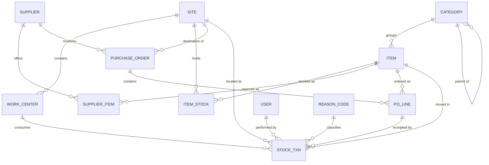
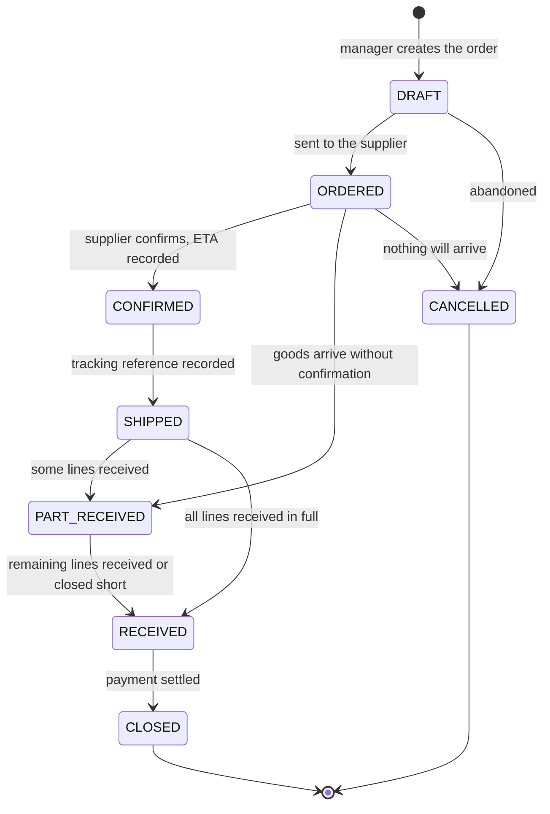

# BPC Inventory System — MVP Technical Specification
## Custom application, PHP + MariaDB

| | |
|---|---|
| Version | 0.1 (draft for review) |
| Date | 28 August 2026 |
| Status | pending approval before development starts |
| Stack | PHP, MariaDB |
| Scope | inventory for two US sites; no ERP, no MRP, no accounting |
| Companion document | IMS USA documentation (business context, stocking policy, InvenTree assessment) |

---

## 1. Purpose and success criterion

Give site managers at BPC001 and BPC002 a reliable answer to two questions: how much of what we have, and what is running out. Everything in this specification exists to serve those two questions. Anything that does not is deferred.

The application replaces no existing system — there is none today. It must therefore be simple enough that a manager with no training in inventory systems can operate it on the first day.

---

## 2. Design decisions

These decisions are settled and the data model depends on them. Changing any of them after development starts means rework.

| # | Decision | Consequence |
|---|---|---|
| D-01 | Decision authority sits with the site manager where the shortage occurs | no central approval step, no routing through Kraków |
| D-02 | Kraków is one supplier among others | no separate node logic; a supplier record like any other |
| D-03 | No shortage requests from operators in the MVP | step 1 of the logical process stays outside the system; the dashboard is the trigger |
| D-04 | Site-to-site transfer is a single-step operation | no in-transit state; one transaction, two stock movements |
| D-05 | Transfer is entered by the receiving manager on arrival | avoids the system claiming stock has arrived while it is still on a truck |
| D-06 | Moving average cost held per item and per site | each site carries its own cost basis |
| D-07 | Transfers carry the sending site's average cost | that value becomes the receiving site's purchase price |
| D-08 | Freight and duty are excluded from cost | inventory value is understated relative to landed cost; accepted limitation |
| D-09 | Partial receipts supported | order lines track ordered and received quantities separately |
| D-10 | One purchase order serves one site | destination site is a header field, not per line |
| D-11 | Three roles: administrator, manager, operator (read-only) | issues are recorded by managers in the MVP |
| D-12 | Consumption reported per work centre, by quantity and value | every issue to a work centre stores quantity and cost |
| D-13 | Tools deferred to a later phase | no tool assignment, no person-level accountability yet |
| D-14 | Single currency: USD | no exchange rates, no multi-currency fields |
| D-15 | No batch or serial tracking | traceability is transaction-level |

---

## 3. Data model



### 3.1 Tables

**site** — the two US locations, extensible to more.

| Column | Type | Notes |
|---|---|---|
| id | INT PK | |
| code | VARCHAR(10) UNIQUE | BPC001, BPC002 |
| name | VARCHAR(100) | |
| state | VARCHAR(2) | CO, GA |
| active | TINYINT(1) | |

**work_center** — production cells, in practice machine names.

| Column | Type | Notes |
|---|---|---|
| id | INT PK | |
| site_id | INT FK | a work centre belongs to one site |
| code | VARCHAR(20) | 004C |
| name | VARCHAR(100) | Truss Saw 004C |
| active | TINYINT(1) | |

Unique on (site_id, code).

**category** — item taxonomy, self-referencing for one level of nesting.

| Column | Type | Notes |
|---|---|---|
| id | INT PK | |
| parent_id | INT FK NULL | NULL for top level |
| name | VARCHAR(100) | |
| is_structural | TINYINT(1) | items cannot be assigned to a structural category |

**item** — the global catalogue. One SKU is shared by both sites.

| Column | Type | Notes |
|---|---|---|
| id | INT PK | |
| sku | VARCHAR(40) UNIQUE | mandatory, immutable after first transaction |
| name | VARCHAR(200) | |
| description | TEXT NULL | |
| category_id | INT FK | must not be structural |
| uom | VARCHAR(20) | pc, set, l, m |
| manufacturer | VARCHAR(100) NULL | |
| mpn | VARCHAR(80) NULL | manufacturer part number |
| drawing_no | VARCHAR(80) NULL | |
| criticality | ENUM('A','B','C') NULL | from the stocking policy |
| active | TINYINT(1) | soft delete only |
| created_at, created_by | | |

**item_stock** — stock and cost per item per site. One row per combination, created on first use.

| Column | Type | Notes |
|---|---|---|
| id | INT PK | |
| item_id | INT FK | |
| site_id | INT FK | |
| qty | DECIMAL(14,3) | never negative |
| avg_cost | DECIMAL(14,4) | moving average, USD |
| min_level | DECIMAL(14,3) | 0 means no alert |
| bin | VARCHAR(40) NULL | free-text shelf reference |

Unique on (item_id, site_id). This table is derived state — it must always be reconstructible from stock_txn.

**supplier**

| Column | Type | Notes |
|---|---|---|
| id | INT PK | |
| name | VARCHAR(150) | Kraków warehouse is one row here |
| contact_email | VARCHAR(150) NULL | |
| lead_time_days | INT NULL | indicative only |
| notes | TEXT NULL | |
| active | TINYINT(1) | |

**supplier_item** — what a given supplier calls the item and what it last cost.

| Column | Type | Notes |
|---|---|---|
| id | INT PK | |
| supplier_id | INT FK | |
| item_id | INT FK | |
| supplier_sku | VARCHAR(80) NULL | |
| last_price | DECIMAL(14,4) NULL | prefilled on new order lines |
| pack_size | DECIMAL(14,3) DEFAULT 1 | units received per ordered pack |

Unique on (supplier_id, item_id).

**purchase_order**

| Column | Type | Notes |
|---|---|---|
| id | INT PK | |
| number | VARCHAR(20) UNIQUE | PO-2026-0001 |
| supplier_id | INT FK | |
| site_id | INT FK | destination site, header level |
| status | ENUM | see 4.3 |
| order_date | DATE NULL | set when status becomes ORDERED |
| confirmed_at | DATE NULL | step 6 |
| eta | DATE NULL | step 6 |
| tracking_ref | VARCHAR(200) NULL | step 7, free text or URL |
| shipped_at | DATE NULL | step 7 |
| closed_at | DATE NULL | step 9 |
| notes | TEXT NULL | |
| created_by, created_at | | |

**po_line**

| Column | Type | Notes |
|---|---|---|
| id | INT PK | |
| po_id | INT FK | |
| item_id | INT FK | |
| qty_ordered | DECIMAL(14,3) | |
| qty_received | DECIMAL(14,3) DEFAULT 0 | |
| unit_price | DECIMAL(14,4) | net, USD |
| is_closed | TINYINT(1) DEFAULT 0 | closed short by the manager |

**stock_txn** — the ledger. Append only. No updates, no deletes.

| Column | Type | Notes |
|---|---|---|
| id | BIGINT PK | |
| txn_type | ENUM | RECEIPT, ISSUE_WC, ISSUE_GENERAL, TRANSFER_OUT, TRANSFER_IN, ADJUSTMENT |
| item_id | INT FK | |
| site_id | INT FK | site whose stock changes |
| qty_delta | DECIMAL(14,3) | signed: positive in, negative out |
| unit_cost | DECIMAL(14,4) | cost applied to this movement |
| value | DECIMAL(14,4) | qty_delta × unit_cost, signed |
| qty_after | DECIMAL(14,3) | stock at this site after the movement |
| avg_cost_after | DECIMAL(14,4) | |
| work_center_id | INT FK NULL | mandatory for ISSUE_WC |
| counter_site_id | INT FK NULL | mandatory for TRANSFER_OUT and TRANSFER_IN |
| po_line_id | INT FK NULL | mandatory for RECEIPT |
| transfer_group | CHAR(36) NULL | links the two rows of one transfer |
| reason_code_id | INT FK NULL | mandatory for ADJUSTMENT and ISSUE_GENERAL |
| note | VARCHAR(500) NULL | |
| user_id | INT FK | |
| created_at | DATETIME | |

Index on (item_id, site_id, created_at) and on (work_center_id, created_at).

**reason_code**

| Column | Type | Notes |
|---|---|---|
| id | INT PK | |
| applies_to | ENUM('ADJUSTMENT','ISSUE_GENERAL') | |
| code | VARCHAR(20) | |
| label | VARCHAR(100) | count correction, damage, loss, found, scrap, maintenance, cleaning |
| active | TINYINT(1) | |

**user**

| Column | Type | Notes |
|---|---|---|
| id | INT PK | |
| name | VARCHAR(100) | |
| email | VARCHAR(150) UNIQUE | login |
| password_hash | VARCHAR(255) | password_hash() with the default algorithm |
| role | ENUM('ADMIN','MANAGER','OPERATOR') | |
| site_id | INT FK NULL | NULL for admin, meaning all sites |
| active | TINYINT(1) | |
| last_login_at | DATETIME NULL | |

**audit_log** — changes to master data, separate from stock movements.

| Column | Type | Notes |
|---|---|---|
| id | BIGINT PK | |
| entity | VARCHAR(40) | item, supplier, user, item_stock |
| entity_id | INT | |
| action | ENUM('CREATE','UPDATE','DELETE') | |
| changes | JSON | before and after for changed fields only |
| user_id | INT FK | |
| created_at | DATETIME | |

---

## 4. Business rules

### 4.1 Moving average cost

Held per item per site, in `item_stock.avg_cost`. Recalculated only on movements that add stock.

**On receipt or transfer in:**

```
new_qty  = qty + received_qty
new_avg  = (qty * avg_cost + received_qty * unit_cost) / new_qty
```

If `qty` is zero or the row is being created, `new_avg = unit_cost`.

**On any outgoing movement** — issue to a work centre, general issue, transfer out, negative adjustment — the average does not change. The movement is valued at the current average:

```
unit_cost = avg_cost
value     = qty_delta * avg_cost
```

**On a positive adjustment**, the movement is valued at the current average and the average does not change. If stock is zero and no average exists, the manager must enter a unit cost.

Store the average at four decimal places. Never round the stored value to two; rounding happens only on display.

### 4.2 Stock movements

| Type | Effect | Mandatory fields |
|---|---|---|
| RECEIPT | increases stock at the destination site | po_line_id, qty, unit_price from the line |
| ISSUE_WC | decreases stock | work_center_id |
| ISSUE_GENERAL | decreases stock | reason_code_id |
| TRANSFER_OUT | decreases stock at the sending site | counter_site_id, transfer_group |
| TRANSFER_IN | increases stock at the receiving site | counter_site_id, transfer_group |
| ADJUSTMENT | increases or decreases stock | reason_code_id, note required for decreases |

**Rules that apply to every movement**

1. Stock may never go negative. An issue or transfer exceeding available quantity is rejected with a clear message stating what is available.
2. Quantity must be greater than zero. Direction is expressed by the transaction type, never by a negative input in the form.
3. Every movement writes exactly one `stock_txn` row per affected site, plus the resulting update to `item_stock`. Both happen in one database transaction.
4. `stock_txn` is append only. A mistake is corrected by a compensating ADJUSTMENT, never by editing or deleting history.
5. `qty_after` and `avg_cost_after` are written on every row so the ledger can be read without replaying it.

**Transfer between sites** creates two rows sharing one `transfer_group`:

- TRANSFER_OUT at the sending site, valued at the sending site's current average
- TRANSFER_IN at the receiving site, with `unit_cost` equal to that same value, which then feeds the receiving site's average

Per decision D-05, the transfer is entered by the receiving manager when the goods physically arrive.

### 4.3 Purchase order lifecycle



**Status rules**

1. Lines can only be received when the order is ORDERED, CONFIRMED, SHIPPED or PART_RECEIVED.
2. The order moves to RECEIVED automatically when every line has `qty_received >= qty_ordered` or `is_closed = 1`.
3. Closing a line short is an explicit action with a reason recorded in the order notes. It does not create a stock movement.
4. Receiving more than ordered is allowed but warns the user and records the excess. Over-receipt usually means a pack size error, so the warning should say so.
5. CLOSED carries no accounting meaning. It records that the commercial transaction ended; no invoice, payment record or ledger entry exists in this system.
6. CANCELLED is only available while nothing has been received.

### 4.4 Numbering

Purchase orders: `PO-{YYYY}-{0001}`, sequence restarting each calendar year, generated inside the insert transaction to avoid gaps and collisions.

### 4.5 Alerts

An item is below minimum when, for a given site, `qty < min_level` and `min_level > 0`. Minimum levels are held per item per site, consistent with cost. There is no global minimum.

Quantity on open orders is shown next to the shortage but never added to available stock.

---

## 5. Process mapping

Mapping of the agreed logical steps to system actions.

| # | Logical step | In the system |
|---|---|---|
| 1 | Operator reports a shortage | outside the system; verbal, or the manager sees it on the dashboard |
| 2 | Manager reviews stock and confirms | stock list filtered by site, with cross-site visibility |
| 3 | Stock at the other site, request a transfer | transfer entered by the receiving manager on arrival |
| 4 | No stock anywhere, place a purchase order | new purchase order, destination site selected |
| 5 | Select the supplier | supplier picker; Kraków appears as a normal supplier |
| 6 | Supplier confirms and gives a delivery date | status CONFIRMED, `eta` recorded |
| 7 | Supplier ships and provides tracking | status SHIPPED, `tracking_ref` recorded |
| 8 | Goods received, stock updated | receipt against order lines, full or partial |
| 9 | Payment settled, transaction closed | status CLOSED |

---

## 6. Screens

Fourteen screens cover the MVP.

| # | Screen | Who | Purpose |
|---|---|---|---|
| 1 | Login | all | email and password |
| 2 | Dashboard | all | alerts and key figures, see section 7 |
| 3 | Stock list | all | filter by site, category, below-minimum flag; search by SKU and name |
| 4 | Item detail | all | master data, stock and average cost per site, movement history |
| 5 | Item form | manager, admin | create and edit catalogue items |
| 6 | Minimum levels | manager | set `min_level` and `bin` per item per site, bulk editable |
| 7 | Purchase order list | manager, admin | filter by status and supplier |
| 8 | Purchase order detail | manager | lines, statuses, ETA, tracking, receive action |
| 9 | Receive goods | manager | per line: quantity received, defaults to outstanding |
| 10 | Issue stock | manager | one form, three modes: work centre, general, transfer to the other site |
| 11 | Adjustment | manager | quantity correction with a reason code |
| 12 | Suppliers | manager, admin | supplier list and supplier-item links |
| 13 | Work centres | admin | per site |
| 14 | Users and settings | admin | accounts, roles, reason codes, categories |

**Interface principles**

1. The issue form must be completable in three steps: pick the item, pick the destination, enter the quantity. Everything else is defaulted or hidden.
2. Every list has a CSV export. This is the escape valve for every report nobody specified.
3. The current site is a global selector in the header; forms default to it and never silently use a different one.
4. Destructive actions do not exist. Nothing is deleted, only deactivated or compensated.

---

## 7. Dashboard

Shown for the selected site; administrators can switch to a consolidated view.

**Alert panel, top of the page**

- items below minimum, class A listed first
- items at zero stock with a minimum set
- purchase orders past their ETA with nothing received
- purchase orders ordered but never confirmed by the supplier
- purchase orders partially received for more than 30 days

**Figures**

- total inventory value at the site, and by category
- number of items below minimum against items with a minimum set
- consumption value for the current month, with the previous month for comparison
- top ten work centres by consumption value over 90 days
- items with no movement in 12 months

The work-centre figures are the reason every issue carries both quantity and cost. They are what later corrects the minimum levels, which were set from guesswork because no consumption history existed.

---

## 8. Roles and permissions

| Action | Admin | Manager | Operator |
|---|---|---|---|
| View stock, items, orders | all sites | own site plus read access to the other | own site plus read access to the other |
| Create and edit items | yes | yes | no |
| Set minimum levels | yes | own site | no |
| Create and send purchase orders | yes | own site | no |
| Receive goods | yes | own site | no |
| Issue stock | yes | own site | no |
| Transfers | yes | as receiving site | no |
| Adjustments | yes | own site | no |
| Manage suppliers and work centres | yes | suppliers only | no |
| Manage users, roles, reason codes | yes | no | no |

Cross-site read access is deliberate: step 3 of the process requires a manager to see stock at the other site before ordering.

Role is a single field on the user record. Granting operators the right to issue stock later requires no schema change — this is the expected first extension, since routing every saw blade through a manager will create a bottleneck.

---

## 9. Non-functional requirements

| Area | Requirement |
|---|---|
| Stack | PHP with MariaDB; InnoDB engine, utf8mb4 |
| Hosting | central server; no component on hardware located at a site |
| Transactions | every stock operation runs inside a database transaction with row-level locking on `item_stock` |
| Concurrency | two managers receiving the same line simultaneously must not double-count; lock the stock row, re-read, then write |
| Passwords | `password_hash()` with the default algorithm; no custom hashing |
| Sessions | session fixation protection, logout, configurable idle timeout |
| Input | prepared statements throughout; no string-built SQL |
| Backups | nightly database dump, 30-day retention, restore tested before go-live |
| Audit | `stock_txn` append-only; master data changes recorded in `audit_log` |
| Time | all timestamps in UTC, displayed in the site's local time zone |
| Language | English interface |
| Decimals | quantities to 3 places, money to 4 places in storage, 2 on display |
| Export | CSV from every list view |
| Browser | current Chrome and Edge; usable on a tablet |

---

## 10. Out of scope for the MVP

Tools and person-level accountability. Shortage requests from operators. Batch and serial tracking. Barcode scanning and label printing. Maintenance schedules, failure logging, downtime. Freight and duty in cost. Accounting, invoices, payments, inventory valuation for reporting purposes. Multi-currency. In-transit stock. Email notifications.

Two of these deserve a note because they will come up quickly.

**Email notifications.** The dashboard is the only alerting channel in the MVP. Whether that is sufficient depends on whether managers open the application daily. If they do not, notifications become the first thing to add.

**Freight and duty.** Inventory value will read roughly four fifths of the real cost of acquisition. Acceptable for stock management, not acceptable if anyone later treats these figures as asset values.

---

## 11. Build sequence

A suggested order that keeps the application testable at every stage.

| Stage | Contents |
|---|---|
| 1 | Schema, users, login, roles, site selector |
| 2 | Categories, items, suppliers, supplier items, work centres |
| 3 | `item_stock`, adjustments, stock list, item detail — the application becomes useful here, since stock can be entered and viewed |
| 4 | Purchase orders, statuses, receiving with partial receipts |
| 5 | Issues: work centre, general, transfer |
| 6 | Dashboard and CSV exports |
| 7 | Audit log, backups, hardening |

Stage 3 is the first point at which the opening stock count can begin. That matters, because the count is the longest single task in the whole project and does not need the rest of the application to exist.

---

## 12. Open items

| ID | Item | Needed before |
|---|---|---|
| S-01 | SKU numbering scheme and its validation pattern | stage 1 |
| S-02 | Reason code list for adjustments and general issues | stage 3 |
| S-03 | Work centre list for both sites | stage 2 |
| S-04 | Category tree, confirmed against the taxonomy in the companion document | stage 2 |
| S-05 | Who performs the opening stock count, and in what time window | stage 3 |
| S-06 | Whether the opening count enters cost per item or zero cost | stage 3 |
| S-07 | PHP version, framework or no framework, who develops and who maintains | stage 1 |
| S-08 | Server, backup location, who administers | stage 1 |
| S-09 | Target go-live date for the first site | planning |

S-06 deserves attention. If the opening count enters quantities without cost, every average starts at zero and only becomes meaningful after the first purchase. If it enters the last known price, the figures are usable from day one but carry an assumption. The second option is recommended, with the source of each price recorded in the transaction note.
