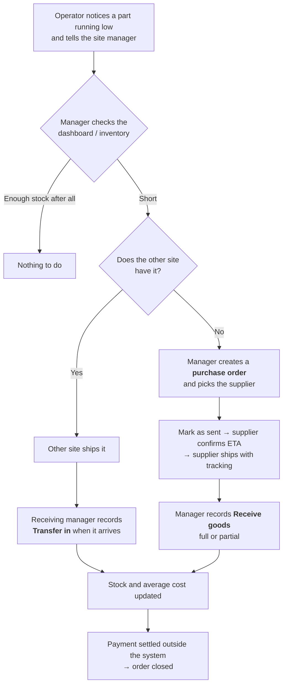
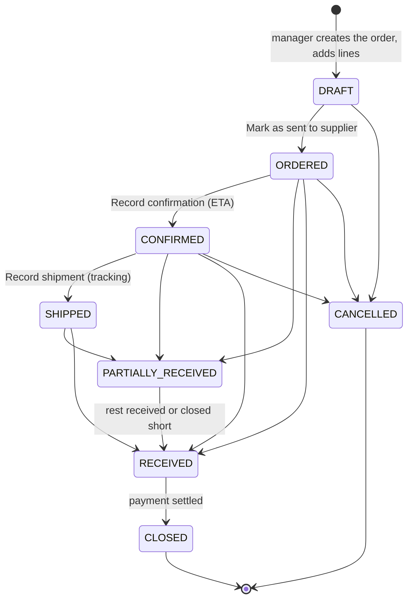
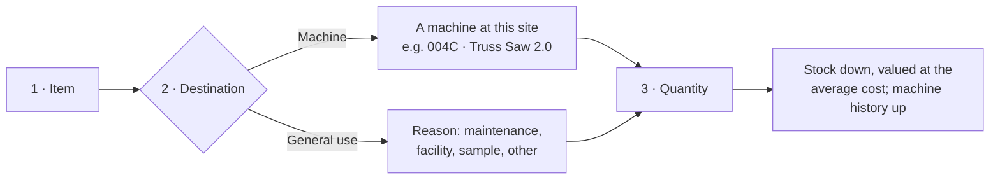
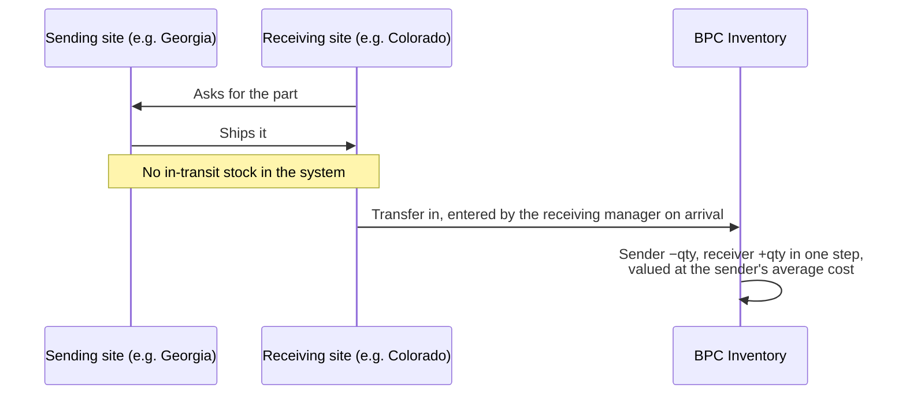
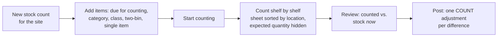
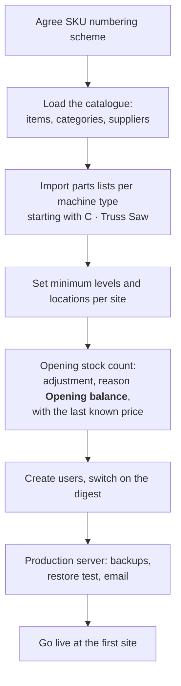

# BPC Inventory

Inventory management for the BPC manufacturing sites in the United States: **BPC001 Georgia** and **BPC002 Colorado**.

It answers two questions for the site managers:

1. **How much of what do we have, and at which site?**
2. **What is running out?**

It covers spare parts, wear parts, consumables and tools for the production machines. It is deliberately not an ERP, MRP or accounting system: it creates no invoices and no ledger entries for finance.


---

## Contents

- [Who uses it](#who-uses-it)
- [Key terms](#key-terms)
- [Processes for review](#processes-for-review)
  - [1. Replenishment: from a shortage to stock on the shelf](#1-replenishment-from-a-shortage-to-stock-on-the-shelf)
  - [2. Purchase order lifecycle](#2-purchase-order-lifecycle)
  - [3. Issuing stock](#3-issuing-stock)
  - [4. Transfer between sites](#4-transfer-between-sites)
  - [5. Cycle counting](#5-cycle-counting)
  - [6. Daily alerts](#6-daily-alerts)
  - [7. Go-live](#7-go-live)
- [User guide](#user-guide)
- [Rules the system enforces](#rules-the-system-enforces)
- [Technical setup](#technical-setup)

---

## Who uses it

| Role | Who | Can do |
|---|---|---|
| **Operator** | Machine operators, technicians | Read inventory, items, two-bin items, purchase orders and machines at both sites. Cannot change anything. |
| **Manager** | Site manager (one per site) | Everything at **their own site**: issue stock, receive goods, adjust, count, set minimum levels, raise purchase orders, receive transfers from the other site. Maintain items, categories, suppliers and parts lists. **Read** the other site. |
| **Administrator** | System owner | Everything at every site, plus users, sites, reason codes, machine register and the audit log. |

Managers can see the other site's stock on purpose: before ordering, check whether the other site has the part. A transfer is usually faster than an order.

## Key terms

| Term | Meaning | Example |
|---|---|---|
| **Site** | A US location that holds stock and machines | BPC001 Georgia |
| **Item** | A catalogue entry: spare part, wear part, consumable or tool. One catalogue for both sites. | SP-10001 Saw blade 18" carbide |
| **Item SKU** | The item's catalogue number | SP-10001 |
| **Machine type** | A family of machines, one letter. Holds the parts list. | C · Truss Saw |
| **Machine** | One physical machine at a site. Stock is issued to machines. | 004C |
| **Machine SKU** | Three-digit serial + type letter | 004C |
| **Revision** | Design version of a machine | Truss Saw **2.0** |
| **Parts list** | Items used on a machine type; a line can be limited to one revision | |
| **Criticality** | How badly a missing item hurts: **High** (its failure stops production and it is hard to get), **Normal**, **Low** | High |
| **Minimum level** | Below this quantity the item is flagged at that site | 2 pc |
| **Two-bin item** | Cheap, regularly used item kept in two bins: when the first bin is empty, reorder; the second covers the delivery time (also called two-bin kanban) | air filters, 6 per bin |
| **Location** | Where an item is stored at a site, free text | shelf CO-SP01 |
| **Average cost** | Moving average purchase price per item and site, USD, excluding freight and duty | $412.00 |

Machine types in use: **A** Wall Machine 6" · **B** Strapping & Header Machine · **C** Truss Saw · **D** Wall Machine 3.5" · **H** Header Machine · **S** Strapping Machine · **T** Truss JIG · **W** Wall JIG.

---

## Processes for review

The diagrams below describe how work flows through the system. They are the agreed process from the specification ([SPEC.md](SPEC.md), sections 1, 5 and 9a). Comment on them in a pull request if the real process differs.

### 1. Replenishment: from a shortage to stock on the shelf

The site manager decides; there is no central approval and no routing through Kraków. The Kraków warehouse is one supplier among others.



Operators do not raise requests in the system. The dashboard and the daily email are the trigger.

### 2. Purchase order lifecycle



- Lines can be changed only while the order is a **draft**. An empty price takes the supplier's last price.
- Goods may arrive without a confirmation or shipping notice: receiving is possible from **Ordered** on.
- **Cancel** is possible only while **nothing has been received**.
- **Receiving** defaults to what is outstanding. Receiving more than ordered is allowed, but warns: it usually means packs were counted instead of units.
- **Close short** ends a line that will not be delivered in full. It needs a reason and writes no stock movement.
- **Closed** means the commercial transaction ended. It has no accounting meaning.

Details: [Purchasing](docs/user-guide/06-purchasing.md).

### 3. Issuing stock

Every item taken from stock is recorded, in three steps. This is what turns guessed minimum levels into measured ones.



Stock can be issued to a machine only at the site where the machine is. Quickest path: open the machine page and use **Issue** next to the part.

Details: [Issuing, transfers and adjustments](docs/user-guide/05-issuing-transfers-adjustments.md).

### 4. Transfer between sites



If the sending site has recorded less than what arrived, the transfer is refused. The sending site first corrects its own stock with an adjustment.

### 5. Cycle counting



- Suggested frequency: **high** criticality **monthly**, **normal and low quarterly**, **two-bin items quarterly**. The dashboard shows how many items are due.
- Lines left blank are skipped. A posted count cannot be changed.

Details: [Stock counts](docs/user-guide/07-stock-counts.md).

### 6. Daily alerts

| What | Where | When |
|---|---|---|
| Status tiles (out of stock, below minimum, two-bin refills, orders to chase, counts due); shortages worst first with level bars and 12-week usage; the most used items of the last 30 days, flagging fast movers without a minimum | Dashboard | Always current |
| Below minimum, two-bin refills, late orders, unconfirmed orders | Daily email digest | Once a day at the site's digest hour (default 07:00 local), **only when something needs attention**, only to users who switched it on |
| Same, all sites in one message | Administrators' digest | Default 07:00 New York time |

### 7. Go-live



Checklist with owners: [Go-live](docs/user-guide/10-go-live.md).

---

## User guide

| Chapter | For |
|---|---|
| [1. Getting started](docs/user-guide/01-getting-started.md): login, menu, site, dashboard, profile | everyone |
| [2. Inventory and items](docs/user-guide/02-stock-and-items.md): finding stock, item pages, creating items | everyone; editing: managers |
| [3. Machines and parts lists](docs/user-guide/03-machines-and-parts-lists.md): register, revisions, CSV import | everyone; editing: managers, administrators |
| [4. Min levels, locations and two-bin items](docs/user-guide/04-min-levels-locations-two-bin.md) | managers |
| [5. Issuing, transfers and adjustments](docs/user-guide/05-issuing-transfers-adjustments.md) | managers |
| [6. Purchasing](docs/user-guide/06-purchasing.md): orders, receiving, suppliers | managers; reading: everyone |
| [7. Stock counts](docs/user-guide/07-stock-counts.md): opening count and cycle counts | managers |
| [8. Dashboard and daily digest](docs/user-guide/08-dashboard-and-digest.md) | everyone |
| [9. Administration](docs/user-guide/09-administration.md): users, sites, reason codes, audit log | administrators |
| [10. Go-live](docs/user-guide/10-go-live.md): checklist | project team |
| [11. Messages and what to do](docs/user-guide/11-messages.md) | everyone |

## Rules the system enforces

- **Stock never goes negative.** Taking out more than is recorded is refused, with the available quantity in the message.
- **History is never edited or deleted.** A mistake is corrected with a new adjustment. The database itself blocks changes to recorded movements.
- **Nothing is deleted.** Items, suppliers, machines and users are deactivated, so their history stays readable.
- **Each site has its own average cost.** Receipts at the order price and transfers at the sender's cost move it; issues do not.
- **Freight and duty are not in the cost.** Stock value is lower than the true landed cost. Fine for managing stock, not for asset valuation.
- **Every change to master data is in the audit log**, with who, when, and before → after.

---

## Technical setup

**[SPEC.md](SPEC.md) is the authoritative specification.** [CLAUDE.md](CLAUDE.md) lists the rules developers must not break.

**Stack:** Laravel 13 on PHP 8.2+, MariaDB 10.6+ (InnoDB), Blade with Tailwind and Alpine.js, Pest for tests.

### Local setup

```sh
brew install php composer mariadb node && brew services start mariadb
mariadb -e "CREATE DATABASE ims CHARACTER SET utf8mb4 COLLATE utf8mb4_unicode_ci;
            CREATE DATABASE ims_test CHARACTER SET utf8mb4 COLLATE utf8mb4_unicode_ci;
            CREATE USER 'ims'@'localhost' IDENTIFIED BY 'ims';
            GRANT ALL ON ims.* TO 'ims'@'localhost'; GRANT ALL ON ims_test.* TO 'ims'@'localhost';
            GRANT ALL ON ims_restore_test.* TO 'ims'@'localhost';"
composer install && npm install && npm run build
cp .env.example .env && php artisan key:generate   # then set SEED_ADMIN_PASSWORD and SEED_MANAGER_PASSWORD
php artisan migrate --seed                          # sites, reason codes, categories, machine register, dev users
php artisan db:seed --class=DemoDataSeeder          # optional: demo catalogue, history, orders, counts
php artisan serve
```

Development accounts: `admin@bpc.test`, `manager.bpc001@bpc.test` (Georgia), `manager.bpc002@bpc.test` (Colorado), with the passwords from `.env`.

### Tests

```sh
php artisan test                                   # all suites, against MariaDB
./vendor/bin/pest --testsuite=Concurrency          # real parallel processes: locks, double posting, numbering
```

The suites run against MariaDB on purpose: triggers, CHECK constraints and row locks are part of what is tested.

### Production

The production server and how to update it: **[docs/deployment.md](docs/deployment.md)** (`scripts/deploy.sh` deploys a new version).

Generic set-up for another server:

1. Environment: `APP_ENV=production`, `APP_DEBUG=false`, `APP_URL=https://…`, database credentials, SMTP (`MAIL_*`), `SESSION_LIFETIME=60`, `SESSION_SECURE_COOKIE=true`, `OPS_EMAIL`, `BACKUP_PATH` (a mounted volume off the database server), `ADMIN_DIGEST_HOUR` and `ADMIN_DIGEST_TIMEZONE`. Leave `SEED_*` empty.
2. Deploy: `composer install --no-dev -o && npm ci && npm run build && php artisan migrate --force && php artisan db:seed --force && php artisan optimize`.
3. Cron, as the web user:
   ```
   * * * * * cd /path/to/app && php artisan schedule:run >> /dev/null 2>&1
   ```
4. Create the first administrator with `php artisan tinker` (`User::create([...'role' => 'ADMIN'])`); everyone else under **Admin → Users**.
5. Before go-live, prove the backups: `php artisan ims:backup && php artisan ims:restore-test`.

### Scheduled jobs

| Job | When | What |
|---|---|---|
| `ims:send-digests` | hourly | each site's digest at its local `digest_hour`; administrators' all-sites digest at `ADMIN_DIGEST_HOUR` |
| `ims:backup` | 07:00 UTC | gzipped dump incl. triggers; older than `BACKUP_KEEP_DAYS` removed |
| `ims:verify-stock` | 07:30 UTC | every stock row against a ledger replay; failure mails `OPS_EMAIL` |

### Restoring a backup

```sh
gunzip -c storage/app/backups/ims-YYYYMMDD-HHMMSS.sql.gz | mariadb -u ims -p ims
php artisan ims:verify-stock
```
