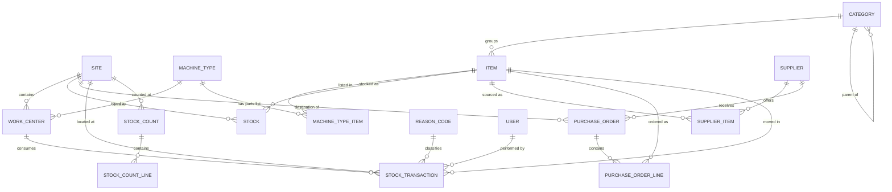
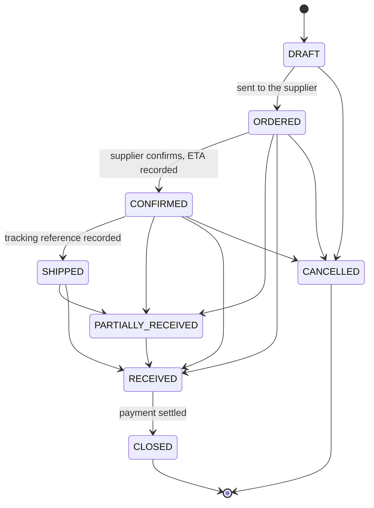

# BPC Inventory System — Build Specification

This is the complete and authoritative specification for the application. It supersedes every earlier document. If something is not described here, it is not in scope.

---

## 1. What this application is

Two manufacturing sites in the United States currently keep no inventory records of any kind. This application gives their managers a reliable answer to two questions:

1. How much of what do we have, at which site?
2. What is running out?

Everything in this specification serves those two questions.

The application manages spare parts, consumables and materials used to keep machines running. It is **not** an ERP, **not** an MRP and **not** an accounting system. It does not produce invoices, ledger entries or financial reports.

**Sites**

| Code | Location |
|---|---|
| BPC001 | Colorado |
| BPC002 | Georgia |

The schema must support adding more sites without modification.

**The replenishment process the application supports**

1. An operator notices a shortage and tells the site manager. *(Happens outside the application.)*
2. The manager reviews stock levels and confirms the shortage.
3. If the other site has stock, the material is transferred between sites.
4. If neither site has stock, the manager raises a purchase order.
5. The supplier is chosen from the supplier list. The Kraków warehouse is one supplier among others and gets no special treatment.
6. The supplier confirms the order and gives an estimated delivery date.
7. The supplier ships and provides a tracking reference.
8. The manager receives the goods and stock is updated.
9. Payment is settled elsewhere; the order is marked closed.

---

## 2. Technology

| Item | Choice |
|---|---|
| Language | PHP 8.2 or newer |
| Framework | Laravel (current stable release) |
| Database | MariaDB 10.6+, InnoDB, `utf8mb4_unicode_ci` |
| Auth scaffolding | Laravel Breeze, Blade stack |
| Views | Blade templates |
| CSS | Tailwind |
| JS | Alpine.js only; no SPA, no build-heavy frontend |
| Background work | Laravel scheduler and queue (database driver) |
| Mail | SMTP via Laravel Mail |
| Tests | Pest or PHPUnit — feature tests required for every rule in section 5 |

**Conventions**

- Table names plural snake_case; Eloquent models singular.
- Every status, type and role is a PHP backed enum under `App\Enums`, never a bare string.
- All stock mutations go through `App\Services\StockService`. Controllers never touch stock tables directly.
- Authorisation through Laravel policies. Never check roles inline in Blade or controllers.
- Validation through Form Request classes.
- All money and quantity arithmetic uses `bcmath` or integer-scaled arithmetic. Never float.
- Interface language is English. All timestamps stored in UTC and displayed in the site's local time zone.

---

## 3. Domain rules that shape everything

Read this section before writing any code. These are deliberate decisions, not oversights.

1. **The item catalogue is global, stock is per site.** One SKU exists once and has a stock row per site.
2. **No batch or serial number tracking.** Traceability is at transaction level: who moved what, when, where, and for which work centre.
3. **Moving average cost, held per item per site.** Each site carries its own cost basis.
4. **Freight and duty are excluded from cost.** Only the supplier's net price enters the average. Inventory value will therefore read below the true cost of acquisition. This is accepted.
5. **Single currency: USD.** No exchange rates anywhere.
6. **Stock locations are flat.** Stock exists at a site. A free-text `bin` field records the shelf. There is no location tree, no zones, no sub-locations.
7. **Site-to-site transfer is a single step** with no in-transit state. It is entered by the receiving manager when the goods physically arrive.
8. **One purchase order serves one site.** The destination site is a header field.
9. **Partial receipts are supported.** A line may be received across several deliveries, or closed short.
10. **Operators have read-only access.** Managers record all stock movements.
11. **The stock ledger is append-only.** Mistakes are corrected by compensating adjustments, never by editing or deleting rows.
12. **Stock may never go negative.**

---

## 4. Data model



### 4.1 sites

| Column | Type | Notes |
|---|---|---|
| id | bigint PK | |
| code | varchar(10) unique | BPC001 |
| name | varchar(100) | |
| state | varchar(2) | CO, GA |
| timezone | varchar(64) | America/Denver, America/New_York |
| digest_hour | tinyint default 7 | local hour (0–23) at which the daily digest is sent |
| is_active | boolean default true | |
| timestamps | | |

### 4.2 machine_types

Holds the parts list once per machine type, so the same list is not duplicated across identical machines at both sites.

| Column | Type | Notes |
|---|---|---|
| id | bigint PK | |
| code | varchar(30) unique | TRUSS_SAW |
| name | varchar(150) | Truss Saw |
| description | text nullable | |
| is_active | boolean default true | |
| timestamps | | |

### 4.3 work_centers

A work centre is a production cell, in practice a named machine at a site.

| Column | Type | Notes |
|---|---|---|
| id | bigint PK | |
| site_id | FK sites | |
| machine_type_id | FK machine_types nullable | gives it a parts list |
| code | varchar(30) | 004C |
| name | varchar(150) | Truss Saw 004C |
| is_active | boolean default true | |
| timestamps | | |

Unique on `(site_id, code)`.

### 4.4 categories

| Column | Type | Notes |
|---|---|---|
| id | bigint PK | |
| parent_id | FK categories nullable | one level of nesting is enough |
| name | varchar(100) | |
| is_structural | boolean default false | items may not be assigned to a structural category |
| default_bin | varchar(40) nullable | prefills the bin on new items |
| timestamps | | |

### 4.5 items

| Column | Type | Notes |
|---|---|---|
| id | bigint PK | |
| sku | varchar(40) unique | mandatory; immutable once the item has transactions |
| name | varchar(200) | |
| description | text nullable | |
| category_id | FK categories | must not be structural |
| uom | varchar(20) | pc, set, l, m |
| manufacturer | varchar(100) nullable | |
| mpn | varchar(80) nullable | manufacturer part number |
| drawing_no | varchar(80) nullable | |
| criticality | enum A,B,C nullable | drives count frequency and dashboard ordering |
| is_active | boolean default true | soft deactivation only, never hard delete |
| timestamps | | |

### 4.6 stocks

Stock and cost for one item at one site. Created on first use. This table is derived state and must always be reconstructible by replaying `stock_transactions`.

| Column | Type | Notes |
|---|---|---|
| id | bigint PK | |
| item_id | FK items | |
| site_id | FK sites | |
| qty | decimal(14,3) default 0 | never negative |
| avg_cost | decimal(14,4) default 0 | USD |
| min_level | decimal(14,3) default 0 | 0 disables the alert |
| bin | varchar(40) nullable | free-text shelf reference |
| is_kanban | boolean default false | |
| bin_qty | decimal(14,3) nullable | units per kanban bin; required when is_kanban |
| last_counted_at | timestamp nullable | set when a stock count is posted |
| timestamps | | |

Unique on `(item_id, site_id)`. Index on `(site_id, qty)`.

### 4.7 machine_type_items

The parts list for a machine type.

| Column | Type | Notes |
|---|---|---|
| id | bigint PK | |
| machine_type_id | FK machine_types | |
| item_id | FK items | |
| reference | varchar(80) nullable | position or drawing reference |
| qty_per_machine | decimal(14,3) nullable | informational |
| is_consumable | boolean default false | wears out rather than being fitted |
| note | varchar(255) nullable | |

Unique on `(machine_type_id, item_id)`.

### 4.8 suppliers

| Column | Type | Notes |
|---|---|---|
| id | bigint PK | |
| name | varchar(150) | the Kraków warehouse is an ordinary row here |
| contact_email | varchar(150) nullable | |
| contact_phone | varchar(50) nullable | |
| lead_time_days | integer nullable | indicative only, never used in calculations |
| notes | text nullable | |
| is_active | boolean default true | |
| timestamps | | |

### 4.9 supplier_items

| Column | Type | Notes |
|---|---|---|
| id | bigint PK | |
| supplier_id | FK suppliers | |
| item_id | FK items | |
| supplier_sku | varchar(80) nullable | |
| last_price | decimal(14,4) nullable | prefills new order lines |
| pack_size | decimal(14,3) default 1 | units received per ordered pack |
| timestamps | | |

Unique on `(supplier_id, item_id)`.

### 4.10 purchase_orders

| Column | Type | Notes |
|---|---|---|
| id | bigint PK | |
| number | varchar(20) unique | PO-2026-0001 |
| supplier_id | FK suppliers | |
| site_id | FK sites | destination |
| status | enum | see 5.3 |
| ordered_at | date nullable | set on DRAFT to ORDERED |
| confirmed_at | date nullable | step 6 |
| eta | date nullable | step 6 |
| shipped_at | date nullable | step 7 |
| tracking_ref | varchar(200) nullable | free text or URL |
| closed_at | date nullable | step 9 |
| notes | text nullable | |
| created_by | FK users | |
| timestamps | | |

### 4.11 purchase_order_lines

| Column | Type | Notes |
|---|---|---|
| id | bigint PK | |
| purchase_order_id | FK purchase_orders | cascade delete only while DRAFT |
| item_id | FK items | |
| qty_ordered | decimal(14,3) | > 0 |
| qty_received | decimal(14,3) default 0 | |
| unit_price | decimal(14,4) | net, USD |
| is_closed | boolean default false | closed short by the manager |
| timestamps | | |

### 4.12 stock_transactions

The ledger. Append only: no updates, no deletes, ever.

| Column | Type | Notes |
|---|---|---|
| id | bigint PK | |
| type | enum | RECEIPT, ISSUE_WORK_CENTER, ISSUE_GENERAL, TRANSFER_OUT, TRANSFER_IN, ADJUSTMENT |
| item_id | FK items | |
| site_id | FK sites | the site whose stock changes |
| qty_delta | decimal(14,3) | signed: positive in, negative out |
| unit_cost | decimal(14,4) | cost applied to this movement |
| value | decimal(14,4) | qty_delta × unit_cost, signed |
| qty_after | decimal(14,3) | stock at this site after the movement |
| avg_cost_after | decimal(14,4) | |
| work_center_id | FK work_centers nullable | required for ISSUE_WORK_CENTER |
| counter_site_id | FK sites nullable | required for TRANSFER_OUT and TRANSFER_IN |
| purchase_order_line_id | FK nullable | required for RECEIPT |
| stock_count_id | FK nullable | set when the adjustment came from a count |
| transfer_group | uuid nullable | links the two rows of one transfer |
| reason_code_id | FK nullable | required for ADJUSTMENT and ISSUE_GENERAL |
| note | varchar(500) nullable | |
| user_id | FK users | |
| created_at | timestamp | no updated_at |

Indexes on `(item_id, site_id, created_at)`, `(work_center_id, created_at)`, `(type, created_at)`.

### 4.13 reason_codes

| Column | Type | Notes |
|---|---|---|
| id | bigint PK | |
| applies_to | enum ADJUSTMENT, ISSUE_GENERAL | |
| code | varchar(20) | |
| label | varchar(100) | |
| is_active | boolean default true | |

### 4.14 stock_counts and stock_count_lines

Cycle counting. A count is created for a site, populated with items, counted, then posted. Posting creates adjustment transactions for every discrepancy.

**stock_counts**

| Column | Type | Notes |
|---|---|---|
| id | bigint PK | |
| site_id | FK sites | |
| reference | varchar(20) unique | SC-2026-0001 |
| status | enum DRAFT, COUNTING, POSTED, CANCELLED | |
| scope_note | varchar(255) nullable | e.g. "Class A monthly" |
| created_by | FK users | |
| posted_by | FK users nullable | |
| posted_at | timestamp nullable | |
| timestamps | | |

**stock_count_lines**

| Column | Type | Notes |
|---|---|---|
| id | bigint PK | |
| stock_count_id | FK stock_counts | |
| item_id | FK items | |
| qty_expected | decimal(14,3) | snapshot taken when the line is added |
| qty_counted | decimal(14,3) nullable | null means not yet counted |
| note | varchar(255) nullable | |

Unique on `(stock_count_id, item_id)`.

### 4.15 users

| Column | Type | Notes |
|---|---|---|
| id | bigint PK | |
| name | varchar(100) | |
| email | varchar(150) unique | login |
| password | varchar(255) | Laravel hashing |
| role | enum ADMIN, MANAGER, OPERATOR | |
| site_id | FK sites nullable | null for ADMIN, meaning all sites |
| is_active | boolean default true | |
| notify_low_stock | boolean default true | |
| last_login_at | timestamp nullable | |
| timestamps, remember_token | | |

### 4.16 audit_logs

Master data changes only. Stock movements live in `stock_transactions`.

| Column | Type | Notes |
|---|---|---|
| id | bigint PK | |
| entity | varchar(40) | item, supplier, user, stock, machine_type |
| entity_id | bigint | |
| action | enum CREATE, UPDATE, DELETE | |
| changes | json | changed fields only, before and after |
| user_id | FK users | |
| created_at | timestamp | |

---

## 5. Business rules

Every rule in this section must have a corresponding feature test.

### 5.1 Moving average cost

Held per item per site in `stocks.avg_cost`. Recalculated only on movements that add stock.

**Incoming movement** (RECEIPT, TRANSFER_IN, positive ADJUSTMENT with an explicit cost):

```
new_qty = qty + incoming_qty
new_avg = (qty * avg_cost + incoming_qty * incoming_unit_cost) / new_qty
```

If `qty` is zero, or the stock row is being created, `new_avg = incoming_unit_cost`.

**Outgoing movement** (ISSUE_WORK_CENTER, ISSUE_GENERAL, TRANSFER_OUT, negative ADJUSTMENT):

```
unit_cost = current avg_cost
value     = qty_delta * avg_cost      // negative
avg_cost  unchanged
```

**Positive adjustment without a supplied cost** uses the current average and leaves it unchanged. If stock is zero and no average exists, the user must supply a unit cost; the form rejects the submission otherwise.

Store four decimal places. Round only for display, never in storage.

**Rounding.** `new_avg` and `value` are computed at higher internal precision and rounded **half-up to four decimal places** exactly once, when stored. Never truncate: `bcdiv` and `bcmul` truncate by default, so a dedicated rounding helper is mandatory. `(10 × 4 + 5 × 6) / 15` must store as 4.6667, not 4.6666. Replaying the ledger (acceptance criterion 8) applies the same rounding at the same points.

### 5.2 Stock movements

| Type | Direction | Mandatory fields |
|---|---|---|
| RECEIPT | in | purchase_order_line_id; `unit_cost` is the line's `unit_price` |
| ISSUE_WORK_CENTER | out | work_center_id |
| ISSUE_GENERAL | out | reason_code_id |
| TRANSFER_OUT | out | counter_site_id, transfer_group |
| TRANSFER_IN | in | counter_site_id, transfer_group |
| ADJUSTMENT | either | reason_code_id |

**Rules applying to all movements**

1. Quantity entered by the user is always positive. Direction comes from the transaction type, never from a negative input.
2. An outgoing movement that would take stock below zero is rejected with a message naming the available quantity.
3. Each movement writes one `stock_transactions` row per affected site and updates the matching `stocks` row, inside one database transaction.
4. The `stocks` row is locked with `SELECT ... FOR UPDATE` before being read for the calculation. Two managers receiving the same line simultaneously must not double-count.
5. `qty_after` and `avg_cost_after` are written on every row so the ledger can be read without replaying it.
6. Nothing in `stock_transactions` is ever updated or deleted. Corrections are compensating adjustments.

**Transfer between sites** writes two rows sharing one `transfer_group` UUID:

- TRANSFER_OUT at the sending site, valued at the sending site's current average cost
- TRANSFER_IN at the receiving site, with `unit_cost` equal to that same value, which feeds the receiving site's average

Both rows are written in one database transaction. The transfer is entered by the manager of the receiving site on a dedicated incoming form (`/transfers/create`), not on the issue form. The form asks for the source site, the item and the quantity.

Entering a transfer writes TRANSFER_OUT at the other site. This is the single exception to the rule that a manager writes only to their own site, and `StockPolicy` must grant it explicitly: a manager may create a transfer whose **receiving** site is their own.

If the sending site's recorded stock is lower than the quantity arriving, the transfer is rejected like any other outgoing movement. The message must name the available quantity at the sending site and say that the sending site's stock must first be corrected with an adjustment there.

### 5.3 Purchase order lifecycle



1. Lines may be received while the order is ORDERED, CONFIRMED, SHIPPED or PARTIALLY_RECEIVED.
2. The order moves to RECEIVED automatically once every line satisfies `qty_received >= qty_ordered` or `is_closed = true`.
3. Closing a line short is an explicit action requiring a note. It creates no stock movement.
4. Receiving more than ordered is allowed but shows a warning stating that this usually indicates a pack size error.
5. CLOSED carries no accounting meaning. It records only that the commercial transaction ended.
6. CANCELLED is available only while nothing has been received.
7. Lines may be added, edited or removed only while the order is DRAFT.
8. `ordered_at`, `confirmed_at`, `shipped_at` and `closed_at` are set automatically on the corresponding transition and are editable afterwards by a manager.
9. Order quantities, received quantities and `unit_price` are always in the item's unit of measure. `supplier_items.pack_size` is informational: it is shown next to the line to help the manager order in whole packs, and the over-receipt warning mentions it, but no conversion is ever applied.

### 5.4 Numbering

- Purchase orders: `PO-{YYYY}-{NNNN}`, four digits, sequence restarting each calendar year.
- Stock counts: `SC-{YYYY}-{NNNN}`, same pattern.

Generated inside the insert transaction with a table lock or an atomic counter. Gaps are acceptable; duplicates are not.

### 5.5 Low stock alerts

An item is below minimum at a site when `min_level > 0` and `qty < min_level`.

For kanban items (`is_kanban = true`), the alert fires when `qty <= bin_qty`, meaning one bin or less remains. `min_level` is ignored for these items, and `bin_qty` is required.

Quantity on open purchase orders is displayed alongside the shortage but is never added to available stock and never suppresses an alert.

### 5.6 Cycle counting

1. A manager creates a count for their site and adds lines, either by selecting a category, by criticality class, by kanban flag, or by picking items individually.
2. `qty_expected` is snapshotted when the line is added.
3. Status moves to COUNTING. Counted quantities are entered per line.
4. Posting the count creates one ADJUSTMENT transaction for every line where `qty_counted` differs from the stock quantity at the moment of posting, using the reason code `COUNT`. Lines with no difference create no transaction.
5. Posting recomputes the difference against the live stock quantity, not against `qty_expected`, because stock may have moved during counting. The difference between `qty_expected` and the live quantity is shown to the user before posting is confirmed.
6. `stocks.last_counted_at` is set for every counted line in a posted count, including lines with no discrepancy.
7. Lines with `qty_counted = null` at posting are skipped: no transaction, no `last_counted_at` update. The confirmation screen states how many lines will be skipped.
8. A posted count is immutable. A cancelled count creates no transactions.
9. An ADJUSTMENT with reason `OPENING` also sets `stocks.last_counted_at`, since an opening balance is a physical count. Without this every item would show as due for counting on the first day.

**Suggested count frequency**, surfaced as a due list rather than enforced: class A monthly, class B and C quarterly, kanban items quarterly.

### 5.7 Kanban

Kanban applies to low-value, regularly consumed items. The physical method is two bins: when one empties, it is a signal to reorder while the second covers the lead time.

In the application this means only:

- `is_kanban` and `bin_qty` on the stock row
- the alert rule in 5.5
- a kanban view listing all kanban items at a site with their bin quantity and current stock, sorted by those needing refill first

Stock is still recorded in the item's unit of measure, not in bins. The application does not model individual bins, print cards, or track which bin is in use.

### 5.8 Machine parts lists

- A parts list belongs to a machine type, not to an individual work centre, so identical machines at both sites share one list.
- A work centre with no machine type simply has no parts list; this is valid.
- The work centre screen shows the parts list with current stock at that work centre's site next to each line, so a technician can see what is available before starting work.
- The parts list is informational. It does not reserve stock, drive ordering, or restrict which items may be issued to a work centre.

### 5.9 Email notifications

A single daily digest, sent by a scheduled job at a configurable hour per site, to every active user with `notify_low_stock = true`, scoped to their site. Administrators receive all sites in one message.

Contents: items below minimum, kanban items needing refill, purchase orders past their ETA with nothing received, and purchase orders ordered but never confirmed.

The digest is skipped entirely when there is nothing to report. No per-event emails, no alert fatigue.

---

## 6. Roles and authorisation

| Action | ADMIN | MANAGER | OPERATOR |
|---|---|---|---|
| View stock, items, orders, work centres | all sites | own site, read-only on the other | own site, read-only on the other |
| Create and edit items and categories | yes | yes | no |
| Set minimum levels, bins, kanban settings | yes | own site | no |
| Create, send and manage purchase orders | yes | own site | no |
| Receive goods | yes | own site | no |
| Issue stock to a work centre or generally | yes | own site | no |
| Transfer between sites | yes | as the receiving site | no |
| Adjustments | yes | own site | no |
| Create and post stock counts | yes | own site | no |
| Manage suppliers and supplier items | yes | yes | no |
| Manage machine types and parts lists | yes | yes | no |
| Manage work centres | yes | no | no |
| Manage users, roles, reason codes | yes | no | no |

Cross-site read access is deliberate: step 3 of the process requires a manager to see the other site's stock before ordering.

Implement as policies: `ItemPolicy`, `StockPolicy`, `PurchaseOrderPolicy`, `StockCountPolicy`, `WorkCenterPolicy`, `UserPolicy`. A manager's write access is granted only when the target record's `site_id` matches their own.

Role is a single enum field on the user. Granting operators the right to issue stock later must require no schema change.

---

## 7. Screens

A site selector sits in the header. It defaults to the user's own site, is switchable for administrators, and every form uses it rather than silently assuming a site.

| # | Route | Screen | Access |
|---|---|---|---|
| 1 | `/login` | Login | public |
| 2 | `/` | Dashboard | all |
| 3 | `/stock` | Stock list: filter by category, criticality, below-minimum, kanban; search by SKU and name; CSV export | all |
| 4 | `/items/{item}` | Item detail: master data, stock and average cost at every site, movement history, suppliers, machine types using it | all |
| 5 | `/items/create`, `/items/{item}/edit` | Item form | manager, admin |
| 6 | `/stock/levels` | Bulk editor for min level, bin, kanban flag and bin quantity at the selected site | manager, admin |
| 7 | `/purchase-orders` | Order list filtered by status and supplier | all; operators read-only |
| 8 | `/purchase-orders/{po}` | Order detail: lines, status transitions, ETA, tracking, receive action | all; actions manager, admin |
| 9 | `/purchase-orders/{po}/receive` | Receive goods: one row per open line, quantity defaulting to the outstanding amount | manager, admin |
| 10 | `/issues/create` | Issue stock: two modes — work centre, general | manager, admin |
| 10a | `/transfers/create` | Transfer in from another site, entered by the receiving manager on arrival | manager, admin |
| 11 | `/adjustments/create` | Adjustment with reason code | manager, admin |
| 12 | `/stock-counts`, `/stock-counts/{count}` | Count list, count sheet, posting | manager, admin |
| 13 | `/kanban` | Kanban view for the selected site | all |
| 14 | `/work-centers`, `/work-centers/{wc}` | Work centre list and detail with parts list and consumption history | all; editing manager, admin |
| 15 | `/machine-types`, `/machine-types/{type}` | Machine types and their parts lists | manager, admin |
| 16 | `/suppliers`, `/suppliers/{supplier}` | Suppliers and supplier items | manager, admin |
| 17 | `/admin/users`, `/admin/reason-codes`, `/admin/sites` | Administration | admin |

**Interface principles**

1. The issue form must be completable in three interactions: pick the item, pick the destination, enter the quantity. Everything else is defaulted or hidden.
2. Every list view has a CSV export. This is the escape valve for every report nobody specified.
3. Nothing is deleted. Records are deactivated; stock errors are compensated.
4. Every form that changes stock shows the resulting quantity before submission.

---

## 8. Dashboard

Scoped to the selected site; administrators may switch to a consolidated view.

**Alert panel, at the top**

- items below minimum, class A first
- kanban items at or below one bin
- items at zero stock that have a minimum set
- purchase orders past their ETA with nothing received
- purchase orders sent but never confirmed by the supplier
- purchase orders partially received for more than 30 days
- stock counts due by the suggested frequency

**Figures**

- total inventory value at the site and by category
- count of items below minimum against items with a minimum set
- consumption value for the current month against the previous month
- top ten work centres by consumption value over the last 90 days
- items with no movement in the last 12 months

The work centre figures are the reason every issue records both quantity and cost. They are what will eventually correct the minimum levels, which have to be set from guesswork because no consumption history exists yet.

---

## 9. Seed data

Seeders must be provided and must be idempotent.

**Sites** — BPC001 Colorado `America/Denver`, BPC002 Georgia `America/New_York`.

**Reason codes**

| applies_to | code | label |
|---|---|---|
| ADJUSTMENT | COUNT | Cycle count correction |
| ADJUSTMENT | DAMAGE | Damaged |
| ADJUSTMENT | LOSS | Lost or missing |
| ADJUSTMENT | FOUND | Found, not recorded |
| ADJUSTMENT | OPENING | Opening balance |
| ADJUSTMENT | SCRAP | Scrapped |
| ISSUE_GENERAL | MAINTENANCE | General maintenance |
| ISSUE_GENERAL | FACILITY | Facility and building |
| ISSUE_GENERAL | SAMPLE | Testing or sample |
| ISSUE_GENERAL | OTHER | Other, see note |

**Categories** — structural parents with children:

- Spare Parts: Mechanical, Hydraulic, Pneumatic, Electrical, Electronic & Optics
- Wear Parts: Punches, Die Blades, Dies & Forming
- Consumables: Cutting, Filtration, Lubricants & Fluids, Fasteners, Seals & Gaskets
- Tools: Power Tools, Hand Tools, Measuring & Gauges
- Machines: Production Machines

**Users** — one administrator plus one manager per site, for development only, with passwords set from environment variables.

**Demo data** — a separate seeder, never run in production: a few machine types with parts lists, a handful of suppliers and items, and sample transactions.

---

## 10. Values to be supplied before go-live

These are configuration, not code. Build the application so they can be entered through the interface or a seeder, and do not hard-code them.

| Item | Status |
|---|---|
| SKU numbering pattern and its validation regex | to be supplied; until then accept any non-empty string up to 40 characters |
| Work centre list for both sites | to be supplied |
| Machine types and their parts lists | to be supplied; import from spreadsheet |
| Initial minimum levels | to be supplied; derive from the suggested quantity column of the existing spare parts spreadsheets |
| Opening stock quantities and costs | from the opening stock count, entered as ADJUSTMENT with reason OPENING |
| Daily digest hour per site | `sites.digest_hour`, editable under `/admin/sites`, default 7 (07:00 local) |

---

## 11. Explicitly out of scope

Do not build any of this, even if it seems natural:

- tools issued to and tracked against individual people
- shortage requests raised by operators
- batch numbers, serial numbers, expiry dates
- barcode scanning, label printing
- maintenance schedules, work orders, failure and downtime logging
- freight, duty or any landed cost allocation
- invoices, payments, ledger entries, inventory valuation reports for accounting
- multiple currencies, exchange rates
- in-transit stock, shipment status beyond the fields defined here, customs status
- location hierarchies, zones, bin management beyond the free-text field
- supplier portals, external access of any kind
- reorder point calculations, forecasting, automatic order generation
- a REST API or mobile application

---

## 12. Build order

Each stage must leave the application working and tested.

| Stage | Contents |
|---|---|
| 1 | Schema and migrations, enums, models, Breeze auth, roles, policies, site selector, layout |
| 2 | Categories, items, suppliers, supplier items, machine types, parts lists, work centres |
| 3 | `StockService`, adjustments, stock list, item detail, bulk level editor — the application becomes usable here and the opening stock count can start |
| 4 | Purchase orders, status transitions, receiving with partial receipts |
| 5 | Issues: work centre, general, transfer between sites |
| 6 | Stock counts: creation, counting, posting |
| 7 | Dashboard, kanban view, CSV exports |
| 8 | Daily digest email, audit log, hardening |

Stage 3 matters most: the opening stock count is the longest single task in the whole project and does not need the rest of the application to exist.

---

## 13. Acceptance criteria

Each of these must be covered by an automated test.

**Costing**

1. Receiving 10 units at 5.00 into empty stock gives quantity 10 and average 5.0000.
2. Receiving a further 10 at 7.00 gives quantity 20 and average 6.0000.
3. Issuing 5 units leaves quantity 15, average unchanged at 6.0000, and writes a transaction with value −30.0000.
4. A transfer of 5 units from a site with average 6.0000 to a site with 10 units at 4.0000 leaves the sender at average 6.0000 and the receiver at quantity 15, average 4.6667.
5. A positive adjustment into zero stock without a supplied unit cost is rejected.

**Stock integrity**

6. An issue larger than available quantity is rejected, and no transaction row is written.
7. Two concurrent receipts against the same line produce exactly two transactions and a correct final quantity.
8. Replaying all transactions for an item and site reproduces the current `stocks` row exactly.
9. No code path updates or deletes a `stock_transactions` row.

**Purchase orders**

10. Receiving 6 of 10 sets the order to PARTIALLY_RECEIVED and leaves the line open with 4 outstanding.
11. Receiving the remaining 4 sets the order to RECEIVED.
12. Closing the remaining 4 short also sets the order to RECEIVED and writes no stock movement.
13. Receiving 12 against 10 succeeds, warns the user and records quantity 12.
14. An order with a received line cannot be cancelled.
15. Two orders created in the same year receive consecutive numbers with no duplicates.

**Counts**

16. Posting a count where counted equals system quantity writes no transaction but updates `last_counted_at`.
17. Posting a count where counted is lower writes an ADJUSTMENT with reason COUNT and the negative difference.
18. A posted count cannot be edited or posted twice.

**Alerts and access**

19. An item with quantity 3 and minimum 5 appears in the low stock list; with minimum 0 it does not.
20. A kanban item with bin quantity 20 and stock 20 appears in the refill list; with stock 21 it does not.
21. A manager at BPC001 can read BPC002 stock but cannot issue, receive or adjust it.
22. An operator receives a 403 on every write route.
23. The daily digest is not sent when there is nothing to report.

**Added in revision 1.1**

24. A manager at BPC002 can enter a transfer from BPC001 into BPC002, but not from BPC002 into BPC001.
25. A transfer exceeding the sending site's recorded stock is rejected, names the available quantity, and writes no rows at either site.
26. Posting a count with an uncounted line writes nothing for that line and leaves its `last_counted_at` unchanged.
27. An OPENING adjustment sets `last_counted_at`.
28. An order in CONFIRMED status can be received in full and moves straight to RECEIVED.

---

## Change history

| Version | Date | Change |
|---|---|---|
| 1.0 | 2026-10-05 | Initial build specification |
| 1.1 | 2026-10-05 | Half-up rounding rule; receipt cost from line price; transfer moved to a dedicated incoming form with explicit policy exception and rejection guidance; missing receive transitions from ORDERED and CONFIRMED; pack size informational only; uncounted lines skipped at posting; OPENING sets `last_counted_at`; operators read purchase orders; `sites.digest_hour` |
