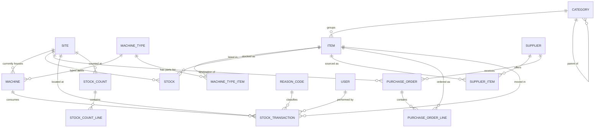
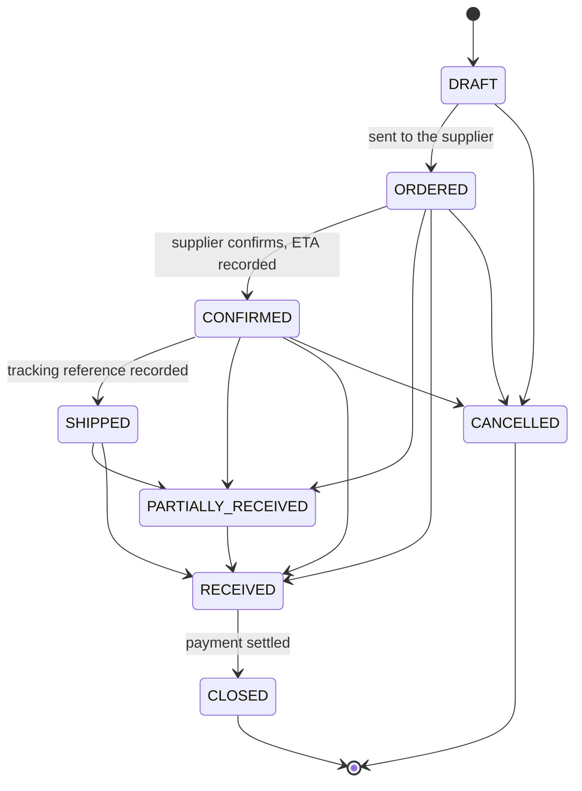

# BPC Inventory System — Build Specification

This is the complete and authoritative specification for the application. It supersedes every earlier document. If something is not described here, it is not in scope.

---

## 1. What this application is

Two manufacturing sites in the United States currently keep no inventory records of any kind. This application gives their managers a reliable answer to two questions:

1. How much of what do we have, at which site?
2. What is running out?

Everything in this specification serves those two questions.

The application manages spare parts, consumables and materials used to keep machines running. It is **not** an ERP, **not** an MRP and **not** an accounting system. It does not produce invoices, ledger entries or financial reports.

**Sites**

| Code | Location |
|---|---|
| BPC001 | Georgia |
| BPC002 | Colorado |

The schema must support adding more sites without modification.

Machines that are currently located outside these two sites, in Poland, are not registered in the application. A machine enters the register when it is installed at a US site.

**The replenishment process the application supports**

1. An operator notices a shortage and tells the site manager. *(Happens outside the application.)*
2. The manager reviews stock levels and confirms the shortage.
3. If the other site has stock, the material is transferred between sites.
4. If neither site has stock, the manager raises a purchase order.
5. The supplier is chosen from the supplier list. The Kraków warehouse is one supplier among others and gets no special treatment.
6. The supplier confirms the order and gives an estimated delivery date.
7. The supplier ships and provides a tracking reference.
8. The manager receives the goods and stock is updated.
9. Payment is settled elsewhere; the order is marked closed.

---

## 1a. Terminology

These terms are used with exactly one meaning throughout the specification, the code and the interface. The interface is in English; the Polish term is given for the team's convenience.

| Term (UI and code) | Polish | Meaning | Example |
|---|---|---|---|
| Site (`site`) | zakład | A US manufacturing location where stock is held and machines are installed. | BPC001 Georgia |
| Item (`item`) | pozycja katalogowa | A catalogue entry for a spare part, wear part, consumable or tool. Global, shared by both sites. | SP-10001 Saw blade |
| Item SKU (`items.sku`) | SKU pozycji | The unique catalogue number of an item. | SP-10001 |
| Machine type (`machine_type`) | typ maszyny | A family of machines, identified by a single letter. Holds the parts list. | C · Truss Saw |
| Machine (`machine`) | maszyna | One physical machine installed at a site. Stock is issued to machines. | 004C |
| Criticality (`items.criticality`) | krytyczność | How badly a missing item hurts: **High** (its failure stops production and it is hard to get), **Normal**, **Low**. Called class A, B, C in earlier documents. | High |
| Machine SKU (`machines.sku`) | SKU maszyny | Three-digit serial number followed by the type letter. Unique across all machines ever built, including those not in the register. | 004C |
| Revision (`revision`) | rewizja | The design version of a machine, in the form `major.minor`. | 2.0 |
| Machine name (`machines.name`) | nazwa własna | The machine's proper name. It may differ between revisions and variants of the same type. Displayed with the revision appended. | Truss Saw 2.0 |
| Parts list (`machine_type_items`) | lista części | The items used on a machine type. A line applies to every revision of the type unless it is limited to one. | |
| Inventory | stan magazynu | The list of items with their quantities on hand at each site (screen 3). | |
| Two-bin item (`stocks.is_kanban`) | pozycja w systemie dwóch pojemników | A cheap, regularly used item kept in two bins: when the first is empty, it is reordered while the second covers the delivery time. Called *kanban* in earlier documents; the interface says *two-bin*. | air filters, 6 per bin |
| Location (`stocks.bin`) | miejsce składowania | Where an item is stored at a site, free text. The interface says *location*; *bin* is used only for the two-bin container. | shelf CO-SP01 |
| Stock count | inwentaryzacja cykliczna | Counting part of the stock and correcting the records (5.6). | SC-2026-0003 |

**Machine types**

| Letter | Type name |
|---|---|
| A | Wall Machine 6" |
| B | Strapping & Header Machine |
| S | Strapping Machine |
| H | Header Machine |
| C | Truss Saw |
| D | Wall Machine 3.5" |
| W | Wall JIG |
| T | Truss JIG |

The term *work centre* used in earlier documents is retired. Consumption is recorded against a machine. Consumption that belongs to no machine, such as general workshop or building maintenance, is a general issue with a reason code.

---

## 2. Technology

| Item | Choice |
|---|---|
| Language | PHP 8.2 or newer |
| Framework | Laravel (current stable release) |
| Database | MariaDB 10.6+, InnoDB, `utf8mb4_unicode_ci` |
| Auth scaffolding | Laravel Breeze, Blade stack |
| Views | Blade templates |
| CSS | Tailwind |
| JS | Alpine.js only; no SPA, no build-heavy frontend |
| Background work | Laravel scheduler and queue (database driver) |
| Mail | SMTP via Laravel Mail |
| Tests | Pest or PHPUnit — feature tests required for every rule in section 5 |

**Conventions**

- Table names plural snake_case; Eloquent models singular.
- Every status, type and role is a PHP backed enum under `App\Enums`, never a bare string.
- All stock mutations go through `App\Services\StockService`. Controllers never touch stock tables directly.
- Authorisation through Laravel policies. Never check roles inline in Blade or controllers.
- Validation through Form Request classes.
- All money and quantity arithmetic uses `bcmath` or integer-scaled arithmetic. Never float.
- Interface language is English. All timestamps stored in UTC and displayed in the site's local time zone.

---

## 3. Domain rules that shape everything

Read this section before writing any code. These are deliberate decisions, not oversights.

1. **The item catalogue is global, stock is per site.** One SKU exists once and has a stock row per site.
2. **No batch or serial number tracking.** Traceability is at transaction level: who moved what, when, where, and for which machine.
3. **Moving average cost, held per item per site.** Each site carries its own cost basis.
4. **Freight and duty are excluded from cost.** Only the supplier's net price enters the average. Inventory value will therefore read below the true cost of acquisition. This is accepted.
5. **Single currency: USD.** No exchange rates anywhere.
6. **Stock locations are flat.** Stock exists at a site. A free-text `bin` field records the shelf. There is no location tree, no zones, no sub-locations.
7. **Site-to-site transfer is a single step** with no in-transit state. It is entered by the receiving manager when the goods physically arrive.
8. **One purchase order serves one site.** The destination site is a header field.
9. **Partial receipts are supported.** A line may be received across several deliveries, or closed short.
10. **Operators have read-only access.** Managers record all stock movements.
11. **The stock ledger is append-only.** Mistakes are corrected by compensating adjustments, never by editing or deleting rows.
12. **Stock may never go negative.**

---

## 4. Data model



### 4.1 sites

| Column | Type | Notes |
|---|---|---|
| id | bigint PK | |
| code | varchar(10) unique | BPC001 |
| name | varchar(100) | |
| state | varchar(2) | CO, GA |
| timezone | varchar(64) | America/New_York, America/Denver |
| digest_hour | tinyint default 7 | local hour (0–23) at which the daily digest is sent |
| is_active | boolean default true | |
| timestamps | | |

### 4.2 machine_types

A family of machines. Holds the parts list once per type, so it is not duplicated across machines of the same type at both sites.

| Column | Type | Notes |
|---|---|---|
| id | bigint PK | |
| code | char(1) unique | one capital letter: A, B, C, D, H, S, T, W |
| name | varchar(150) | Truss Saw |
| description | text nullable | |
| last_serial | smallint unsigned default 0 | highest serial number issued for this type, including machines outside the register |
| is_active | boolean default true | |
| timestamps | | |

### 4.3 machines

One physical machine installed at a site.

| Column | Type | Notes |
|---|---|---|
| id | bigint PK | |
| sku | varchar(10) unique | serial and type letter, e.g. 004C; immutable once the machine has transactions |
| machine_type_id | FK machine_types | must match the letter in the SKU |
| name | varchar(150) | proper name, e.g. Wall Machine 6" Standard no HD punch; defaults to the type name |
| revision | varchar(10) | `major.minor`, e.g. 2.0 |
| site_id | FK sites | current location; may change when the machine is relocated |
| is_active | boolean default true | |
| timestamps | | |

The display name is `name` followed by `revision`: *Truss Saw 2.0*.

### 4.4 categories

| Column | Type | Notes |
|---|---|---|
| id | bigint PK | |
| parent_id | FK categories nullable | one level of nesting is enough |
| name | varchar(100) | |
| is_structural | boolean default false | items may not be assigned to a structural category |
| default_bin | varchar(40) nullable | prefills the bin on new items |
| timestamps | | |

### 4.5 items

| Column | Type | Notes |
|---|---|---|
| id | bigint PK | |
| sku | varchar(40) unique | mandatory; immutable once the item has transactions |
| name | varchar(200) | |
| description | text nullable | |
| category_id | FK categories | must not be structural |
| uom | varchar(20) | pc, set, l, m |
| manufacturer | varchar(100) nullable | |
| mpn | varchar(80) nullable | manufacturer part number |
| drawing_no | varchar(80) nullable | |
| criticality | enum HIGH, NORMAL, LOW nullable | drives count frequency and dashboard ordering; shown as High, Normal, Low |
| is_active | boolean default true | soft deactivation only, never hard delete |
| timestamps | | |

### 4.6 stocks

Stock and cost for one item at one site. Created on first use. This table is derived state and must always be reconstructible by replaying `stock_transactions`.

| Column | Type | Notes |
|---|---|---|
| id | bigint PK | |
| item_id | FK items | |
| site_id | FK sites | |
| qty | decimal(14,3) default 0 | never negative |
| avg_cost | decimal(14,4) default 0 | USD |
| min_level | decimal(14,3) default 0 | 0 disables the alert |
| bin | varchar(40) nullable | free-text shelf reference |
| is_kanban | boolean default false | |
| bin_qty | decimal(14,3) nullable | units per kanban bin; required when is_kanban |
| last_counted_at | timestamp nullable | set when a stock count is posted |
| timestamps | | |

Unique on `(item_id, site_id)`. Index on `(site_id, qty)`.

### 4.7 machine_type_items

The parts list for a machine type.

| Column | Type | Notes |
|---|---|---|
| id | bigint PK | |
| machine_type_id | FK machine_types | |
| item_id | FK items | |
| revision | varchar(10) nullable | null: the line applies to every revision; otherwise only to that revision |
| reference | varchar(80) nullable | position or drawing reference |
| qty_per_machine | decimal(14,3) nullable | informational |
| is_consumable | boolean default false | wears out rather than being fitted |
| note | varchar(255) nullable | |

Unique on `(machine_type_id, item_id, revision)`. An item is listed on a type either once for all revisions, or once per specific revision, never both: see 5.8.

### 4.8 suppliers

| Column | Type | Notes |
|---|---|---|
| id | bigint PK | |
| name | varchar(150) | the Kraków warehouse is an ordinary row here |
| contact_email | varchar(150) nullable | |
| contact_phone | varchar(50) nullable | |
| lead_time_days | integer nullable | indicative only, never used in calculations |
| notes | text nullable | |
| is_active | boolean default true | |
| timestamps | | |

### 4.9 supplier_items

| Column | Type | Notes |
|---|---|---|
| id | bigint PK | |
| supplier_id | FK suppliers | |
| item_id | FK items | |
| supplier_sku | varchar(80) nullable | |
| last_price | decimal(14,4) nullable | prefills new order lines |
| pack_size | decimal(14,3) default 1 | units received per ordered pack |
| timestamps | | |

Unique on `(supplier_id, item_id)`.

### 4.10 purchase_orders

| Column | Type | Notes |
|---|---|---|
| id | bigint PK | |
| number | varchar(20) unique | PO-2026-0001 |
| supplier_id | FK suppliers | |
| site_id | FK sites | destination |
| status | enum | see 5.3 |
| ordered_at | date nullable | set on DRAFT to ORDERED |
| confirmed_at | date nullable | step 6 |
| eta | date nullable | step 6 |
| shipped_at | date nullable | step 7 |
| tracking_ref | varchar(200) nullable | free text or URL |
| closed_at | date nullable | step 9 |
| notes | text nullable | |
| created_by | FK users | |
| timestamps | | |

### 4.11 purchase_order_lines

| Column | Type | Notes |
|---|---|---|
| id | bigint PK | |
| purchase_order_id | FK purchase_orders | cascade delete only while DRAFT |
| item_id | FK items | |
| qty_ordered | decimal(14,3) | > 0 |
| qty_received | decimal(14,3) default 0 | |
| unit_price | decimal(14,4) | net, USD |
| is_closed | boolean default false | closed short by the manager |
| timestamps | | |

### 4.12 stock_transactions

The ledger. Append only: no updates, no deletes, ever.

| Column | Type | Notes |
|---|---|---|
| id | bigint PK | |
| type | enum | RECEIPT, ISSUE_MACHINE, ISSUE_GENERAL, TRANSFER_OUT, TRANSFER_IN, ADJUSTMENT |
| item_id | FK items | |
| site_id | FK sites | the site whose stock changes |
| qty_delta | decimal(14,3) | signed: positive in, negative out |
| unit_cost | decimal(14,4) | cost applied to this movement |
| value | decimal(14,4) | qty_delta × unit_cost, signed |
| qty_after | decimal(14,3) | stock at this site after the movement |
| avg_cost_after | decimal(14,4) | |
| machine_id | FK machines nullable | required for ISSUE_MACHINE; the machine must be at `site_id` at the time of the issue |
| counter_site_id | FK sites nullable | required for TRANSFER_OUT and TRANSFER_IN |
| purchase_order_line_id | FK nullable | required for RECEIPT |
| stock_count_id | FK nullable | set when the adjustment came from a count |
| transfer_group | uuid nullable | links the two rows of one transfer |
| reason_code_id | FK nullable | required for ADJUSTMENT and ISSUE_GENERAL |
| note | varchar(500) nullable | |
| user_id | FK users | |
| created_at | timestamp | no updated_at |

Indexes on `(item_id, site_id, created_at)`, `(machine_id, created_at)`, `(type, created_at)`.

### 4.13 reason_codes

| Column | Type | Notes |
|---|---|---|
| id | bigint PK | |
| applies_to | enum ADJUSTMENT, ISSUE_GENERAL | |
| code | varchar(20) | |
| label | varchar(100) | |
| is_active | boolean default true | |

### 4.14 stock_counts and stock_count_lines

Cycle counting. A count is created for a site, populated with items, counted, then posted. Posting creates adjustment transactions for every discrepancy.

**stock_counts**

| Column | Type | Notes |
|---|---|---|
| id | bigint PK | |
| site_id | FK sites | |
| reference | varchar(20) unique | SC-2026-0001 |
| status | enum DRAFT, COUNTING, POSTED, CANCELLED | |
| scope_note | varchar(255) nullable | e.g. "High criticality monthly" |
| created_by | FK users | |
| posted_by | FK users nullable | |
| posted_at | timestamp nullable | |
| timestamps | | |

**stock_count_lines**

| Column | Type | Notes |
|---|---|---|
| id | bigint PK | |
| stock_count_id | FK stock_counts | |
| item_id | FK items | |
| qty_expected | decimal(14,3) | snapshot taken when the line is added |
| qty_counted | decimal(14,3) nullable | null means not yet counted |
| note | varchar(255) nullable | |

Unique on `(stock_count_id, item_id)`.

### 4.15 users

| Column | Type | Notes |
|---|---|---|
| id | bigint PK | |
| name | varchar(100) | |
| email | varchar(150) unique | login |
| password | varchar(255) | Laravel hashing |
| role | enum ADMIN, MANAGER, OPERATOR | |
| site_id | FK sites nullable | null for ADMIN, meaning all sites |
| is_active | boolean default true | |
| notify_low_stock | boolean default true | |
| last_login_at | timestamp nullable | |
| timestamps, remember_token | | |

### 4.16 audit_logs

Master data changes only. Stock movements live in `stock_transactions`. For `stock`, only settings (min level, bin, kanban) are audited; quantity, cost and count dates come from the ledger and counts. Passwords and login times are never recorded. Administrators read the log under `/admin/audit-log`.

| Column | Type | Notes |
|---|---|---|
| id | bigint PK | |
| entity | varchar(40) | item, category, supplier, supplier_item, user, stock, machine_type, machine_type_item, machine, reason_code, site |
| entity_id | bigint | |
| action | enum CREATE, UPDATE, DELETE | |
| changes | json | changed fields only, before and after |
| user_id | FK users | |
| created_at | timestamp | |

---

## 5. Business rules

Every rule in this section must have a corresponding feature test.

### 5.1 Moving average cost

Held per item per site in `stocks.avg_cost`. Recalculated only on movements that add stock.

**Incoming movement** (RECEIPT, TRANSFER_IN, positive ADJUSTMENT with an explicit cost):

```
new_qty = qty + incoming_qty
new_avg = (qty * avg_cost + incoming_qty * incoming_unit_cost) / new_qty
```

If `qty` is zero, or the stock row is being created, `new_avg = incoming_unit_cost`.

**Outgoing movement** (ISSUE_MACHINE, ISSUE_GENERAL, TRANSFER_OUT, negative ADJUSTMENT):

```
unit_cost = current avg_cost
value     = qty_delta * avg_cost      // negative
avg_cost  unchanged
```

**Positive adjustment without a supplied cost** uses the current average and leaves it unchanged. If stock is zero and no average exists, the user must supply a unit cost; the form rejects the submission otherwise.

Store four decimal places. Round only for display, never in storage.

**Rounding.** `new_avg` and `value` are computed at higher internal precision and rounded **half-up to four decimal places** exactly once, when stored. Never truncate: `bcdiv` and `bcmul` truncate by default, so a dedicated rounding helper is mandatory. `(10 × 4 + 5 × 6) / 15` must store as 4.6667, not 4.6666. Replaying the ledger (acceptance criterion 8) applies the same rounding at the same points.

### 5.2 Stock movements

| Type | Direction | Mandatory fields |
|---|---|---|
| RECEIPT | in | purchase_order_line_id; `unit_cost` is the line's `unit_price` |
| ISSUE_MACHINE | out | machine_id |
| ISSUE_GENERAL | out | reason_code_id |
| TRANSFER_OUT | out | counter_site_id, transfer_group |
| TRANSFER_IN | in | counter_site_id, transfer_group |
| ADJUSTMENT | either | reason_code_id |

**Rules applying to all movements**

1. Quantity entered by the user is always positive. Direction comes from the transaction type, never from a negative input.
2. An outgoing movement that would take stock below zero is rejected with a message naming the available quantity.
3. Each movement writes one `stock_transactions` row per affected site and updates the matching `stocks` row, inside one database transaction.
4. The `stocks` row is locked with `SELECT ... FOR UPDATE` before being read for the calculation. Two managers receiving the same line simultaneously must not double-count. The row is locked before any insert is attempted, connections use the READ COMMITTED isolation level (MariaDB's snapshot isolation otherwise rejects locking reads of recently changed rows), and a deadlock is retried up to three times before an error reaches the user.
5. `qty_after` and `avg_cost_after` are written on every row so the ledger can be read without replaying it.
6. Nothing in `stock_transactions` is ever updated or deleted. Corrections are compensating adjustments.

**Transfer between sites** writes two rows sharing one `transfer_group` UUID:

- TRANSFER_OUT at the sending site, valued at the sending site's current average cost
- TRANSFER_IN at the receiving site, with `unit_cost` equal to that same value, which feeds the receiving site's average

Both rows are written in one database transaction. The transfer is entered by the manager of the receiving site on a dedicated incoming form (`/transfers/create`), not on the issue form. The form asks for the source site, the item and the quantity.

Entering a transfer writes TRANSFER_OUT at the other site. This is the single exception to the rule that a manager writes only to their own site, and `StockPolicy` must grant it explicitly: a manager may create a transfer whose **receiving** site is their own.

If the sending site's recorded stock is lower than the quantity arriving, the transfer is rejected like any other outgoing movement. The message must name the available quantity at the sending site and say that the sending site's stock must first be corrected with an adjustment there.

### 5.3 Purchase order lifecycle



1. Lines may be received while the order is ORDERED, CONFIRMED, SHIPPED or PARTIALLY_RECEIVED.
2. The order moves to RECEIVED automatically once every line satisfies `qty_received >= qty_ordered` or `is_closed = true`.
3. Closing a line short is an explicit action requiring a note. It creates no stock movement.
4. Receiving more than ordered is allowed but shows a warning stating that this usually indicates a pack size error.
5. CLOSED carries no accounting meaning. It records only that the commercial transaction ended.
6. CANCELLED is available only while nothing has been received.
7. Lines may be added, edited or removed only while the order is DRAFT.
8. `ordered_at`, `confirmed_at`, `shipped_at` and `closed_at` are set automatically on the corresponding transition and are editable afterwards by a manager.
9. Order quantities, received quantities and `unit_price` are always in the item's unit of measure. `supplier_items.pack_size` is informational: it is shown next to the line to help the manager order in whole packs, and the over-receipt warning mentions it, but no conversion is ever applied.

### 5.4 Numbering

- Purchase orders: `PO-{YYYY}-{NNNN}`, four digits, sequence restarting each calendar year.
- Stock counts: `SC-{YYYY}-{NNNN}`, same pattern.

Generated inside the insert transaction with a table lock or an atomic counter. Gaps are acceptable; duplicates are not.

### 5.5 Low stock alerts

An item is below minimum at a site when `min_level > 0` and `qty < min_level`.

For kanban items (`is_kanban = true`), the alert fires when `qty <= bin_qty`, meaning one bin or less remains. `min_level` is ignored for these items, and `bin_qty` is required.

Quantity on open purchase orders is displayed alongside the shortage but is never added to available stock and never suppresses an alert.

### 5.6 Cycle counting

1. A manager creates a count for their site and adds lines, either by selecting a category, by criticality, by two-bin flag, by the items currently due for counting (see the suggested frequency below), or by picking items individually. Lines can be added or removed only while the count is DRAFT.
2. `qty_expected` is snapshotted when the line is added.
3. Status moves to COUNTING. Counted quantities are entered per line, on a sheet sorted by bin with the expected quantity hidden unless the counter asks for it, so the count is taken rather than confirmed. Counts can be saved repeatedly before posting.
4. Posting the count creates one ADJUSTMENT transaction for every line where `qty_counted` differs from the stock quantity at the moment of posting, using the reason code `COUNT`. Lines with no difference create no transaction.
5. Posting recomputes the difference against the live stock quantity, not against `qty_expected`, because stock may have moved during counting. The difference between `qty_expected` and the live quantity is shown to the user before posting is confirmed.
6. `stocks.last_counted_at` is set for every counted line in a posted count, including lines with no discrepancy.
7. A counted line that raises stock from zero for an item with no average cost yet needs a unit cost (5.1); the review screen asks for it on exactly those lines and posting is refused without it.
8. Lines with `qty_counted = null` at posting are skipped: no transaction, no `last_counted_at` update. The confirmation screen states how many lines will be skipped.
9. A posted count is immutable. A cancelled count creates no transactions. The count row is locked while posting, so a count cannot be posted twice even by two simultaneous requests.
10. An ADJUSTMENT with reason `OPENING` also sets `stocks.last_counted_at`, since an opening balance is a physical count. Without this every item would show as due for counting on the first day.

**Suggested count frequency**, surfaced as a due list rather than enforced: high criticality monthly, normal and low quarterly, two-bin items quarterly.

### 5.7 Kanban

Kanban applies to low-value, regularly consumed items. The physical method is two bins: when one empties, it is a signal to reorder while the second covers the lead time.

In the application this means only:

- `is_kanban` and `bin_qty` on the stock row
- the alert rule in 5.5
- a kanban view listing all kanban items at a site with their bin quantity and current stock, sorted by those needing refill first

Stock is still recorded in the item's unit of measure, not in bins. The application does not model individual bins, print cards, or track which bin is in use.

### 5.8 Machines and parts lists

**Machine register**

- Only machines installed at a US site are registered. Every machine has a type, a revision and a current site.
- A machine's SKU is a three-digit serial number followed by its type letter: `004C`. Serial numbers run per type and are never reused.
- When a machine is registered, the form proposes the next serial: one more than the higher of `machine_types.last_serial` and the highest serial already in the register for that type. The administrator may overwrite it to register an existing machine under its known number. Saving raises `last_serial` when the serial used is higher.
- The SKU must match the pattern `^\d{3}[A-Z]$`, and its letter must equal the machine type's code.
- A machine may be relocated to another site by changing its `site_id`. Its consumption history is unaffected, because every transaction stores the site where it happened. Stock can be issued to a machine only at the site where the machine currently is.
- Machines are deactivated, never deleted. An inactive machine is not offered on the issue form.

**Parts lists**

- A parts list belongs to a machine type, not to an individual machine, so machines of the same type share one list.
- A line with no revision applies to every revision of the type. A line with a revision applies only to machines of that revision. Use this when a part differs between revisions.
- An item appears on a type's list either once with no revision, or once per specific revision. Mixing the two for the same item is rejected, so a machine never sees the same item twice.
- The machine screen shows the lines that apply to its revision, with current stock at the machine's site next to each line, so a technician can see what is available before starting work.
- The parts list is informational. It does not reserve stock, drive ordering, or restrict which items may be issued to a machine.
- A parts list can be imported from CSV with the columns `sku, revision, reference, qty_per_machine, is_consumable, note`. Lines are matched by item and revision. The import is all-or-nothing: one invalid line rejects the whole file.

### 5.9 Email notifications

A single daily digest, sent by a scheduled job at a configurable hour per site, to every active user with `notify_low_stock = true`, scoped to their site. Administrators receive all sites in one message, at the hour and time zone set by `ADMIN_DIGEST_HOUR` and `ADMIN_DIGEST_TIMEZONE` (default 07:00 America/New_York), since they belong to no site. A digest is sent at most once per site, or once for the administrators, per local day.

Contents: items below minimum, kanban items needing refill, purchase orders past their ETA with nothing received, and purchase orders ordered but never confirmed.

The digest is skipped entirely when there is nothing to report. No per-event emails, no alert fatigue.

---

## 6. Roles and authorisation

| Action | ADMIN | MANAGER | OPERATOR |
|---|---|---|---|
| View stock, items, orders, machines | all sites | own site, read-only on the other | own site, read-only on the other |
| Create and edit items and categories | yes | yes | no |
| Set minimum levels, bins, kanban settings | yes | own site | no |
| Create, send and manage purchase orders | yes | own site | no |
| Receive goods | yes | own site | no |
| Issue stock to a machine or generally | yes | own site | no |
| Transfer between sites | yes | as the receiving site | no |
| Adjustments | yes | own site | no |
| Create and post stock counts | yes | own site | no |
| Manage suppliers and supplier items | yes | yes | no |
| Manage machine types and parts lists | yes | yes | no |
| Register, edit and relocate machines | yes | no | no |
| Manage users, roles, reason codes | yes | no | no |

Cross-site read access is deliberate: step 3 of the process requires a manager to see the other site's stock before ordering.

Implement as policies: `ItemPolicy`, `StockPolicy`, `PurchaseOrderPolicy`, `StockCountPolicy`, `MachinePolicy`, `UserPolicy`. A manager's write access is granted only when the target record's `site_id` matches their own.

Role is a single enum field on the user. Granting operators the right to issue stock later must require no schema change.

---

## 7. Screens

A site selector sits in the header. It defaults to the user's own site, is switchable for administrators, and every form uses it rather than silently assuming a site.

| # | Route | Screen | Access |
|---|---|---|---|
| 1 | `/login` | Login | public |
| 2 | `/` | Dashboard | all |
| 3 | `/stock` | Inventory: filter by category, criticality, below-minimum, two-bin; search by SKU and name; CSV export | all |
| 4 | `/items/{item}` | Item detail: master data, stock and average cost at every site, movement history, suppliers, machine types using it | all |
| 5 | `/items/create`, `/items/{item}/edit` | Item form | manager, admin |
| 6 | `/stock/levels` | Min levels & locations: bulk editor for min level, location, two-bin flag and quantity per bin at the selected site | manager, admin |
| 7 | `/purchase-orders` | Order list filtered by status and supplier | all; operators read-only |
| 8 | `/purchase-orders/{po}` | Order detail: lines, status transitions, ETA, tracking, receive action | all; actions manager, admin |
| 9 | `/purchase-orders/{po}/receive` | Receive goods: one row per open line, quantity defaulting to the outstanding amount | manager, admin |
| 10 | `/issues/create` | Issue stock: two modes — to a machine, general | manager, admin |
| 10a | `/transfers/create` | Transfer in from another site, entered by the receiving manager on arrival | manager, admin |
| 11 | `/adjustments/create` | Adjustment with reason code | manager, admin |
| 12 | `/stock-counts`, `/stock-counts/{count}` | Stock counts: count list, count sheet, posting | manager, admin |
| 13 | `/two-bin` | Two-bin items at the selected site (the old `/kanban` address redirects) | all |
| 14 | `/machines`, `/machines/{machine}` | Machine register for the selected site; machine detail with the parts list for its revision, stock at its site, and consumption history | all; editing admin |
| 15 | `/machine-types`, `/machine-types/{type}` | Machine types and their parts lists | manager, admin |
| 16 | `/suppliers`, `/suppliers/{supplier}` | Suppliers and supplier items | manager, admin |
| 17 | `/admin/users`, `/admin/reason-codes`, `/admin/sites` | Administration | admin |

**Interface principles**

1. The issue form must be completable in three interactions: pick the item, pick the machine (or a general reason), enter the quantity. Everything else is defaulted or hidden.
2. Every list view has a CSV export. This is the escape valve for every report nobody specified.
3. Nothing is deleted. Records are deactivated; stock errors are compensated.
4. Every form that changes stock shows the resulting quantity before submission.

---

## 8. Dashboard

Scoped to the selected site; administrators may switch to a consolidated view.

**Alert panel, at the top**

- items below minimum, high criticality first
- kanban items at or below one bin
- items at zero stock that have a minimum set
- purchase orders past their ETA with nothing received
- purchase orders sent but never confirmed by the supplier
- purchase orders partially received for more than 30 days
- stock counts due by the suggested frequency

**Figures**

- total inventory value at the site and by category
- count of items below minimum against items with a minimum set
- consumption value for the current month against the previous month
- top ten machines by consumption value over the last 90 days
- items with no movement in the last 12 months

The machine figures are the reason every issue records both quantity and cost. They are what will eventually correct the minimum levels, which have to be set from guesswork because no consumption history exists yet.

---

## 9. Seed data

Seeders must be provided and must be idempotent.

**Sites** — BPC001 Georgia `America/New_York`, BPC002 Colorado `America/Denver`.

**Reason codes**

| applies_to | code | label |
|---|---|---|
| ADJUSTMENT | COUNT | Cycle count correction |
| ADJUSTMENT | DAMAGE | Damaged |
| ADJUSTMENT | LOSS | Lost or missing |
| ADJUSTMENT | FOUND | Found, not recorded |
| ADJUSTMENT | OPENING | Opening balance |
| ADJUSTMENT | SCRAP | Scrapped |
| ISSUE_GENERAL | MAINTENANCE | General maintenance |
| ISSUE_GENERAL | FACILITY | Facility and building |
| ISSUE_GENERAL | SAMPLE | Testing or sample |
| ISSUE_GENERAL | OTHER | Other, see note |

**Categories** — structural parents with children:

- Spare Parts: Mechanical, Hydraulic, Pneumatic, Electrical, Electronic & Optics
- Wear Parts: Punches, Die Blades, Dies & Forming
- Consumables: Cutting, Filtration, Lubricants & Fluids, Fasteners, Seals & Gaskets
- Tools: Power Tools, Hand Tools, Measuring & Gauges
- Machines: Production Machines

**Machine types** — the eight types listed in 1a, with `last_serial` set to the highest serial issued so far: A 7, B 6, C 6, D 1, W 9, and 0 for H, S and T.

**Machines** — the machines installed at US sites as of October 2026:

| SKU | Name | Revision | Site |
|---|---|---|---|
| 003C | Truss Saw | 1.0 | BPC001 |
| 004C | Truss Saw | 2.0 | BPC002 |
| 003A | Wall Machine 6" Standard no HD punch | 1.0 | BPC002 |
| 004A | Wall Machine 6" Standard no HD punch | 1.0 | BPC001 |
| 005A | Wall Machine 6" Standard no HD punch | 1.0 | BPC001 |
| 004B | Header & Strapping Machine | 1.0 | BPC001 |
| 006W | Wall JIG | 1.0 | BPC001 |
| 007W | Wall JIG | 1.0 | BPC001 |
| 008W | Wall JIG | 1.0 | BPC002 |
| 009W | Wall JIG | 1.0 | BPC002 |

Machines 005C, 006C (Truss Saw 2.0), 006A, 007A (Wall Machine 6"), 001D (Wall Machine 3 5/8" Standard), 005B and 006B (Header & Strapping Machine) are in Poland and are not registered; their serials are reserved through `last_serial`.

Type C, the Truss Saw, is the reference case for the parts list, demo data and acceptance tests: machine 003C (revision 1.0, Georgia) and 004C (revision 2.0, Colorado).

**Users** — one administrator plus one manager per site, for development only, with passwords set from environment variables.

**Demo data** — a separate seeder, never run in production: a Truss Saw parts list with lines common to both revisions and lines specific to 1.0 or 2.0, a handful of suppliers and items, and sample transactions.

---

## 9a. Operations

| Area | Requirement |
|---|---|
| Hosting | central server; nothing runs on hardware at a site |
| Scheduler | cron runs `php artisan schedule:run` every minute; it sends the digests hourly per site and runs the nightly jobs below |
| Backups | `ims:backup` nightly: a gzipped `mariadb-dump` including triggers, kept `BACKUP_KEEP_DAYS` days (default 30), stored off the database server |
| Restore | `ims:restore-test` loads the newest backup into a scratch database, checks every table, both ledger triggers and a full ledger replay, then drops it; run before go-live and after any change to the backup set-up |
| Integrity | `ims:verify-stock` nightly; failures of nightly jobs are emailed to `OPS_EMAIL` |
| Sessions | session fixation protection on login; idle timeout `SESSION_LIFETIME` minutes (60 recommended); secure cookies over HTTPS |
| Passwords | Laravel hashing; at least 12 characters with letters and digits in production; no self-registration |
| Transport | HTTPS only in production; security headers on every response (frame, content-type, referrer, permissions) |
| Accounts | administrators cannot remove their own access, and the last active administrator cannot be removed |

---

## 10. Values to be supplied before go-live

These are configuration, not code. Build the application so they can be entered through the interface or a seeder, and do not hard-code them.

| Item | Status |
|---|---|
| SKU numbering pattern and its validation regex | to be supplied; until then accept any non-empty string up to 40 characters |
| Machine types and machine register | supplied; see section 9 |
| Parts lists per machine type | to be supplied; import from spreadsheet, starting with type C |
| Initial minimum levels | to be supplied; derive from the suggested quantity column of the existing spare parts spreadsheets |
| Opening stock quantities and costs | from the opening stock count, entered as ADJUSTMENT with reason OPENING |
| Daily digest hour per site | `sites.digest_hour`, editable under `/admin/sites`, default 7 (07:00 local) |

---

## 11. Explicitly out of scope

Do not build any of this, even if it seems natural:

- tools issued to and tracked against individual people
- shortage requests raised by operators
- batch numbers, serial numbers, expiry dates
- barcode scanning, label printing
- maintenance schedules, work orders, failure and downtime logging
- freight, duty or any landed cost allocation
- invoices, payments, ledger entries, inventory valuation reports for accounting
- multiple currencies, exchange rates
- in-transit stock, shipment status beyond the fields defined here, customs status
- location hierarchies, zones, bin management beyond the free-text field
- machines located outside the US sites, and stock held outside them
- supplier portals, external access of any kind
- reorder point calculations, forecasting, automatic order generation
- a REST API or mobile application

---

## 12. Build order

Each stage must leave the application working and tested.

| Stage | Contents |
|---|---|
| 1 | Schema and migrations, enums, models, Breeze auth, roles, policies, site selector, layout |
| 2 | Categories, items, suppliers, supplier items, machine types, parts lists, machine register |
| 3 | `StockService`, adjustments, stock list, item detail, bulk level editor — the application becomes usable here and the opening stock count can start |
| 4 | Purchase orders, status transitions, receiving with partial receipts |
| 5 | Issues: to a machine, general; transfer between sites |
| 6 | Stock counts: creation, counting, posting |
| 7 | Dashboard, kanban view, CSV exports |
| 8 | Daily digest email, audit log, hardening |

Stage 3 matters most: the opening stock count is the longest single task in the whole project and does not need the rest of the application to exist.

---

## 13. Acceptance criteria

Each of these must be covered by an automated test.

**Costing**

1. Receiving 10 units at 5.00 into empty stock gives quantity 10 and average 5.0000.
2. Receiving a further 10 at 7.00 gives quantity 20 and average 6.0000.
3. Issuing 5 units leaves quantity 15, average unchanged at 6.0000, and writes a transaction with value −30.0000.
4. A transfer of 5 units from a site with average 6.0000 to a site with 10 units at 4.0000 leaves the sender at average 6.0000 and the receiver at quantity 15, average 4.6667.
5. A positive adjustment into zero stock without a supplied unit cost is rejected.

**Stock integrity**

6. An issue larger than available quantity is rejected, and no transaction row is written.
7. Two concurrent receipts against the same line produce exactly two transactions and a correct final quantity.

`php artisan ims:verify-stock` performs check 8 for every stock row and exits non-zero on any mismatch; run it nightly.
8. Replaying all transactions for an item and site reproduces the current `stocks` row exactly.
9. No code path updates or deletes a `stock_transactions` row.

**Purchase orders**

10. Receiving 6 of 10 sets the order to PARTIALLY_RECEIVED and leaves the line open with 4 outstanding.
11. Receiving the remaining 4 sets the order to RECEIVED.
12. Closing the remaining 4 short also sets the order to RECEIVED and writes no stock movement.
13. Receiving 12 against 10 succeeds, warns the user and records quantity 12.
14. An order with a received line cannot be cancelled.
15. Two orders created in the same year receive consecutive numbers with no duplicates.

**Counts**

16. Posting a count where counted equals system quantity writes no transaction but updates `last_counted_at`.
17. Posting a count where counted is lower writes an ADJUSTMENT with reason COUNT and the negative difference.
18. A posted count cannot be edited or posted twice.

**Alerts and access**

19. An item with quantity 3 and minimum 5 appears in the low stock list; with minimum 0 it does not.
20. A kanban item with bin quantity 20 and stock 20 appears in the refill list; with stock 21 it does not.
21. A manager at BPC001 can read BPC002 stock but cannot issue, receive or adjust it.
22. An operator receives a 403 on every write route.
23. The daily digest is not sent when there is nothing to report.

**Added in revision 1.1**

24. A manager at BPC002 can enter a transfer from BPC001 into BPC002, but not from BPC002 into BPC001.
25. A transfer exceeding the sending site's recorded stock is rejected, names the available quantity, and writes no rows at either site.
26. Posting a count with an uncounted line writes nothing for that line and leaves its `last_counted_at` unchanged.
27. An OPENING adjustment sets `last_counted_at`.
28. An order in CONFIRMED status can be received in full and moves straight to RECEIVED.

**Added in revision 1.2 — machines, with type C as the reference case**

29. Registering a new Truss Saw proposes SKU 007C, because `last_serial` for type C is 6 even though only 003C and 004C are registered.
30. A machine SKU whose letter does not match its type, such as 007A for a Truss Saw, is rejected; so is a duplicate SKU.
31. A parts list line with no revision appears for both 003C (1.0) and 004C (2.0); a line limited to 2.0 appears for 004C only.
32. Adding a revision-specific line for an item that already has an all-revisions line on the same type is rejected, and vice versa.
33. Stock can be issued to 004C only at BPC002. After 004C is relocated to BPC001, issues go through BPC001, and earlier transactions still show BPC002.

---

## Change history

| Version | Date | Change |
|---|---|---|
| 1.0 | 2026-10-05 | Initial build specification |
| 1.8 | 2026-10-06 | Criticality High, Normal, Low (was A, B, C), stored as HIGH, NORMAL, LOW; stock status *Low* renamed *Below min* to avoid a clash |
| 1.7 | 2026-10-06 | Interface names: Inventory, Two-bin items (was Kanban), Stock counts, Min levels & locations; shelf *bin* shown as *Location*; terms added to 1a; database names unchanged |
| 1.6 | 2026-10-05 | Operations section 9a (scheduler, backups with restore test, nightly integrity check, sessions, passwords, HTTPS); administrators' digest hour; audited entities listed; digest at most once per day |
| 1.5 | 2026-10-05 | Counts: add lines by "due for counting"; lines change only in DRAFT; blind count sheet sorted by bin; unit cost asked for found items without a cost; posting locked against double posts |
| 1.4 | 2026-10-05 | Concurrency details in 5.2.4 (lock before insert, READ COMMITTED, retry); `ims:verify-stock` |
| 1.3 | 2026-10-05 | Site codes corrected: BPC001 is Georgia, BPC002 is Colorado. Machine locations unchanged; their site codes and criterion 33 updated accordingly |
| 1.2 | 2026-10-05 | Terminology section; *work centre* replaced by *machine* throughout; machine types identified by letter with `last_serial`; machine register with SKU, name, revision and current site, relocatable; parts list lines optionally limited to a revision; machines in Poland excluded; machine register seeded; type C as the reference case; criteria 29–33 |
| 1.1 | 2026-10-05 | Half-up rounding rule; receipt cost from line price; transfer moved to a dedicated incoming form with explicit policy exception and rejection guidance; missing receive transitions from ORDERED and CONFIRMED; pack size informational only; uncounted lines skipped at posting; OPENING sets `last_counted_at`; operators read purchase orders; `sites.digest_hour` |
