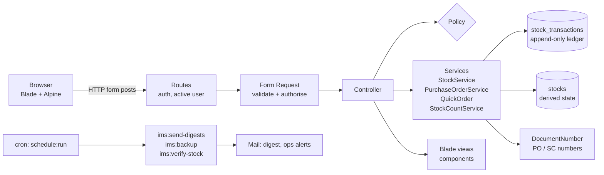
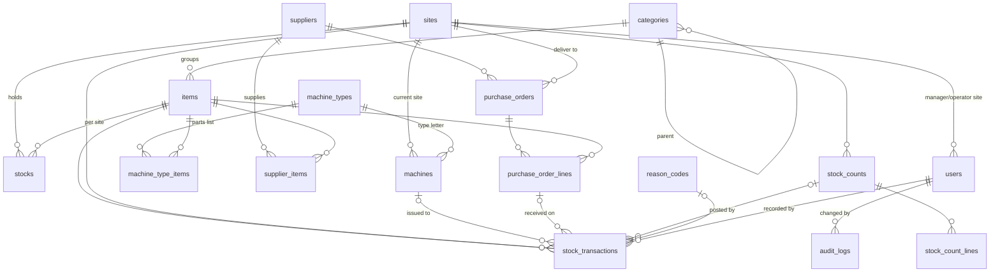

# BPC Inventory System: architecture and technical guide

For developers who maintain or extend the application. [SPEC.md](../SPEC.md) is the authoritative specification: behaviour not described there is out of scope. The rules that are easy to break are summarised in [§12](#12-rules-that-are-easy-to-break) and repeated in [AGENTS.md](../AGENTS.md).

## Contents

1. [Stack](#1-stack)
2. [Local set-up](#2-local-set-up)
3. [Repository layout](#3-repository-layout)
4. [Architecture overview](#4-architecture-overview)
5. [Data model](#5-data-model)
6. [The stock ledger](#6-the-stock-ledger)
7. [Concurrency](#7-concurrency)
8. [Money and quantities](#8-money-and-quantities)
9. [Authorisation, sites and navigation](#9-authorisation-sites-and-navigation)
10. [User interface](#10-user-interface)
11. [Services, commands and the scheduler](#11-services-commands-and-the-scheduler)
12. [Rules that are easy to break](#12-rules-that-are-easy-to-break)
13. [Testing](#13-testing)
14. [Configuration](#14-configuration)
15. [Deployment and operations](#15-deployment-and-operations)
16. [How to…](#16-how-to)

---

## 1. Stack

| Layer | Choice | Notes |
|---|---|---|
| Language | PHP 8.3+ (`composer.json`), production runs **8.5** | `bcmath`, `intl`, `pdo_mysql` required |
| Framework | **Laravel 13** | Breeze (Blade) for authentication screens |
| Database | **MariaDB** 10.6+ (production 11.8), InnoDB, `utf8mb4_unicode_ci` | CHECK constraints and triggers are part of the design; SQLite is not supported |
| Front end | Blade, **Tailwind CSS 3**, **Alpine.js 3**, built with **Vite** | no SPA, no API; pages are server-rendered |
| Tests | **Pest** 5 (PHPUnit) | run against MariaDB, including real parallel processes |
| Code style | **Pint** (Laravel preset) | `./vendor/bin/pint` before committing |
| Mail | Laravel Mail over SMTP | production: Microsoft 365 Direct Send |
| Hosting | nginx + PHP-FPM on Ubuntu, cron for the scheduler | see [deployment.md](deployment.md) |

Size: about 8,300 lines of PHP in `app/`, 80 Blade views, 108 routes, 280 tests (348 with datasets).

## 2. Local set-up

```sh
brew install php composer mariadb node && brew services start mariadb
mariadb -e "CREATE DATABASE ims CHARACTER SET utf8mb4 COLLATE utf8mb4_unicode_ci;
            CREATE DATABASE ims_test CHARACTER SET utf8mb4 COLLATE utf8mb4_unicode_ci;
            CREATE USER 'ims'@'localhost' IDENTIFIED BY 'ims';
            GRANT ALL ON ims.* TO 'ims'@'localhost'; GRANT ALL ON ims_test.* TO 'ims'@'localhost';
            GRANT ALL ON ims_restore_test.* TO 'ims'@'localhost';"
composer install && npm install && npm run build
cp .env.example .env && php artisan key:generate   # set SEED_ADMIN_PASSWORD and SEED_MANAGER_PASSWORD
php artisan migrate --seed                          # sites, reason codes, categories, machine register, dev users
php artisan db:seed --class=DemoDataSeeder          # optional demo catalogue, history, orders, counts
php artisan serve                                   # or `composer run dev` for Vite hot reload
```

Development accounts: `admin@bpc.test`, `manager.bpc001@bpc.test` (Georgia), `manager.bpc002@bpc.test` (Colorado), with the passwords from `.env`.

## 3. Repository layout

```
app/
  Console/Commands/   ims:* commands: backup, restore-test, verify-stock, send-digests, create-admin
  Enums/              Role, TransactionType, PurchaseOrderStatus, StockCountStatus, Criticality, ReasonCodeScope, AuditAction
  Exceptions/         StockException, PurchaseOrderException, StockCountException (user-facing, with a form field)
  Http/Controllers/   one controller per screen; Admin/ for administration; Auth/ from Breeze
  Http/Middleware/    EnsureUserIsActive, SecurityHeaders
  Http/Requests/      Form Requests: validation and authorisation of every write
  Mail/               DailyDigest
  Models/             Eloquent models; Concerns/Auditable
  Policies/           one per model; the only place permissions are decided
  Services/           StockService, PurchaseOrderService, QuickOrder, StockCountService, DocumentNumber,
                      Dashboard, Digest, PartsListImporter
  Support/            Decimal, Format, CurrentSite, CsvExport, LedgerCsv
  View/Components/    AppLayout, GuestLayout, MainNavigation
config/
  ims.php             SKU pattern, units, admin digest, backups, OPS_EMAIL, dev seed accounts
  navigation.php      the main menu: sections, links, abilities, the Issue action button
database/
  migrations/         schema incl. CHECK constraints and ledger triggers
  seeders/            Site, ReasonCode, Category, MachineRegister (production); DevUser, DemoData (development)
resources/
  views/              Blade pages per area; components/ for shared pieces
  css/app.css         Tailwind layers, component classes (btn, card, table, badge), status colour tokens
routes/
  web.php             every route, behind auth + active-user middleware
  console.php         the schedule
scripts/deploy.sh     production deployment
tests/
  Unit/ Feature/      Pest tests against ims_test
  Concurrency/        real parallel PHP processes (worker.php) against ims_test
docs/                 project, architecture, deployment, user guide, FAQ
SPEC.md               authoritative specification
AGENTS.md, CLAUDE.md  instructions for AI coding assistants
```

## 4. Architecture overview

A classic server-rendered Laravel application. Controllers stay thin; everything that changes stock or follows a state machine lives in a service that owns the transaction and the locks.



Request path: `routes/web.php` → middleware (`auth`, `EnsureUserIsActive`, `SecurityHeaders`) → Form Request (`authorize()` via policies, `rules()`) → controller → service → redirect with a flash message. Errors that users must see are thrown as `StockException`, `PurchaseOrderException` or `StockCountException` with a field name, and the controller turns them into validation errors on that field.

## 5. Data model



| Table | Purpose | Notable constraints |
|---|---|---|
| `sites` | US sites; `timezone`, `digest_hour` | `code` unique, fixed once created |
| `users` | `role` (ADMIN, MANAGER, OPERATOR), `site_id` (null for admins), `digest_opt_in`, `is_active` | |
| `categories` | two levels; only children are assignable | unique (`parent_id`, `name`) |
| `items` | catalogue: `sku`, `name`, `uom`, `criticality` (HIGH/NORMAL/LOW), manufacturer, MPN | `sku` unique; SKU locked once movements exist |
| `stocks` | per item and site: `qty`, `avg_cost`, `min_level`, `bin` (location), `is_kanban`, `bin_qty`, `last_counted_at` | unique (`item_id`, `site_id`); CHECK `qty >= 0`, `min_level >= 0`, two-bin needs `bin_qty > 0` |
| `stock_transactions` | **the ledger**: type, `qty_delta`, `unit_cost`, `value`, `qty_after`, `avg_cost_after`, links to machine, other site, PO line, count, reason, user | CHECK `qty_delta <> 0`, `qty_after >= 0`; triggers block UPDATE and DELETE |
| `machine_types` | letter code, name, `last_serial` | `code` unique |
| `machines` | `sku` (serial + letter), revision, current `site_id` | `sku` unique, letter must match type |
| `machine_type_items` | parts list line: type, item, qty, optional `revision` | unique (type, item, revision); a line is either for all revisions or for specific ones |
| `suppliers`, `supplier_items` | suppliers; per item: supplier SKU, `last_price`, `pack_size` | unique (supplier, item) |
| `purchase_orders`, `purchase_order_lines` | order header with status and dates; lines with ordered/received qty, price, `is_closed` | `number` unique; CHECK quantities and price |
| `stock_counts`, `stock_count_lines` | count header with status; lines with expected/counted qty | `reference` unique; unique (count, item) |
| `reason_codes` | reasons for adjustments and general issues; `is_system` for COUNT and OPENING | unique (`applies_to`, `code`) |
| `number_sequences` | counters per prefix and year | |
| `audit_logs` | master data changes: entity, id, action, before/after JSON, user | |

Enums are stored as strings and mapped by backed enums in `app/Enums`. Nothing is hard-deleted: master data has `is_active`.

## 6. The stock ledger

`stock_transactions` is the single source of truth; `stocks.qty` and `stocks.avg_cost` are derived state that `StockService::replay()` can rebuild from the ledger.

| Type | Written by | Effect |
|---|---|---|
| `RECEIPT` | `StockService::receipt()` via `PurchaseOrderService::receive()` | + qty at the line's unit price; moves the average |
| `ISSUE_MACHINE` | `issueToMachine()` | − qty at the average; `machine_id` set |
| `ISSUE_GENERAL` | `issueGeneral()` | − qty at the average; reason code |
| `TRANSFER_OUT` / `TRANSFER_IN` | `transfer()` | a pair sharing `transfer_group`; in at the sender's average |
| `ADJUSTMENT` | `adjust()`, `countTo()` | ± qty; reason code (OPENING, COUNT, FOUND, LOST, …); an increase may carry a cost |

**Moving average** (SPEC 5.1): an incoming movement applies `(qty × avg + in × cost) / (qty + in)`, rounded half-up to 4 places. Into empty stock the average becomes the incoming cost. Outgoing movements leave the average unchanged. A movement that enters at the current average leaves it unchanged by construction, which is what makes `replay()` exact.

**Integrity:** the model refuses updates and deletes; database triggers refuse them too. `ims:verify-stock` replays every stock row nightly and mails `OPS_EMAIL` on a mismatch. Corrections are always new compensating adjustments.

All movements go through `StockService::post()` (protected), called inside `DB::transaction(..., StockService::ATTEMPTS)`. Public methods: `adjust`, `issueToMachine`, `issueGeneral`, `transfer`, `receipt`, `countTo`, `replay`.

## 7. Concurrency

Two managers can work at the same moment, and two browser tabs can post the same form. The design guarantees correct stock under that load:

- **Row locks.** Every movement locks its `stocks` row with `SELECT … FOR UPDATE` before reading it. A missing row is inserted with `INSERT IGNORE` only **after** the locking read returned nothing, then locked again. Inserting first caused deadlocks through shared locks.
- **Lock order** is always: purchase order → its lines → stock rows. Several stock rows (a transfer) are locked in site-id order. Keeping both orders prevents deadlocks.
- **READ COMMITTED.** The connection uses READ COMMITTED (`config/database.php`, `DB_ISOLATION_LEVEL`). MariaDB 11.6+ snapshot isolation otherwise raises error 1020 on a locking read of a row changed after the snapshot.
- **Retries.** Deadlocks are retried 3 times (`StockService::ATTEMPTS`) by `DB::transaction`.
- **Double posting.** Receiving, closing short, status changes and count posting lock the order or count first and re-check its status inside the lock, so a second identical request finds nothing to do.
- **Numbers.** `DocumentNumber` uses `INSERT … ON DUPLICATE KEY UPDATE last_value = LAST_INSERT_ID(last_value + 1)`: atomic, no duplicates, gaps allowed.

Pest runs every test inside one transaction, so it cannot test locks. `tests/Concurrency` starts real parallel PHP processes (`worker.php`) against `ims_test`, commits, checks the result and rebuilds the database. Mutation checks during development confirmed those tests fail when a lock is removed.

## 8. Money and quantities

- **No floats.** All arithmetic uses `App\Support\Decimal` (bcmath on strings, half-up rounding). Raw `bcdiv`/`bcmul` truncate and break the 4.6667 acceptance case.
- Quantities: `DECIMAL(14,3)`; money: `DECIMAL(14,4)`; USD only.
- Display goes through `App\Support\Format`: quantities without trailing zeros, money with two decimals, timestamps stored in UTC and shown in the site's time zone (`CurrentSite::timezone()`).

## 9. Authorisation, sites and navigation

- **Roles** (`App\Enums\Role`): Admin, Manager, Operator. `User::canWriteSite($site)` is true for an admin, for a manager at their own site, never for an operator. `User::canEditMasterData()` is true for admins and managers.
- **Policies only.** Every permission is decided in `app/Policies` (plus a few gates in `AppServiceProvider`: `switch-site`, `view-audit-log`, `issue-stock`, `set-levels`). Form Requests call them in `authorize()`. The one cross-site exception: `StockPolicy::transfer` authorises against the **receiving** site.
- **Current site.** `App\Support\CurrentSite` resolves the site in the header. Managers and operators are fixed to their own site; administrators switch, including `null` = *All sites* (consolidated view). Never assume a site silently.
- **Inactive users** are logged out by `EnsureUserIsActive` on their next request.
- **Navigation** is data: `config/navigation.php` defines sections (Dashboard, Stock, Purchasing, Machines, Admin) and the action button (Issue, Transfer in, Adjust stock). A link appears when its route exists and the user passes its `can`. `MainNavigation` builds the menu.
- **Security headers** (`SecurityHeaders`): X-Frame-Options DENY, nosniff, Referrer-Policy same-origin, Permissions-Policy, HSTS over HTTPS.

## 10. User interface

- Blade pages under `resources/views/<area>/`; the layout is `layouts/app.blade.php` with `<x-page-header>` and `<x-page>`.
- Shared components in `resources/views/components/`: form fields (`field`, `select`, `textarea`, `input-error`), `item-picker` (type-ahead backed by `items.search`), `flash`, `export-link`, `po-status`, `count-status`, and the dashboard set `status-icon`, `status-chip`, `level-meter`, `sparkline`, `bar-list`.
- Component classes in `resources/css/app.css`: `btn-primary`, `btn-secondary`, `card`, `table`, `num`, `badge-*`, `form-input`. Status colours are CSS tokens (`--status-critical`, `--status-serious`, `--status-warning`, `--status-good`) and always come with an icon and a word, never colour alone.
- Alpine.js for small interactions only (menus, pickers, counters, toggles).
- Every list supports `?export=csv` through `App\Support\CsvExport` (UTF-8 with BOM for Excel). Movement histories use `LedgerCsv`.
- The interface shows plain words; the database keeps original names. Mapping (SPEC 1a): `stocks.is_kanban` → *Two-bin item*, `stocks.bin` → *Location*, `kanban.index` route → `/two-bin`.

## 11. Services, commands and the scheduler

| Service | Responsibility |
|---|---|
| `StockService` | every stock movement, moving average, locks, retries, replay |
| `PurchaseOrderService` | order lifecycle, lines, receiving, close short, cancel; `PurchaseOrderStatus::transitions()` mirrors SPEC 5.3 |
| `QuickOrder` | dashboard quick order: suggested supplier, quantity and price; one draft per site and supplier, all or nothing (SPEC 5.3a) |
| `StockCountService` | count lifecycle: add lines, start, save counts, post |
| `DocumentNumber` | PO and SC numbers |
| `Dashboard` | alerts, *Stock to act on*, movers, weekly usage, figures |
| `Digest` | content of the daily digest per site or for all sites |
| `PartsListImporter` | CSV import of parts lists, all or nothing |

| Command | Schedule (`routes/console.php`) | What |
|---|---|---|
| `ims:send-digests {--now}` | hourly | each site's digest at its local `digest_hour`; administrators' digest at `ADMIN_DIGEST_HOUR` |
| `ims:backup` | 07:00 UTC | gzipped `mariadb-dump` incl. triggers to `BACKUP_PATH`, older than `BACKUP_KEEP_DAYS` removed |
| `ims:verify-stock` | 07:30 UTC | ledger replay against every stock row |
| `ims:restore-test` | manual | loads the newest backup into `ims_restore_test`, checks tables, triggers and replay, drops it |
| `ims:create-admin {email}` | manual | creates or resets an administrator, password asked twice |

A failing scheduled job mails `OPS_EMAIL`.

## 12. Rules that are easy to break

1. **All stock changes go through `StockService`.** `stocks.qty` and `avg_cost` are not fillable on purpose.
2. **Lock order:** purchase order → lines → stock rows; several stock rows in site-id order.
3. **After touching locking**, run the Concurrency suite and `php artisan ims:verify-stock`.
4. **The ledger is append-only.** Correct with compensating adjustments.
5. **No floats** for money or quantities: `Decimal`.
6. **Permissions only in policies.** Managers write only at their own site.
7. **Statuses, types and roles are enums.**
8. **The current site comes from `CurrentSite`.** `null` means all sites.
9. **Master data models use `Auditable`**; list ledger-owned or secret attributes in `$auditExclude`.
10. **Nothing is hard-deleted.**
11. **Display through `Format`**; UTC in the database.
12. **New screens go into a section of `config/navigation.php`.** No new top-level entries.
13. **Charts:** one hue for single-series bars (`<x-bar-list>`), status palette with icon and label; render and look at the page after changing a chart.
14. **Every list has a CSV export.**
15. **Items are picked with `<x-item-picker>`.**
16. **`WriteRoutesTest` sweeps every write route as an operator**; a new route parameter needs a fixture there.
17. **A UI change updates the user documentation** (`docs/USER-GUIDE.md`, `docs/user-guide/`, screenshots; `11-messages.md` quotes messages verbatim) and, for behaviour, `SPEC.md`.
18. **Every business rule and acceptance criterion has a feature test.**

## 13. Testing

```sh
php artisan test                                   # Unit, Feature and Concurrency suites
./vendor/bin/pest --testsuite=Concurrency          # only the parallel-process tests
./vendor/bin/pest tests/Feature/QuickOrderTest.php # one file
```

- Tests run against **MariaDB** (`ims_test`), never SQLite: triggers, CHECK constraints and locks are part of the behaviour.
- Feature tests seed the production seeders and use Colorado (BPC002), Truss Saw 004C and item SP-10001 as the reference case. Acceptance criteria are named in test titles (`criterion 35: …`).
- `WriteRoutesTest` finds every authenticated non-GET route and asserts an operator gets 403.
- The Concurrency suite commits data and rebuilds `ims_test` afterwards.
- For UI changes, take Playwright screenshots of the changed pages and look at them. Two layout bugs were caught that way that no test saw.

## 14. Configuration

| Variable | Meaning |
|---|---|
| `APP_ENV`, `APP_DEBUG`, `APP_URL`, `APP_KEY` | standard; production `APP_DEBUG=false` |
| `DB_*`, `DB_ISOLATION_LEVEL` | MariaDB connection; isolation defaults to READ COMMITTED |
| `SESSION_LIFETIME`, `SESSION_SECURE_COOKIE` | idle timeout (60), secure cookies in production |
| `MAIL_*` | SMTP; production uses Microsoft 365 Direct Send (see deployment.md) |
| `OPS_EMAIL` | receives failures of scheduled jobs |
| `BACKUP_PATH`, `BACKUP_KEEP_DAYS`, `BACKUP_RESTORE_TEST_DATABASE` | backups |
| `ADMIN_DIGEST_HOUR`, `ADMIN_DIGEST_TIMEZONE` | administrators' all-sites digest |
| `SKU_PATTERN`, `SKU_PATTERN_HINT` | SKU validation once the numbering scheme is agreed |
| `SEED_ADMIN_EMAIL`, `SEED_ADMIN_PASSWORD`, `SEED_MANAGER_PASSWORD` | development accounts only; empty in production |

## 15. Deployment and operations

Production: OVH VPS, nginx, PHP 8.5-FPM, MariaDB 11.8, cron, Let's Encrypt. Full record in [deployment.md](deployment.md).

```sh
scripts/deploy.sh   # from a clean main branch: tests → build → rsync → composer, migrate, optimize → reload
```

The script refuses uncommitted changes, opens one shared SSH connection with retries (bots fill sshd's `MaxStartups`), uploads without permissions (the server keeps `storage` group-writable), and runs migrations inside a few seconds of maintenance mode. The server's `.env`, storage and backups are never touched. `.env` must stay `ubuntu:www-data 640`.

## 16. How to…

**Add a stock movement type.** Add a case to `TransactionType`, a public method on `StockService` that validates and calls `post()` inside `DB::transaction(..., self::ATTEMPTS)`, a policy ability, a Form Request, a controller and a form; add the route to `WriteRoutesTest` fixtures if it has a new parameter; extend `replay()` only if the averaging rule differs; write feature tests and, if it locks more than one row, a Concurrency test.

**Add a screen.** Controller + policy check + view using `<x-page-header>`/`<x-page>`; a CSV export if it is a list; a link in the right section of `config/navigation.php` with `can`; a chapter or section in the user guide with a screenshot.

**Add a master data model.** Migration with `is_active`, model with `Auditable`, policy, Form Request, CRUD screens, audit log entity label, tests.

**Change a business rule.** Update `SPEC.md` first (rule, acceptance criterion, change history), then code and tests, then the user documentation.

**Rename something on screen.** Change the label only; keep database and route names. Record the mapping in SPEC 1a, update docs and screenshots.
