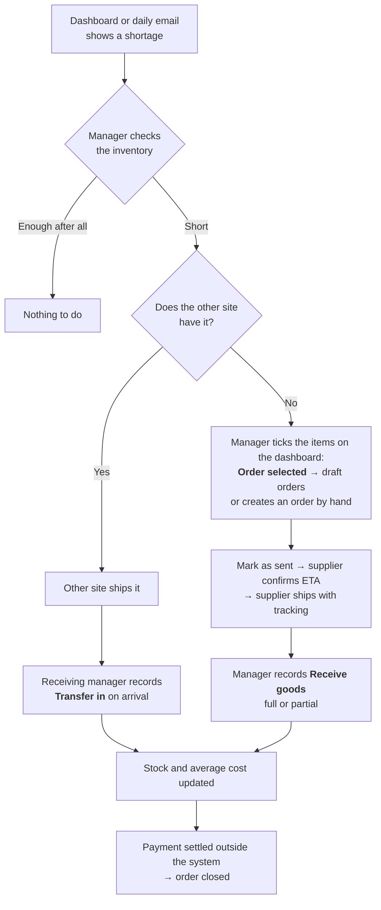
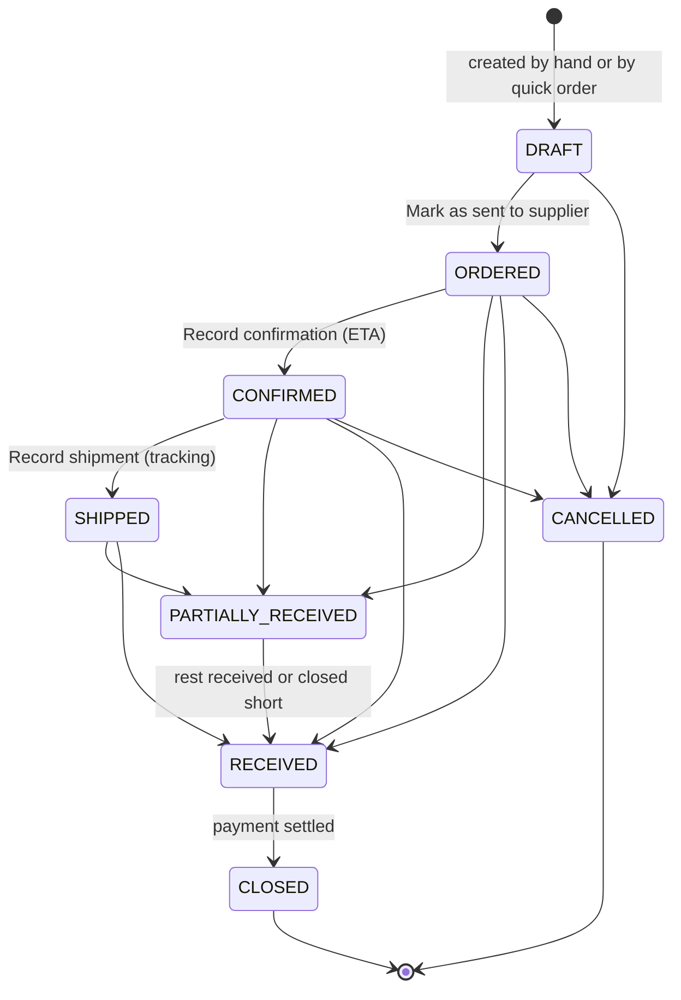
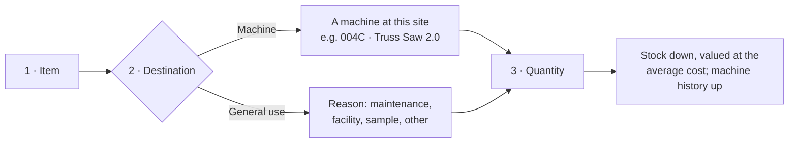
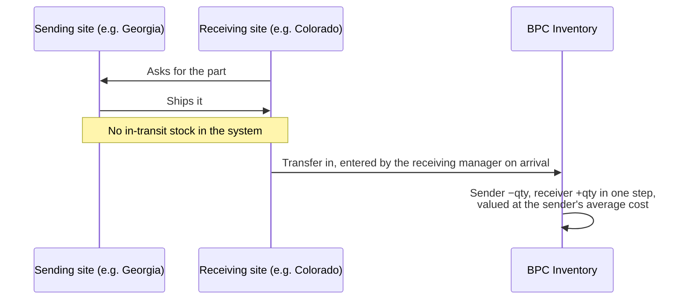
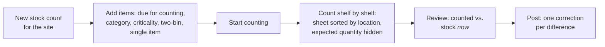
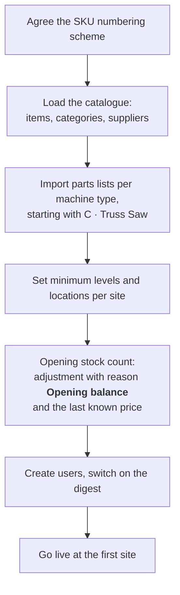

# BPC Inventory System: project documentation

The whole project on one page: why it exists, what it covers, how the work flows, what was decided and why, where it runs, and what is still open. Written for the project owner, management and anyone joining the project.

| Document | For |
|---|---|
| **This file** | project owner, management, new team members |
| [USER-GUIDE.md](USER-GUIDE.md) and [user-guide/](user-guide/) | people using the application, by role |
| [FAQ.md](FAQ.md) | the 25 questions users ask most |
| [ARCHITECTURE.md](ARCHITECTURE.md) | developers: stack, architecture, data model, rules, tests |
| [deployment.md](deployment.md) | the production server and how to update it |
| [../AGENTS.md](../AGENTS.md) | AI coding assistants continuing the work |
| [../SPEC.md](../SPEC.md) | the authoritative specification: every rule and acceptance criterion |

---

## Contents

1. [Purpose](#1-purpose)
2. [Scope](#2-scope)
3. [Sites, people and roles](#3-sites-people-and-roles)
4. [Key terms](#4-key-terms)
5. [Processes](#5-processes)
6. [Functions of the application](#6-functions-of-the-application)
7. [Rules the system enforces](#7-rules-the-system-enforces)
8. [Decisions and their reasons](#8-decisions-and-their-reasons)
9. [Production environment](#9-production-environment)
10. [Project history](#10-project-history)
11. [Status, open items and risks](#11-status-open-items-and-risks)
12. [Possible next steps](#12-possible-next-steps)

---

## 1. Purpose

Two BPC manufacturing sites in the United States, **BPC001 Georgia** and **BPC002 Colorado**, kept no inventory records before this project. The application gives their managers a reliable answer to two questions:

1. **How much of what do we have, and at which site?**
2. **What is running out?**

It covers spare parts, wear parts, consumables and tools that keep the production machines running. Everything in the application serves those two questions.

A second purpose grows over time: every item taken from stock is recorded against the machine it went to. After a few months this consumption history replaces the guessed minimum levels with measured ones, and shows which machines cost most to keep running.

## 2. Scope

**In scope**

- One item catalogue shared by both sites, with categories, criticality, suppliers and supplier prices.
- Stock per item and site: quantity, minimum level, shelf location, two-bin settings, moving average cost.
- Every stock movement: issues to machines or general use, receipts against purchase orders, transfers between sites, adjustments, stock counts. All of them are kept in a permanent movement history.
- Purchase orders from draft to closed, with partial deliveries, plus a quick order from the dashboard.
- Machine register (machine types, machines, revisions, relocation) and parts lists per machine type.
- Cycle counting with a blind count sheet.
- Dashboard, a daily email digest, CSV export of every list, an audit log of master data changes.
- Users with three roles, two sites, and room for more sites without code changes.

**Out of scope, deliberately** (SPEC section 11): accounting, invoices and payments; freight, duty and landed cost; currencies other than USD; batch and serial numbers, expiry dates; barcodes and labels; maintenance schedules and work orders; tools issued to people; requests raised by operators; in-transit stock; bin hierarchies; forecasting and automatic ordering; supplier portals; an API or mobile app; machines and stock outside the US sites (machines in Poland are not registered until they are installed in the US).

The application is **not** an ERP, MRP or accounting system.

## 3. Sites, people and roles

| Site | Location | Time zone |
|---|---|---|
| **BPC001** | Georgia | America/New_York |
| **BPC002** | Colorado | America/Denver |

| Role | Who | Can |
|---|---|---|
| **Operator** | machine operators, technicians | read inventory, items, two-bin items, purchase orders and machines at both sites; change nothing |
| **Manager** | the site manager, one per site | everything at **their own site**: issue, receive, transfer in, adjust, count, set minimum levels, raise purchase orders. Maintain shared master data: items, categories, suppliers, parts lists. **Read** the other site. |
| **Administrator** | the system owner | everything at every site, plus users, sites, reason codes, the machine register and the audit log |

Managers see the other site's stock on purpose: before ordering, they check whether the other site has the part, because a transfer is usually faster than an order with a 20–60 day lead time.

## 4. Key terms

| Term | Meaning | Example |
|---|---|---|
| **Site** | A US location that holds stock and machines | BPC001 Georgia |
| **Item** / **Item SKU** | A catalogue entry and its number. One catalogue for both sites. | SP-10001 Saw blade 18" carbide |
| **Machine type** | A family of machines, one letter; holds the parts list | C · Truss Saw |
| **Machine** / **Machine SKU** | One physical machine at a site; three-digit serial + type letter | 004C |
| **Revision** | Design version of a machine; a parts list line can be limited to one revision | Truss Saw 2.0 |
| **Criticality** | How badly a missing item hurts: **High** (stops production, hard to get), **Normal**, **Low** | High |
| **Minimum level** | Below this quantity the item is flagged at that site | 2 pc |
| **Two-bin item** | A cheap, regularly used item kept in two bins: when the first is empty, reorder; the second covers the delivery time (two-bin kanban) | air filters, 6 per bin |
| **Location** | Where an item is kept at a site, free text | shelf CO-SP01 |
| **Average cost** | Moving average purchase price per item and site, USD, without freight and duty | $412.00 |
| **Purchase order (PO)** | An order to one supplier for one site, numbered PO-YYYY-NNNN | PO-2026-0007 |
| **Stock count** | A counting session for one site, numbered SC-YYYY-NNNN | SC-2026-0002 |

Machine types: **A** Wall Machine 6" · **B** Strapping & Header Machine · **C** Truss Saw · **D** Wall Machine 3.5" · **H** Header Machine · **S** Strapping Machine · **T** Truss JIG · **W** Wall JIG. Type **C** is the reference case: 003C (rev 1.0) in Georgia and 004C (rev 2.0) in Colorado.

## 5. Processes

The agreed processes, as built. Comment in a pull request if the real process differs.

### 5.1 Replenishment: from a shortage to stock on the shelf

The site manager decides. There is no central approval, and no routing through Kraków: the Kraków warehouse is one supplier among others.

Operators do not raise requests in the system. They tell the manager; the dashboard and the daily email are the trigger.

### 5.2 Purchase order lifecycle

- Lines can be changed only while the order is a draft. An empty price takes the supplier's last price.
- Goods may arrive without a confirmation or shipping notice, so receiving is possible from **Ordered** on.
- **Cancel** is possible only while nothing has been received. **Close short** ends a line that will not be delivered in full, with a reason, and writes no stock movement.
- Receiving more than ordered is allowed with a warning: it usually means packs were counted as units.
- **Quick order**: ticked items become one draft per supplier. The system suggests the supplier, a quantity and the price. Items already on an order in progress, drafts included, show the order number, so nobody orders them twice.

### 5.3 Issuing stock

Stock can be issued to a machine only at the site where the machine is.

### 5.4 Transfer between sites

If the sending site has recorded less than what arrived, the transfer is refused. The sending site first corrects its stock with an adjustment.

### 5.5 Cycle counting

Suggested frequency: high criticality monthly; normal, low and two-bin items quarterly. Blank lines are skipped. A posted count cannot be changed.

### 5.6 Alerts

| What | Where | When |
|---|---|---|
| Out of stock, below minimum, two-bin refills, orders to chase, counts due; shortages worst first with level bars, 12-week usage and orders in progress; the most used items of the last 30 days | Dashboard | always current |
| Below minimum, two-bin refills, late and unconfirmed orders | Daily email digest | once a day at the site's digest hour (default 07:00 local), only when something needs attention, only to users who switched it on in their profile |
| The same for all sites | Administrators' digest | default 07:00 New York time |

### 5.7 Go-live

Checklist with owners: [user-guide/10-go-live.md](user-guide/10-go-live.md).

## 6. Functions of the application

| Area | Functions | Who |
|---|---|---|
| **Dashboard** | status tiles; *Stock to act on* worst first, with level bars, orders in progress and quick order; orders to chase; most used items; stock value by category; consumption this month against last; top machines by consumption; dormant stock | everyone; quick order: managers, administrators |
| **Stock ▸ Inventory** | every item with stock per site, value, status; filters (search, category, criticality, below minimum, two-bin, inactive); item page with stock per site, movement history, suppliers, parts lists | everyone; editing items: managers, administrators |
| **Stock ▸ Two-bin items** | two-bin items, refills first | everyone |
| **Stock ▸ Stock counts** | counts, items due for counting, blind count sheet, review, post | managers, administrators |
| **Stock ▸ Min levels & locations** | bulk editor for minimum level, location and two-bin settings at one site | managers (own site), administrators |
| **Stock ▸ Categories** | two-level category tree | everyone reads; managers and administrators edit |
| **Purchasing ▸ Purchase orders** | list, new order, lines, status steps, receiving, close short, cancel | everyone reads; managers (own site) and administrators change |
| **Purchasing ▸ Suppliers** | suppliers with lead time, contact, the items they supply with last price and pack size | managers, administrators |
| **Machines ▸ Machines** | machine register with revision and site; each machine's parts list and consumption history | everyone reads; administrators register, edit and relocate machines |
| **Machines ▸ Machine types** | parts lists per type and revision, CSV import | managers, administrators |
| **Issue ▾** | Issue (to a machine or general use), Transfer in, Adjust stock | managers (own site), administrators |
| **Admin** | users, sites (time zone, digest hour), reason codes, audit log | administrators |
| **Everywhere** | CSV export of every list; site selector (administrators can switch to *All sites*); profile with password and digest switch | everyone |

## 7. Rules the system enforces

- **Stock never goes negative.** Taking out more than is recorded is refused, with the available quantity in the message.
- **History is never edited or deleted.** A mistake is corrected with a new adjustment; the database itself blocks changes to recorded movements.
- **Nothing is deleted.** Items, suppliers, machines and users are deactivated, so their history stays readable.
- **A manager changes only their own site.** The one exception is *Transfer in*, which the receiving manager records for goods coming from the other site.
- **Each site has its own average cost.** Receipts at the order price and transfers at the sender's cost move it; issues do not.
- **Freight and duty are not in the cost.** Stock value is lower than the true landed cost: fine for managing stock, not for asset valuation.
- **Every change to master data is in the audit log**, with who, when, and before → after.
- **Two people working at the same moment cannot corrupt stock.** Simultaneous movements, receipts and count postings are serialised by the database and proven by tests that run real parallel processes.

## 8. Decisions and their reasons

| Decision | Why |
|---|---|
| A web application on a central server, nothing installed at the sites | Two sites, few users, no IT on site; a browser is enough on a PC or phone |
| Laravel, MariaDB, server-rendered pages | Mature, well known, cheap to host and to maintain; no separate front-end build to look after |
| One catalogue, stock per site | The same parts are used at both sites; managers must see the other site before ordering |
| Moving average cost per site, USD only, no landed cost | Enough to value consumption per machine; accounting is done elsewhere |
| Append-only movement history, stock derived from it | Every quantity can be explained and rebuilt; mistakes are corrected openly |
| Transfers recorded once, by the receiving site, on arrival | No in-transit state to maintain; the receiver knows what actually arrived |
| Machine register with type letter, serial and revision (replacing "work centres") | Matches how BPC names its machines; parts lists differ by revision |
| Plain interface words: *Inventory*, *Two-bin items*, *Stock counts*, *Min levels & locations*, criticality *High/Normal/Low* | Users start from zero inventory practice; jargon such as *kanban* or *bins* confused them. The database keeps the original names. |
| Quick order creates **drafts** only, suggestion = one bin or up to twice the minimum less what is on order | Speeds up ordering without automatic ordering; a person still checks and sends each order |
| OVH VPS instead of the OVH *Cloud Web* hosting | Cloud Web offered PHP 8.0 and MySQL 5.6 at most and is being retired; the application needs PHP 8.3+ and MariaDB 10.6+ |
| SSH password login kept on the VPS | The owner's choice; key login is used for deployments, fail2ban limits guessing |
| Email through Microsoft 365 *Direct Send* | No extra account or password; all users have @byldinc.com addresses. Mail reaches only @byldinc.com. |
| Backups: nightly database dump on the server plus OVH's daily VPS backup in another data centre | A quick restore of the data, and protection against losing the whole server |

## 9. Production environment

| | |
|---|---|
| Address | **https://ims.byldinc.com** (also `https://vps-7edfab5f.vps.ovh.ca`) |
| Server | OVH VPS `144.217.90.113`, Ubuntu 26.04, nginx, PHP 8.5-FPM, MariaDB 11.8 |
| Code | GitHub, private repository `Byld-research/ims`, branch `main` |
| Updates | `scripts/deploy.sh` from a developer's computer: tests, build, upload, migrate, a few seconds of maintenance mode |
| HTTPS | Let's Encrypt, renewed automatically |
| Email | Microsoft 365 Direct Send from `inventory@byldinc.com`; technical alerts to `admin@byldinc.com` |
| Scheduled jobs | digests hourly per site; database backup 07:00 UTC; stock integrity check 07:30 UTC |
| Backups | nightly dump kept 30 days in `/var/backups/ims`; OVH daily backup of the whole VPS in another data centre |
| Security | firewall (SSH, HTTP, HTTPS only), fail2ban, security headers, 60-minute idle logout, passwords of 12+ characters |
| Data at go-live | sites, categories, reason codes, machine types and the 10 US machines; no demo data, no test accounts |

Details and procedures: [deployment.md](deployment.md).

## 10. Project history

| Date | Milestone |
|---|---|
| 2026-10-05 | Specification agreed. Stages 1–8 built: data model and roles; catalogue, suppliers, machine types and parts lists; stock service and adjustments; purchase orders; issues and transfers; stock counts; dashboard and exports; digest, audit log, administration and backups |
| 2026-10-05 | Machine register replaces work centres; site codes corrected (BPC001 Georgia, BPC002 Colorado); user documentation; dashboard redesigned to put problems first |
| 2026-10-06 | Plain menu names; criticality High/Normal/Low |
| 2026-10-06 | Production on the OVH VPS at ims.byldinc.com; first administrator created; data entry starts |
| 2026-10-06 | Quick order from the dashboard with orders in progress per item; email via Microsoft 365; deployment script hardened |
| 2026-10-07 | Post-project documentation: this file, architecture, user guide by role, FAQ, instructions for AI assistants |

The specification's change history (SPEC versions 1.0–1.9) records every change of rules.

## 11. Status, open items and risks

**Status:** in production, all eight build stages and the quick order complete, 348 automated tests passing.

**Values still to be supplied** (SPEC section 10): the SKU numbering scheme, the parts lists per machine type (starting with type C), the initial minimum levels, the opening stock count.

| Risk | Effect | Mitigation |
|---|---|---|
| Minimum levels are guesses at first | Too many or too few alerts | Review them after 2–3 months of issues, using *Most used* and each machine's consumption |
| Issues not recorded on the floor | Stock drifts from reality; consumption history is wrong | Cycle counts show the drift; train managers to issue every part |
| Microsoft 365 *Reject Direct Send* switched on by an M365 administrator | Digest and password reset emails stop | Switch to an SMTP relay connector or a mail service (see deployment.md) |
| A user without an @byldinc.com address | That user gets no email | Give them a company address, or change the mail set-up |
| SSH password login open to the internet | Constant guessing attempts | Strong password, fail2ban; key-only login is one setting away |
| One developer knows the system | Slow changes if they are unavailable | This documentation, ARCHITECTURE.md and AGENTS.md |

## 12. Possible next steps

Not agreed, listed so they are not lost:

- CSV import of items and opening balances for a faster go-live.
- Suggested minimum levels from measured consumption (needs history first).
- Quick order from the inventory list (*Below minimum* filter), not only from the dashboard.
- A printable or emailable purchase order document for suppliers.
- Barcode labels for locations and items (currently out of scope).
