# BPC Inventory: user guide

How to use the application, written for each role. Every task is a numbered click sequence with the exact words you see on screen. Menu paths are written like **Stock ▸ Inventory**: open the **Stock** menu at the top, then choose **Inventory**.

- Short questions and answers: [FAQ.md](FAQ.md).
- One chapter per task, with every detail: [user-guide/](user-guide/) (chapters 1–11, listed at the [end](#detailed-chapters)).
- The whole project, processes and decisions: [PROJECT.md](PROJECT.md).

Examples use **BPC002 Colorado**, its Truss Saw **004C** and the saw blade **SP-10001**.

## Contents

- [Find your role](#find-your-role)
- [Everyone: the basics](#everyone-the-basics)
- [Operator](#operator)
- [Manager](#manager)
  - [Every day](#every-day)
  - [When goods arrive](#when-goods-arrive)
  - [Every week or month](#every-week-or-month)
  - [Occasionally](#occasionally)
- [Administrator](#administrator)
- [Where is it?](#where-is-it)
- [Detailed chapters](#detailed-chapters)

---

## Find your role

Your role is shown under your name in the top-right menu.

| | Operator | Manager | Administrator |
|---|:-:|:-:|:-:|
| Dashboard, inventory, item pages, two-bin items, categories | read | read | read |
| Purchase orders | read | own site | every site |
| Machines and their parts lists | read | read | read, register, relocate |
| Machine types, suppliers, stock counts | — | yes (counts: own site) | yes |
| Issue, Transfer in, Adjust stock | — | own site | every site |
| Min levels & locations | — | own site | every site |
| Items, categories, suppliers, parts lists | — | create and edit | create and edit |
| Quick order from the dashboard | — | own site | every site |
| Users, sites, reason codes, audit log | — | — | yes |
| Switch to the other site or *All sites* | — | — | yes |

Managers and operators are fixed to their own site but can **read** the other site's stock: the inventory has a column per site.

---

## Everyone: the basics

### Log in

1. Open **https://ims.byldinc.com**.
2. Enter your **Email** and **Password**, then **Log in**.

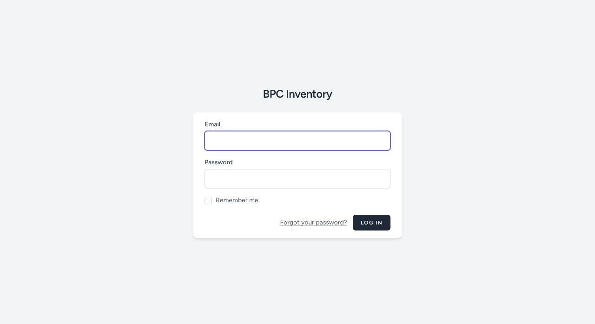

**Forgot your password?** On the login page: **Forgot your password?** → enter your email → **Email Password Reset Link** → open the email and choose a new password. Emails reach **@byldinc.com** addresses only.


After 60 minutes without activity you are logged out; log in again.

### Find your way around

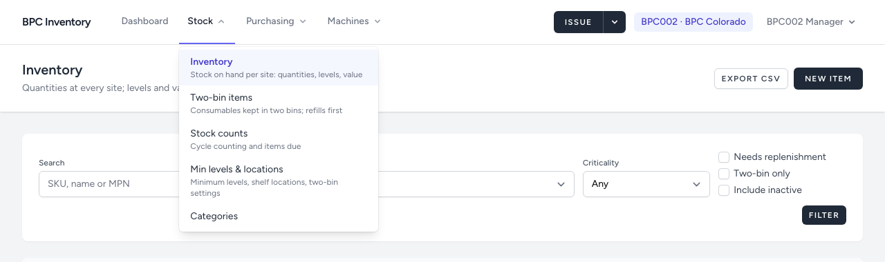

| Part of the screen | What it is |
|---|---|
| **Dashboard** | alerts and figures for your site; start here |
| **Stock ▾** | Inventory, Two-bin items, Stock counts, Min levels & locations, Categories |
| **Purchasing ▾** | Purchase orders, Suppliers |
| **Machines ▾** | Machines, Machine types |
| **Admin ▾** | administrators only |
| **Issue ▾** (dark button) | Issue stock, Transfer in, Adjust stock; managers and administrators only |
| Blue label | your site |
| **Your name ▾** | Profile, Log Out |

Each menu shows only what your role may open. On a phone the menu is behind **☰**.

### Switch the daily email on or off

1. **Your name ▾ ▸ Profile**.
2. Tick or untick **Send me the daily low-stock digest**.
3. **Save**.

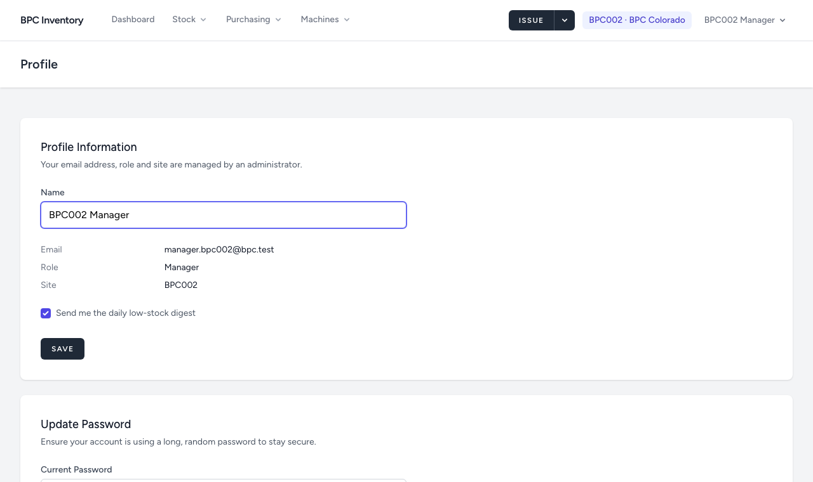

The digest comes once a day at the site's digest hour (07:00 local by default), and only when something needs attention. On the same page, **Update Password** changes your password.

### Find an item and its stock

1. **Stock ▸ Inventory**.
2. Type part of the SKU, name or manufacturer part number in **Search**, optionally choose a **Category** or **Criticality**, tick **Needs replenishment** or **Two-bin only**, then **Filter**.
3. Click the SKU to open the item page: stock and location at both sites, what is on order, suppliers, machine types that use it, and the full movement history.


### Export to Excel

On any list, set the filters, then **Export CSV**. The file contains everything the filters match, without paging.

---

## Operator

Operators read everything they need on the floor and change nothing. When a part runs low, **tell your site manager**: the system has no requests.

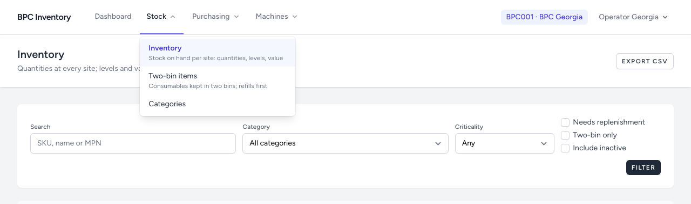

### Is the part in stock, and where is it?

1. **Stock ▸ Inventory** → search `SP-10001` → **Filter**.
2. The row shows the quantity at each site and its status.
3. Open the item: **Stock by site** shows the **Location** (e.g. shelf CO-SP01) and the minimum level at each site.

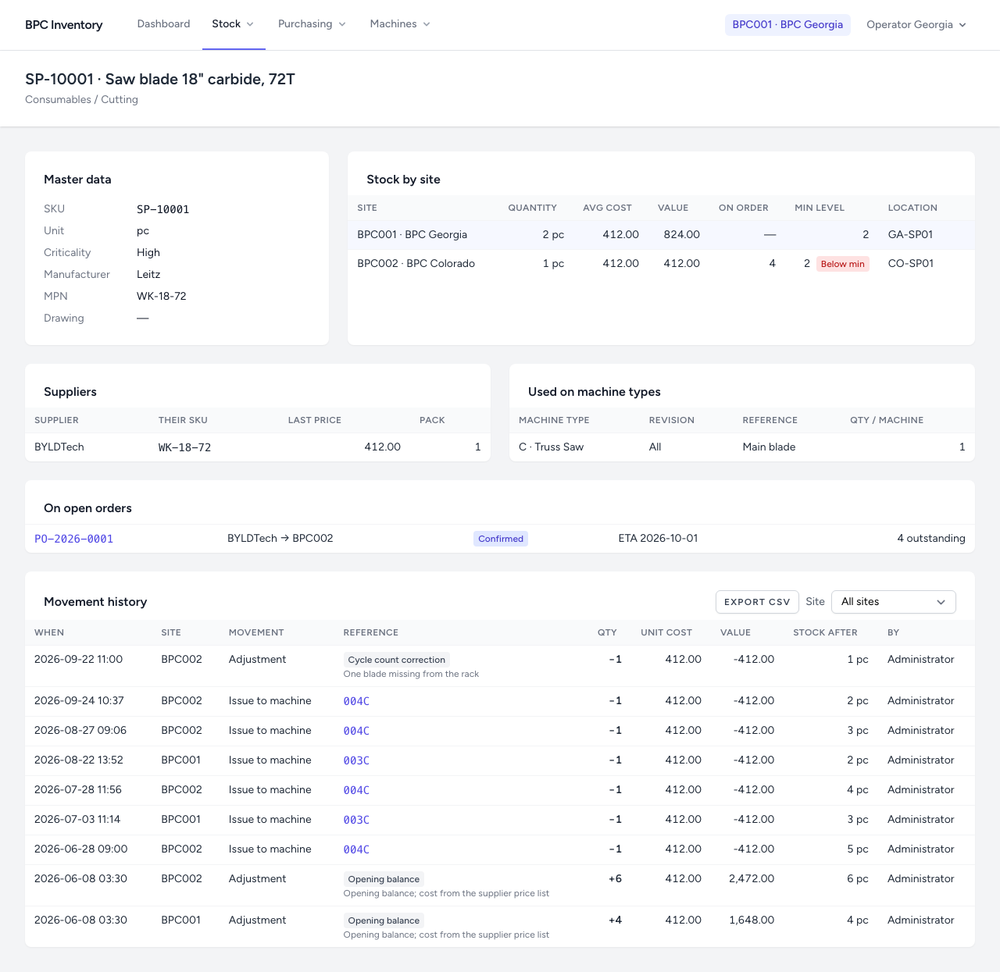

### Is it already ordered?

- On the item page, **On open orders** lists the order number, supplier, status and ETA.
- On the **Dashboard**, the **On order** column under *Stock to act on* shows the order and its status, drafts included.
- **Purchasing ▸ Purchase orders** → open an order to see its lines and dates.

### Which parts does a machine use?

1. **Machines ▸ Machines** → click the machine SKU, e.g. **004C**.
2. The machine page shows its parts list (for its type and revision) with stock at this site, and what has been issued to it.

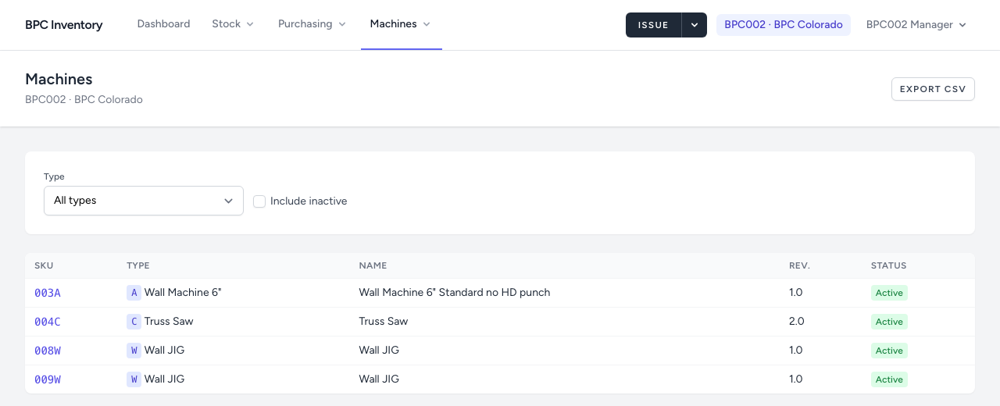

### Two-bin items

**Stock ▸ Two-bin items** lists the consumables kept in two bins, refills first. When one bin is empty, tell the manager.

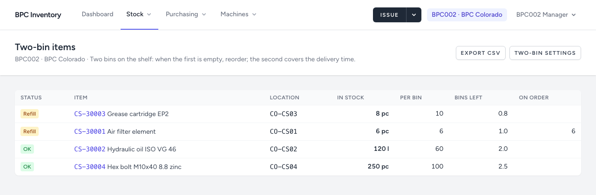

### Your dashboard

The operator's dashboard shows the same alerts without the ordering controls.


---

## Manager

You change stock **at your own site** only and read the other site. Detailed chapters: [5. Issuing, transfers and adjustments](user-guide/05-issuing-transfers-adjustments.md), [6. Purchasing](user-guide/06-purchasing.md), [7. Stock counts](user-guide/07-stock-counts.md).

### Every day

#### 1. Check the dashboard

1. **Dashboard**.
2. The tiles at the top count **Out of stock**, **Below minimum**, **Two-bin refill**, **Orders to chase** and **Due for counting**. Click a tile to jump to its list.
3. **Stock to act on** lists the items to reorder, worst first. Each row shows the level bar (the black mark is the minimum), the orders already in progress and 12-week usage.
4. **Orders to chase** lists orders that are late, unconfirmed or half-delivered for over 30 days.


Status words: **Out** (red ✕) = nothing left; **Below min** (orange ▲ for high criticality, amber ● otherwise) = under the minimum; **Refill** (amber ●) = a two-bin item is down to one bin.

#### 2. Record every part taken from the shelf (Issue)

1. Click **Issue** (dark button, top right).
2. **Item**: type at least two characters, e.g. `saw blade`, and click the suggestion.
3. **Destination**: **Machine** → choose **004C · Truss Saw 2.0**, or **General use** → choose the reason.
4. **Quantity**, e.g. `1`; optional note (work order, shift).
5. Check the grey line *stock now → after*, then **Issue**.
6. The form stays open on the same machine for the next part; **Done** when finished.


Faster from the machine: **Machines ▸ Machines** → **004C** → **Issue to 004C**, or **Issue** next to a part in its parts list.

#### 3. Reorder what is short (quick order)

1. **Dashboard** → under **Stock to act on**, tick the items to order.
2. **Order selected (n)**.
3. On **Quick order**, check each line: **Supplier**, **Quantity** (suggested: one bin for a two-bin item, otherwise up to twice the minimum less what is already on order, in whole packs), **Unit price** (blank = last price).
4. Items marked **Already on PO-…** start unticked: tick them only if you really want more.
5. **Create draft orders**. One draft is created per supplier.
6. Open each draft, check it, send it to the supplier yourself (email, portal), then **Mark as sent to supplier**.

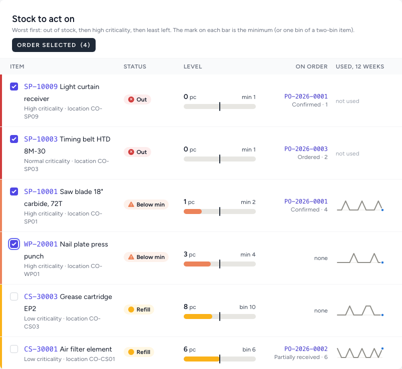

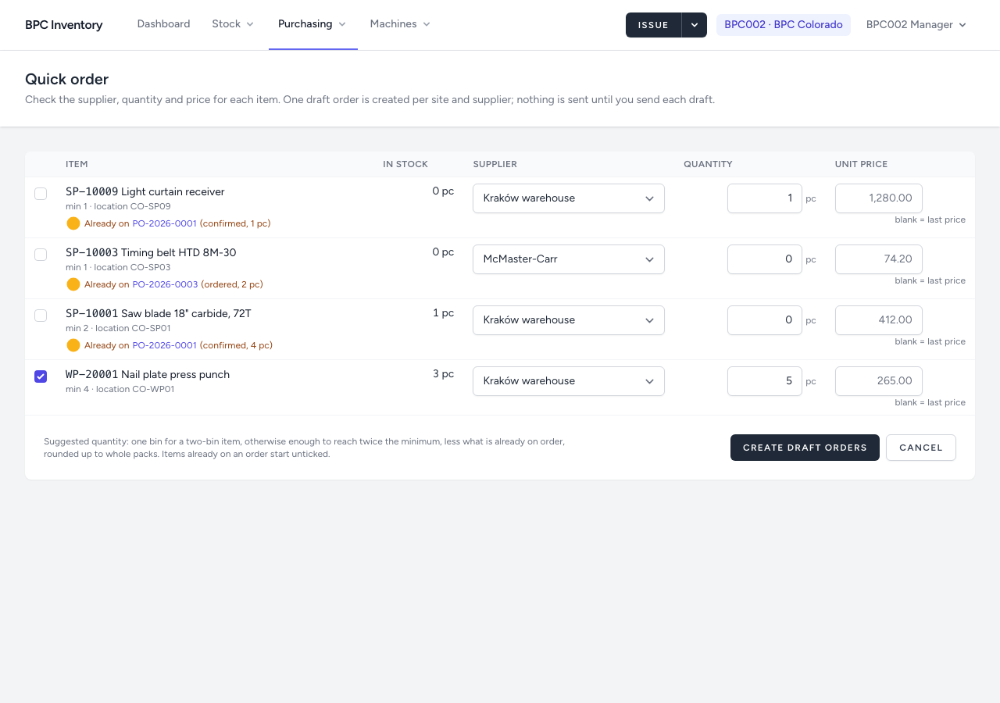

**Before ordering, check the other site**: in **Stock ▸ Inventory** the other site's column may show the part. A transfer is usually faster than a 20–60 day order.

### When goods arrive

#### Goods from a supplier (Receive goods)

1. **Purchasing ▸ Purchase orders** → open the order (filter **Open** if the list is long).
2. **Receive goods**.
3. Each line is prefilled with what is still outstanding: change it to what actually arrived, or leave a line at 0.
4. **Record receipt**. Stock and average cost update; the order becomes *Partially received* or *Received*.

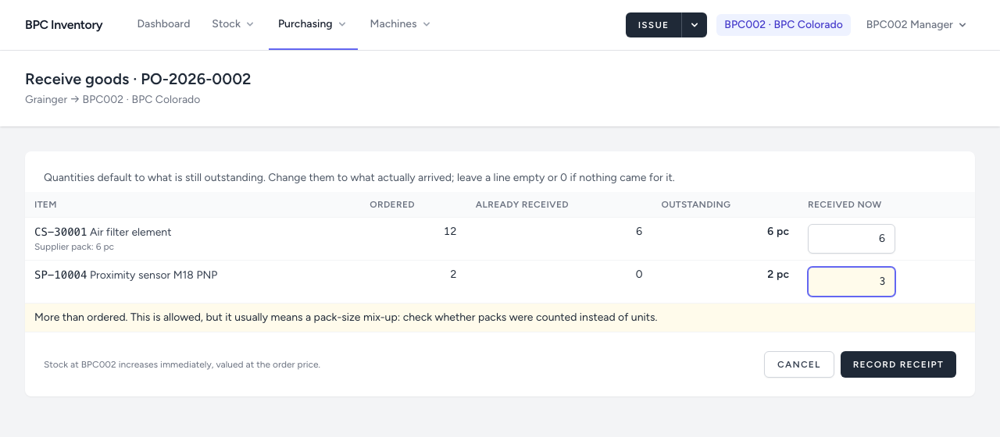

- Receiving works from **Ordered** on, even without a confirmation or shipping notice.
- More than ordered: allowed, with a yellow warning. It usually means packs were entered as units.
- The rest will not come: on the order, **Close short…** next to the line, give a reason, **Close line short**.

#### Recording supplier updates

On the order page, the next possible step is always the only button shown:

1. **Record confirmation**: enter the ETA from the supplier.
2. **Record shipment**: enter the tracking number or link.
3. After payment is settled elsewhere: **Close order**.

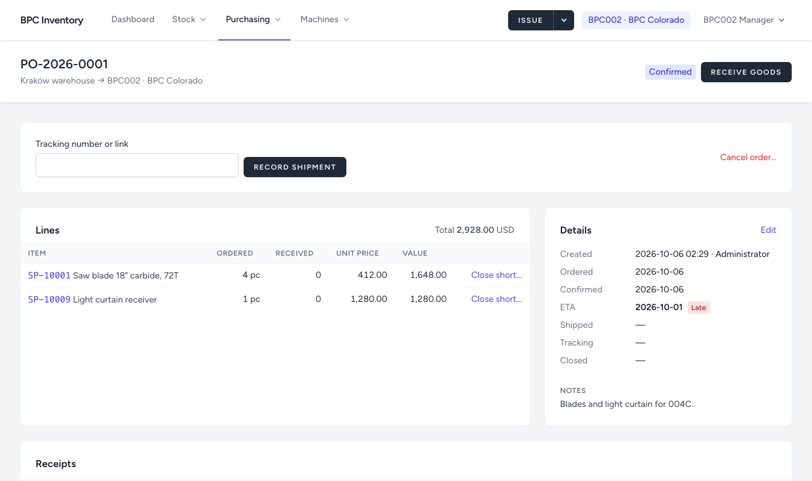

#### Goods from the other site (Transfer in)

1. When the parts are physically here: **Issue ▾ ▸ Transfer in**.
2. **Item**, **From** (the other site), **Quantity**, optional note.
3. **Record transfer**. The other site goes down and yours goes up in one step, at the sender's average cost.


If the sender has recorded less than arrived, the transfer is refused: ask the other site's manager to correct their stock with an adjustment first.

### Every week or month

#### Count stock (cycle count)

1. **Stock ▸ Stock counts**. The yellow note says how many items are due for counting.
2. **New count** → **Scope**, e.g. `High criticality monthly` → **Create count**.
3. Under **Add items to count**, choose **Add by**: **Due for counting (n)**, a category, a criticality, two-bin items or one item → **Add**.
4. **Start counting**. Print or open the sheet: sorted by location, the expected quantity is hidden.
5. Enter what you count; leave a line blank if you did not count it. **Save counts** as you go, then **Save and review**.
6. The review compares your count with the stock **now**. **Post count**: one correction per difference.

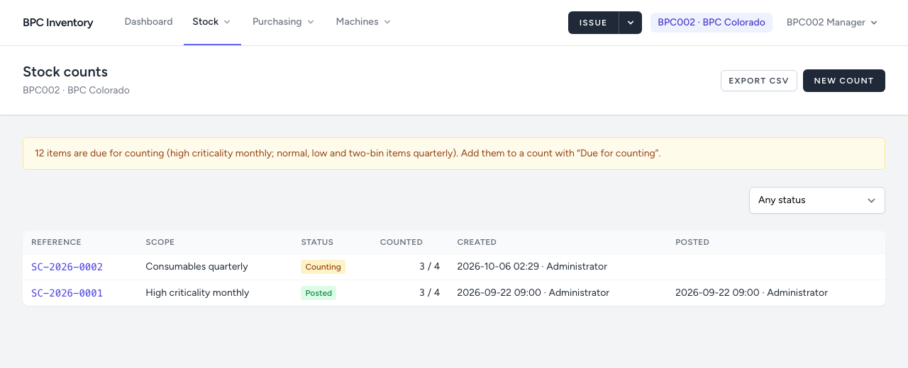

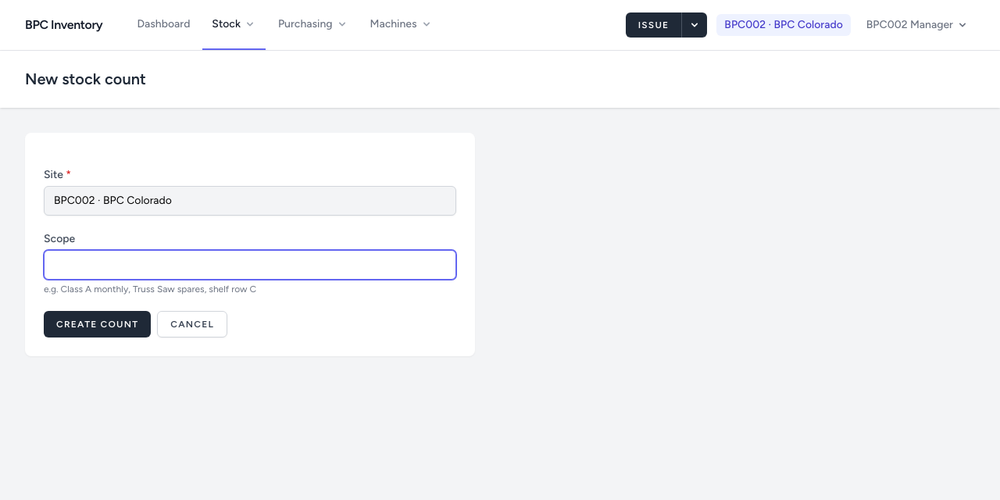

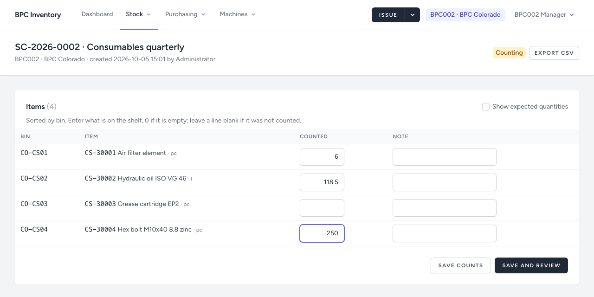

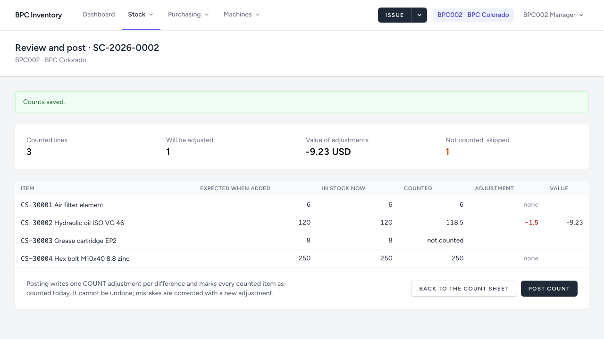

Suggested rhythm: high criticality monthly; normal, low and two-bin items quarterly.

#### Review minimum levels and locations

1. **Stock ▸ Min levels & locations**.
2. Filter by search or category → **Filter**.
3. Edit **Min level** and **Location** in the table; **Two-bin settings** for two-bin items and their quantity per bin.
4. **Save levels**.

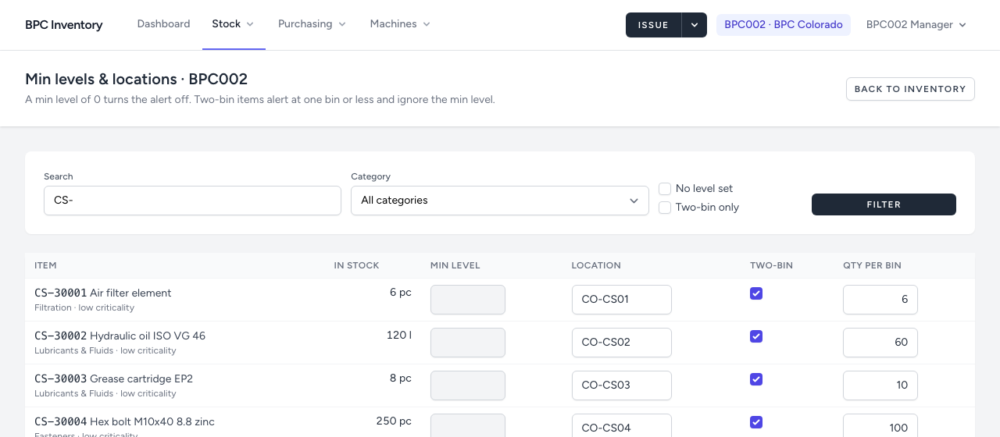

Use the dashboard's *Most used* list and each machine's consumption to correct the guessed minimums after a few months.

#### Chase orders

**Dashboard ▸ Orders to chase**: open each order, contact the supplier, then **Record confirmation** or **Record shipment**, or update the dates under **Details → Edit**.

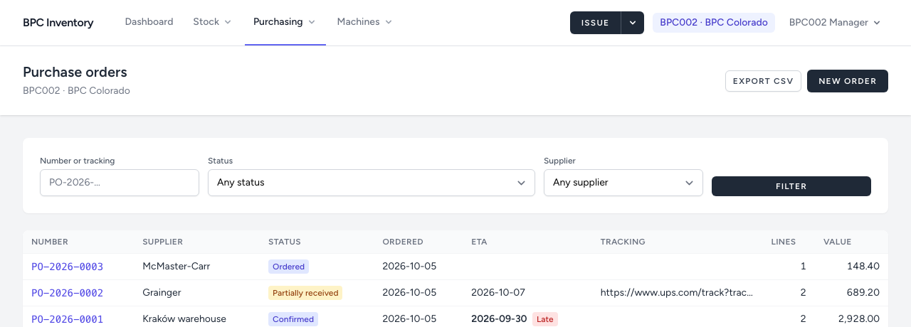

### Occasionally

#### Correct stock (Adjust stock)

1. **Issue ▾ ▸ Adjust stock**, or **Adjust** on the item page next to your site.
2. **Item**, **Increase** or **Decrease**, **Quantity**, **Reason** (Found, not recorded / Lost or missing / Damaged / Scrapped / Opening balance), a note.
3. For an increase with no cost yet at your site, enter the **Unit cost**.
4. **Record adjustment**.


A wrong issue or adjustment is never deleted: record the opposite adjustment with a note saying what it corrects.

#### Create a purchase order by hand

1. **Purchasing ▸ Purchase orders ▸ New order**.
2. **Supplier**; **Deliver to** is your site; optional **Notes** → **Create draft**.
3. Add lines: item, quantity in the item's unit, unit price (blank = supplier's last price) → **Add**.
4. **Mark as sent to supplier** once you have sent it.

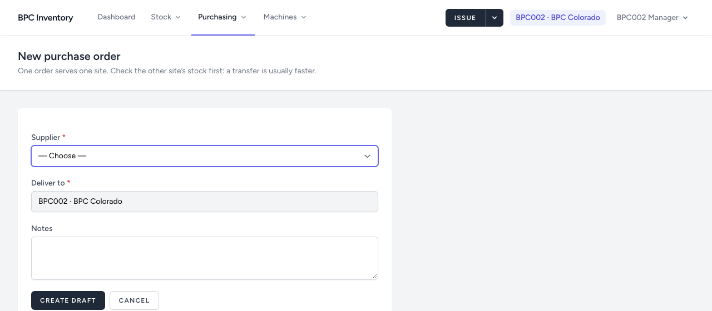

#### Add a new item

1. **Stock ▸ Inventory ▸ New item**.
2. **SKU**, **Name**, **Category** (a subcategory), **Unit of measure**; optionally description, manufacturer, part and drawing numbers, **Criticality**.
3. **Save**. Then set its minimum and location in **Min levels & locations**, and add its supplier.

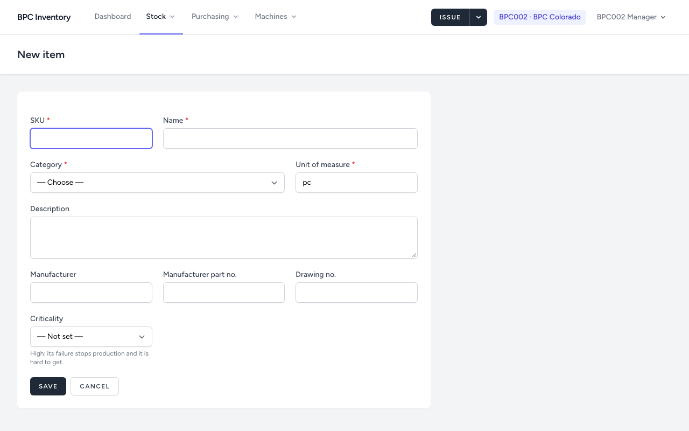

#### Add a supplier and the items it supplies

1. **Purchasing ▸ Suppliers ▸ New supplier** → name, contact, lead time → **Save**.
2. On the supplier page, under **Items supplied**: **Item**, **Supplier SKU**, **Last price (USD)**, **Pack size** → **Add**.

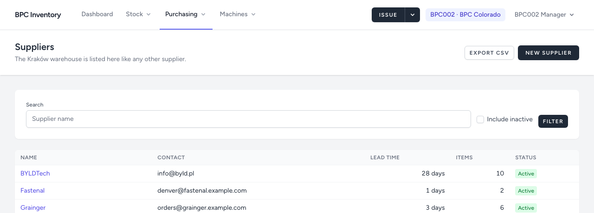

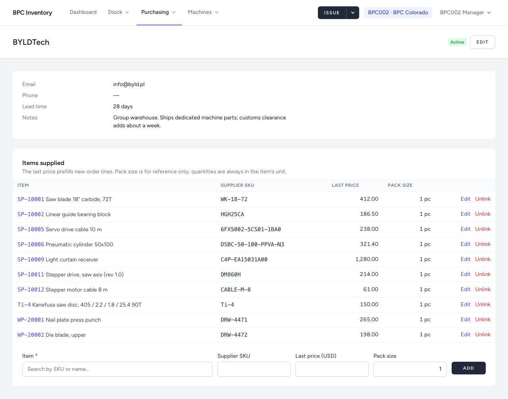

#### Maintain a parts list

1. **Machines ▸ Machine types** → open the type, e.g. **C · Truss Saw**.
2. Add a line (item, quantity per machine, optionally a revision such as 2.0), or **Import CSV** to load a whole list.

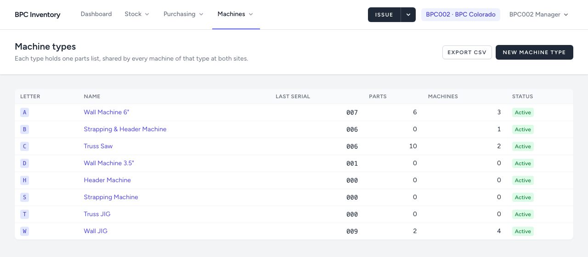

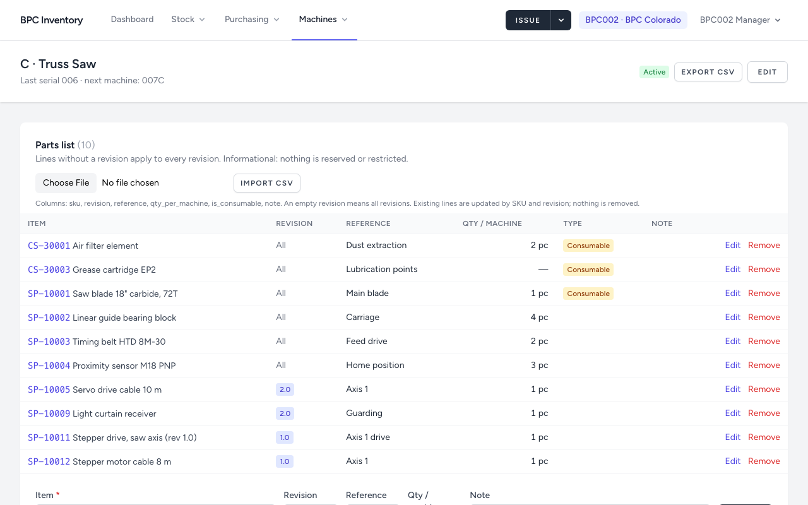

Details: [3. Machines and parts lists](user-guide/03-machines-and-parts-lists.md).

#### Categories

**Stock ▸ Categories**: two levels. Top-level groups only group; items go into subcategories. **New category** or **Add subcategory**.

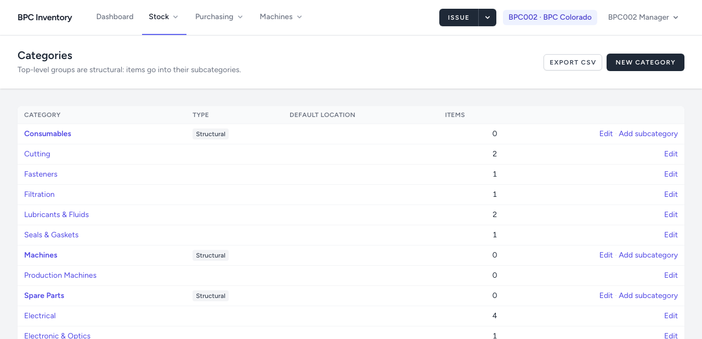

---

## Administrator

Administrators can do everything a manager does, at every site, plus the following. Details: [9. Administration](user-guide/09-administration.md).

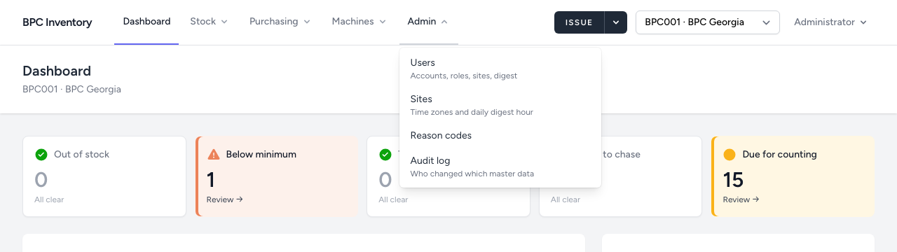

### Work across sites

The blue site selector in the header switches between **BPC001**, **BPC002** and **All sites**. *All sites* shows the consolidated dashboard and lists with site codes; quick orders made from it create separate drafts per site.

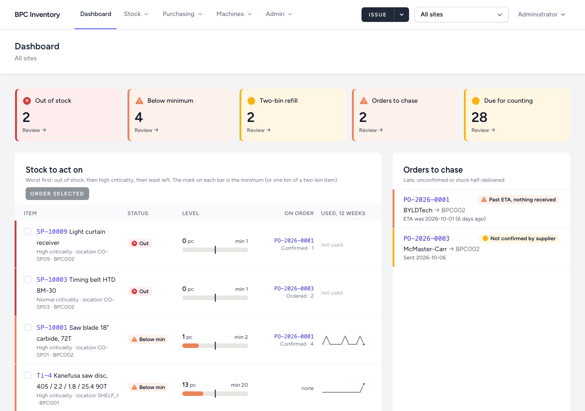

### Add a user

1. **Admin ▸ Users ▸ New user**.
2. **Name**, **Email (login)** (an @byldinc.com address, so emails arrive), **Role**, **Site** (not for administrators), a password, **Daily low-stock digest by email**.
3. **Save**. Hand the password over in person, or open the user and **Email a password reset link** so they choose their own.

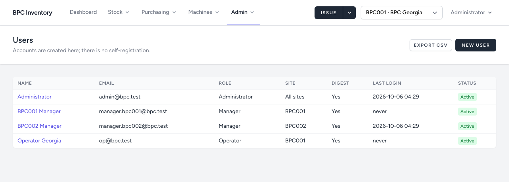

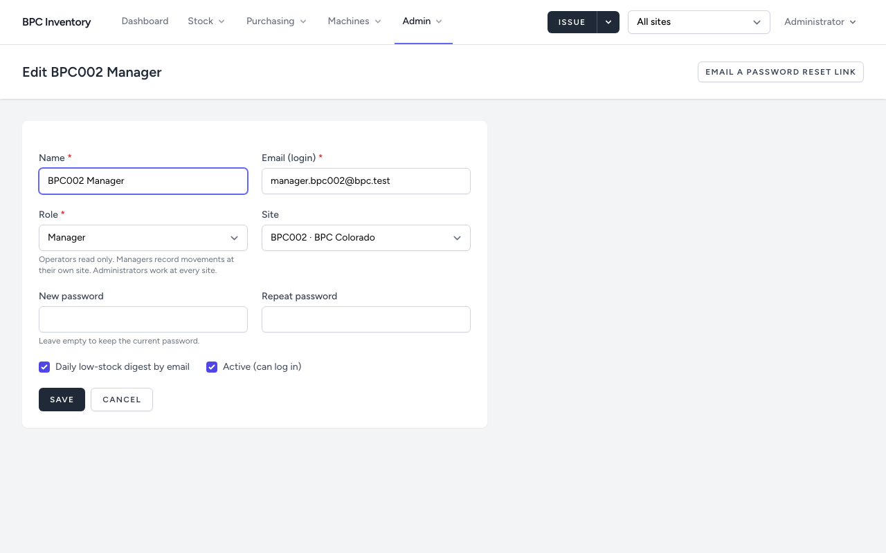

To remove access, untick **Active (can log in)** and **Save**. Nothing is deleted; their work stays attributed to them.

### Sites

**Admin ▸ Sites** → **Edit**: name, state, time zone and the **daily digest hour**.

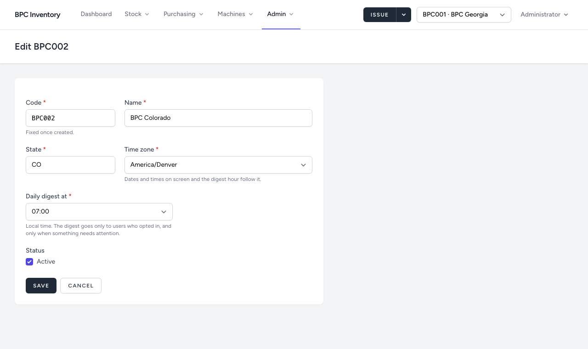

### Reason codes

**Admin ▸ Reason codes ▸ New reason code** for adjustments or general issues; deactivate ones no longer used. **COUNT** and **OPENING** are system codes: only their label can change.

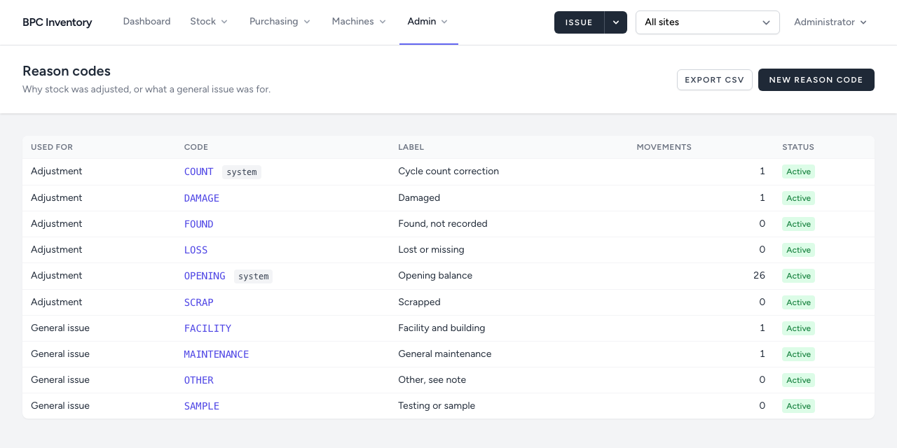

### Machine register

- **Register a machine:** **Machines ▸ Machines ▸ Register machine** → **Type**, **Machine SKU** (the next free serial is proposed, e.g. 007C), **Name**, **Revision**, **Site** → **Save**.
- **Relocate a machine:** open it → **Edit** → change **Site** → **Save**. Earlier issues stay at the site where they happened.

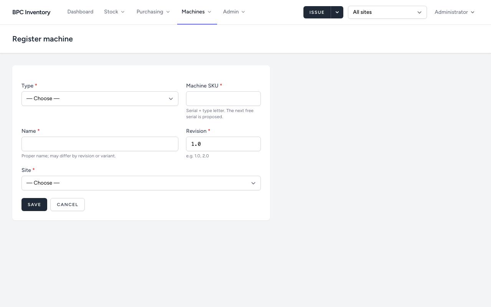

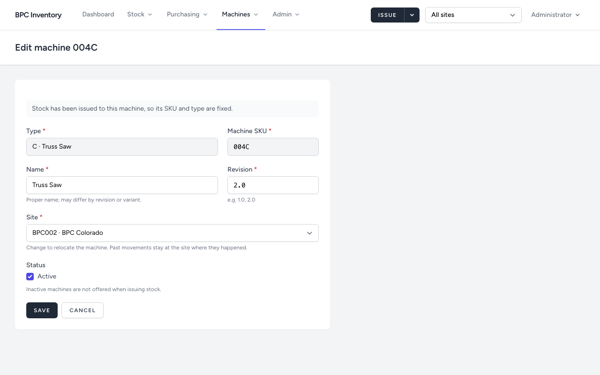

### Who changed what (audit log)

**Admin ▸ Audit log** → filter by record type, record, person or dates → **Filter**. Every change to master data with before → after. Stock movements are in each item's movement history instead.

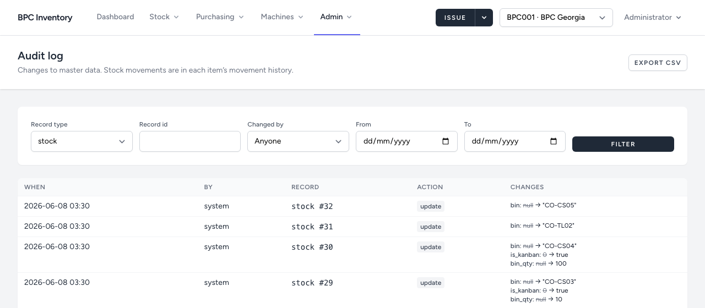

### Reset an administrator's password without email

From a computer with server access (see [deployment.md](deployment.md)):

```sh
ssh -t -i ~/.ssh/vps_ims -o IdentitiesOnly=yes ubuntu@144.217.90.113 \
  'cd /var/www/ims && sudo -u www-data php artisan ims:create-admin admin@byldinc.com'
```

---

## Where is it?

| Task | Path | Chapter |
|---|---|---|
| See what to reorder | **Dashboard ▸ Stock to act on** | [8](user-guide/08-dashboard-and-digest.md) |
| Quick order | **Dashboard** → tick → **Order selected** | [6](user-guide/06-purchasing.md#quick-order-from-the-dashboard) |
| Find stock and location | **Stock ▸ Inventory** → item | [2](user-guide/02-stock-and-items.md) |
| Issue a part | **Issue** | [5](user-guide/05-issuing-transfers-adjustments.md) |
| Record goods from the other site | **Issue ▾ ▸ Transfer in** | [5](user-guide/05-issuing-transfers-adjustments.md) |
| Correct stock | **Issue ▾ ▸ Adjust stock** | [5](user-guide/05-issuing-transfers-adjustments.md) |
| New purchase order | **Purchasing ▸ Purchase orders ▸ New order** | [6](user-guide/06-purchasing.md) |
| Receive a delivery | **Purchasing ▸ Purchase orders** → order → **Receive goods** | [6](user-guide/06-purchasing.md) |
| Supplier prices and pack sizes | **Purchasing ▸ Suppliers** → supplier | [6](user-guide/06-purchasing.md) |
| Count stock | **Stock ▸ Stock counts ▸ New count** | [7](user-guide/07-stock-counts.md) |
| Minimum levels and locations | **Stock ▸ Min levels & locations** | [4](user-guide/04-min-levels-locations-two-bin.md) |
| Two-bin items | **Stock ▸ Two-bin items** | [4](user-guide/04-min-levels-locations-two-bin.md) |
| New item | **Stock ▸ Inventory ▸ New item** | [2](user-guide/02-stock-and-items.md) |
| Parts list of a machine type | **Machines ▸ Machine types** → type | [3](user-guide/03-machines-and-parts-lists.md) |
| Machine and its consumption | **Machines ▸ Machines** → machine | [3](user-guide/03-machines-and-parts-lists.md) |
| Daily email on/off, password | **Your name ▾ ▸ Profile** | [1](user-guide/01-getting-started.md) |
| Users | **Admin ▸ Users** | [9](user-guide/09-administration.md) |
| Digest hour per site | **Admin ▸ Sites** | [9](user-guide/09-administration.md) |
| Who changed what | **Admin ▸ Audit log** | [9](user-guide/09-administration.md) |
| A message you don't understand | | [11](user-guide/11-messages.md) |

## Detailed chapters

1. [Getting started](user-guide/01-getting-started.md): login, menu, site, profile, exports
2. [Inventory and items](user-guide/02-stock-and-items.md)
3. [Machines and parts lists](user-guide/03-machines-and-parts-lists.md)
4. [Min levels, locations and two-bin items](user-guide/04-min-levels-locations-two-bin.md)
5. [Issuing, transfers and adjustments](user-guide/05-issuing-transfers-adjustments.md)
6. [Purchasing](user-guide/06-purchasing.md)
7. [Stock counts](user-guide/07-stock-counts.md)
8. [Dashboard and daily digest](user-guide/08-dashboard-and-digest.md)
9. [Administration](user-guide/09-administration.md)
10. [Go-live](user-guide/10-go-live.md)
11. [Messages and what to do](user-guide/11-messages.md)
