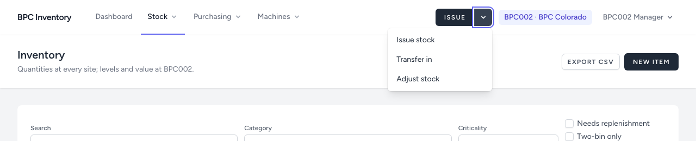

# 1. Getting started

[← Back to README](../../README.md)

## Logging in

Open the address your administrator gave you and log in with your email and password.

- There is no self-registration. Accounts are created by an administrator.
- **Forgot your password?** sends a reset link by email.
- After a period without activity (set by the administrator; 60 minutes is recommended) you are logged out and asked to log in again.
- If your account is deactivated, the login fails as if the password were wrong.

## The screen

| Part | What it is |
|---|---|
| **Dashboard** | Alerts and key figures for your site. Start here every day. |
| **Stock ▾** | Inventory, two-bin items, stock counts, min levels & locations, categories |
| **Purchasing ▾** | Purchase orders, suppliers |
| **Machines ▾** | Machines at your site, machine types with parts lists |
| **Admin ▾** | Administrators only: users, sites, reason codes, audit log |
| **Issue ▾** (dark button) | The most frequent action. The arrow opens **Transfer in** and **Adjust stock**. Managers and administrators only. |
| **Site** (blue label) | The site you work at. Managers and operators are fixed to their own site. Administrators switch here, including **All sites**. |
| **Your name ▾** | Profile and log out |

Every menu shows only what your role may open. An operator, for example, sees no Issue button and no minimum levels.

On a phone, the menu is behind the ☰ icon; the Issue button stays visible next to it.

## Your site and the other site

Everything you record happens at the site in the header. You can still **read** the other site: the inventory shows a column per site, and every item page shows stock at both sites. Use this before ordering: the other site may have the part.

## Dates and numbers

- Times are shown in your site's local time (Georgia: New York time, Colorado: Denver time).
- Quantities are shown without trailing zeros (`2.5`, `10`); up to three decimals are stored.
- Money is in USD with two decimals on screen; four decimals are kept internally.

## Your profile

**Your name ▾ → Profile** lets you change your name and password, and switch the **daily low-stock digest** on or off. Email, role and site are set by an administrator.

## Exporting to Excel

Every list has **Export CSV**. It exports what the list currently shows with your filters, without paging. The file opens in Excel with accented names intact.
