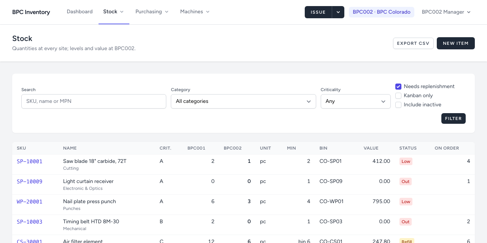
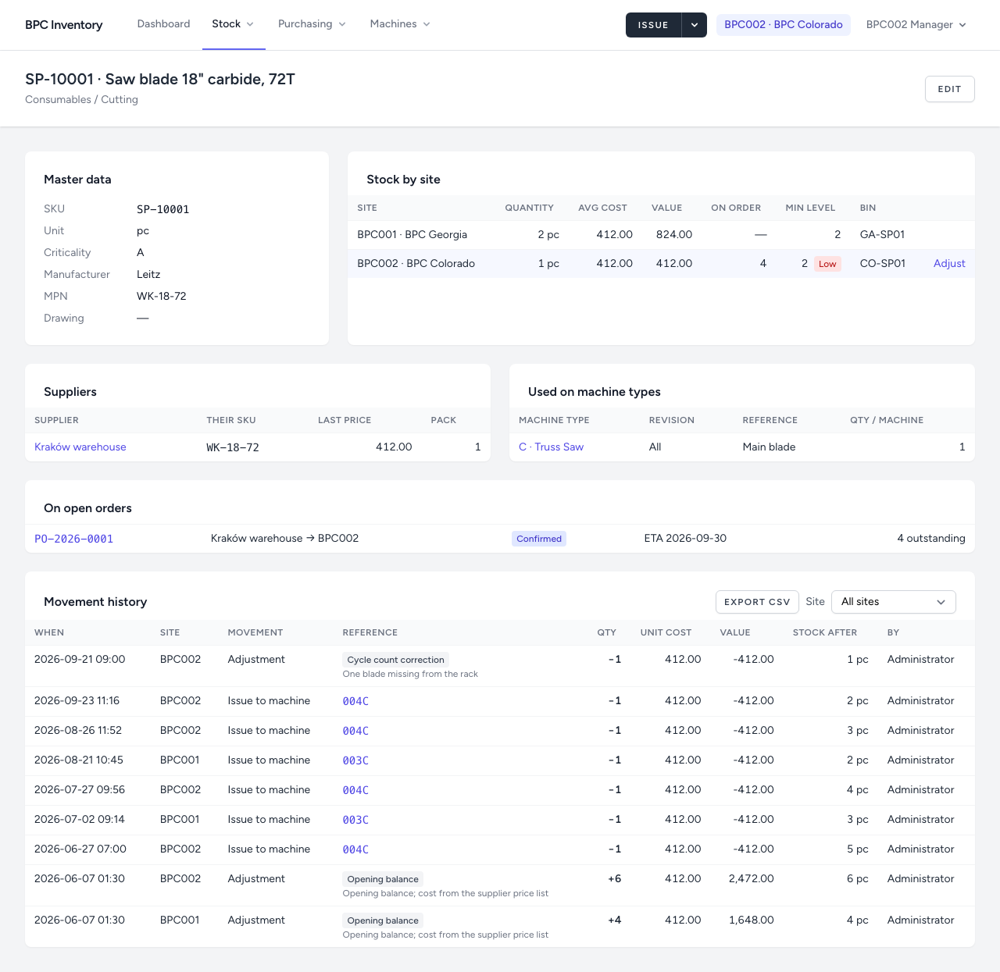

# 2. Stock list and items

[← Back to README](../../README.md)

## The stock list

**Stock → Stock list** is the catalogue with quantities.

- **One column per site**, your site highlighted. Quantities of the other site are for reading.
- For your site: **Min** (minimum level, or *bin N* for kanban items), **Bin**, **Value** (quantity × average cost) and **Status**:
  - **Out**: a minimum is set and nothing is left
  - **Low**: below the minimum
  - **Refill**: kanban item at one bin or less
- **On order**: quantity still expected on open purchase orders for your site. It is shown next to a shortage, but never counted as stock.

Filters: search by SKU, name or manufacturer part number; category (a top-level group includes its subcategories); criticality; **Needs replenishment** (class A first); **Kanban only**; **Include inactive**.

## The item page

Click a SKU to open the item.

| Section | Shows |
|---|---|
| Master data | SKU, unit, criticality, manufacturer, part numbers, drawing |
| Stock by site | Quantity, average cost, value, on order, minimum, bin per site; **Adjust** for sites you may change |
| Suppliers | Who supplies it, their SKU, last price, pack size |
| Used on machine types | Parts lists the item is on, with revision |
| On open orders | Orders still expected, with ETA |
| Movement history | Every receipt, issue, transfer, adjustment and count, newest first; filter by site; **Export CSV** |

The movement history is read-only. If something was recorded wrongly, correct it with an adjustment (chapter 5).

## Creating and editing items

Managers and administrators: **Stock list → New item**.

| Field | Notes |
|---|---|
| **SKU** | Required, unique, up to 40 characters. Once the item has any stock movement, the SKU is locked. When the numbering scheme is agreed, the system checks it automatically. |
| **Name**, **Category**, **Unit of measure** | Required. The category must be a subcategory (e.g. *Spare Parts / Mechanical*); top-level groups only group. |
| **Criticality** | **A**: failure stops production and the part is hard to get. **B**, **C**: lower. Drives the dashboard order and how often the item should be counted. |
| Manufacturer, manufacturer part no., drawing no., description | Optional, but they help find the right part |
| **Active** | Untick to retire an item. It disappears from pickers and lists but keeps its history. Items are never deleted. |

## Categories

**Stock → Categories.** Top-level groups (Spare Parts, Wear Parts, Consumables, Tools, Machines) are *structural*: items go into their subcategories. A category can carry a **default bin**, which pre-fills the shelf reference when an item is first stocked at a site.

## Suppliers

**Purchasing → Suppliers** (managers and administrators). The Kraków warehouse is listed like any other supplier.

On a supplier's page, **Items supplied** links items to the supplier with the supplier's own SKU, the **last price** (pre-filled on new order lines, updated automatically when an order is sent) and the **pack size**. The pack size is a reminder only: quantities in the system are always in the item's unit.
