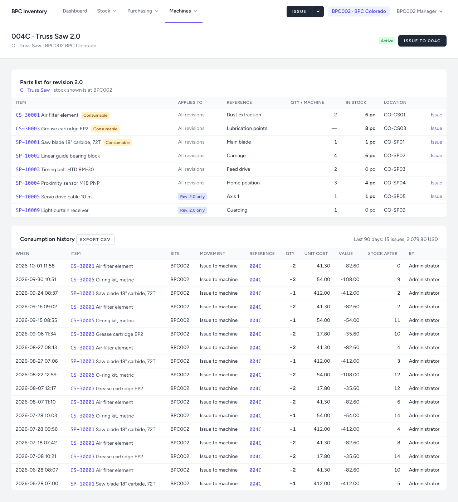

# 3. Machines and parts lists

[← Back to the user guide](../USER-GUIDE.md)

## Machine types and machines

A **machine type** is a family with one letter, e.g. **C · Truss Saw**. It holds the **parts list**.
A **machine** is one physical machine at a site, e.g. **004C**: serial 004, type C.

Machines at the US sites today:

| Site | Machines |
|---|---|
| BPC001 Georgia | 003C Truss Saw 1.0 · 004A, 005A Wall Machine 6" · 004B Header & Strapping · 006W, 007W Wall JIG |
| BPC002 Colorado | 004C Truss Saw 2.0 · 003A Wall Machine 6" · 008W, 009W Wall JIG |

Machines in Poland are not in the system until they are installed at a US site; their serial numbers are reserved.

## The machine page

**Machines → Machines** lists the machines at your site. Open one:



- **Parts list for revision 2.0**: the lines of the type's parts list that apply to this machine's revision, with **stock at this machine's site** and its location. Lines without a revision apply to all revisions; lines marked *Rev. 2.0 only* apply only to 2.0 machines.
- **Issue** next to a part (when in stock) opens the issue form with the machine and the item already filled in.
- **Consumption history**: everything issued to the machine, with the total for the last 90 days. **Export CSV** for the full list.

## Parts lists

**Machines → Machine types → C · Truss Saw** (managers and administrators).


Each line has an item, an optional **revision**, a reference (position or drawing), quantity per machine, a note, and whether it is a **consumable** (wears out rather than being fitted).

**Revisions.** Leave the revision empty when the part fits every revision. When a part differs between revisions, add one line per revision (e.g. the stepper drive for 1.0, the servo cable for 2.0). An item is listed either once for all revisions or per revision, never both.

The parts list is information only: it reserves nothing and does not restrict what can be issued.

### Importing a parts list from a spreadsheet

**Import CSV** on the machine type page. Save the spreadsheet as CSV with a header row:

```
sku,revision,reference,qty_per_machine,is_consumable,note
SP-10001,,Main blade,1,yes,
SP-10011,1.0,Axis 1 drive,1,no,stepper
SP-10005,2.0,Axis 1,1,no,servo
```

- `sku` is required and must exist in the catalogue. Every other column is optional.
- An empty `revision` means all revisions.
- Existing lines are updated by SKU and revision; nothing is removed.
- **All or nothing**: if any line is wrong, nothing is imported and every problem is listed with its line number.
- Tip: **Export CSV** on a machine type produces exactly this format. Export, edit in Excel, import back.

## Registering, editing and relocating machines (administrators)

**Machines → Register machine.** Choose the type; the next free **machine SKU** is proposed (e.g. 007C, because 005C and 006C exist in Poland). The name defaults to the type name and may differ per variant; the revision has the form `2.0`.

To **relocate** a machine, change its site. Its earlier consumption stays recorded at the old site; from then on, stock is issued to it at the new site. Once stock has been issued to a machine, its SKU and type are fixed.
