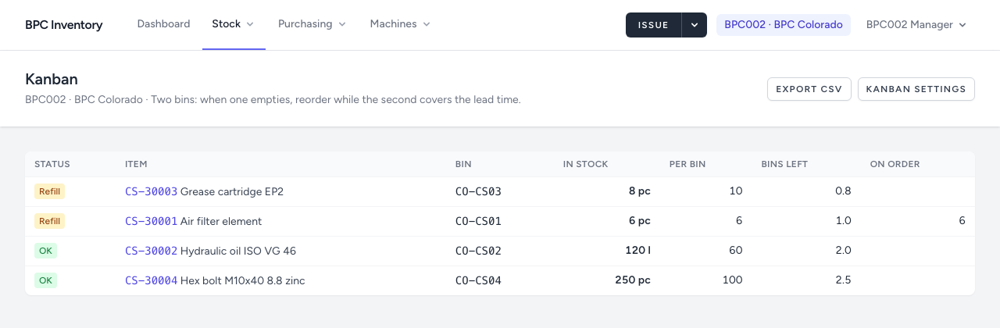

# 4. Minimum levels, bins and kanban

[← Back to README](../../README.md)

Minimum levels, shelves and kanban settings are kept **per site**: the same item can have a minimum of 2 in Colorado and none in Georgia.

## Setting them in bulk

**Stock → Min levels & bins** (managers for their own site, administrators for any site).

| Column | Meaning |
|---|---|
| **Min level** | Below this the item is flagged *Low*. **Empty or 0 turns the alert off.** |
| **Bin** | Free-text shelf reference, e.g. `CO-SP01` |
| **Kanban** | Tick for low-value, regularly used items kept in two bins |
| **Qty per bin** | Required for kanban items |

- **Save levels** saves the rows on the current page (50 per page). Use the filters (**No level set**, **Kanban only**, category, search) to work through the catalogue.
- If one row is wrong, nothing is saved and the row is marked.
- Rows you did not touch for items never stocked at this site create nothing.

## When an item is flagged

| Item type | Flagged when |
|---|---|
| Normal item with a minimum | quantity **below** the minimum |
| Kanban item | quantity **at or below one bin** (the minimum level is ignored) |

Quantities on open orders are shown next to the flag but never clear it: the part is not on the shelf yet.

## Kanban

**Stock → Kanban** lists the kanban items at your site, those needing a refill first, then by bins left.

The physical method: two bins on the shelf. When the first is empty, reorder; the second bin covers the delivery time. Stock is still recorded in the item's unit; *Bins left* is only a reading aid.

## Where the first minimum levels come from

At go-live, minimum levels are taken from the suggested quantities in the existing spare parts spreadsheets: an educated guess. After a few months, the consumption per machine (dashboard, machine pages) shows what is really used. Adjust the levels then.
