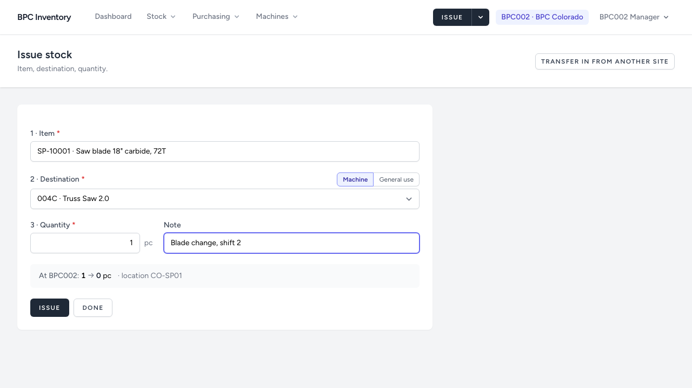
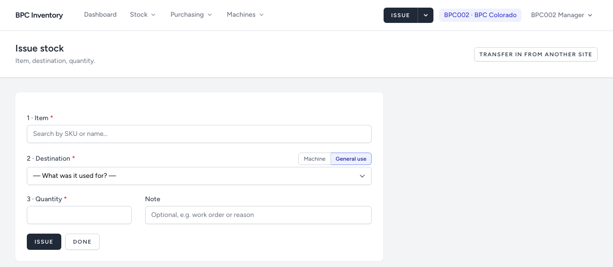
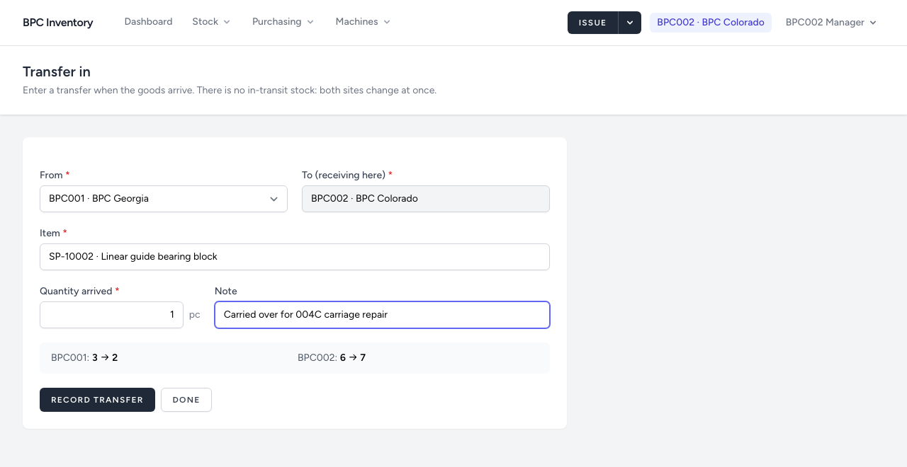
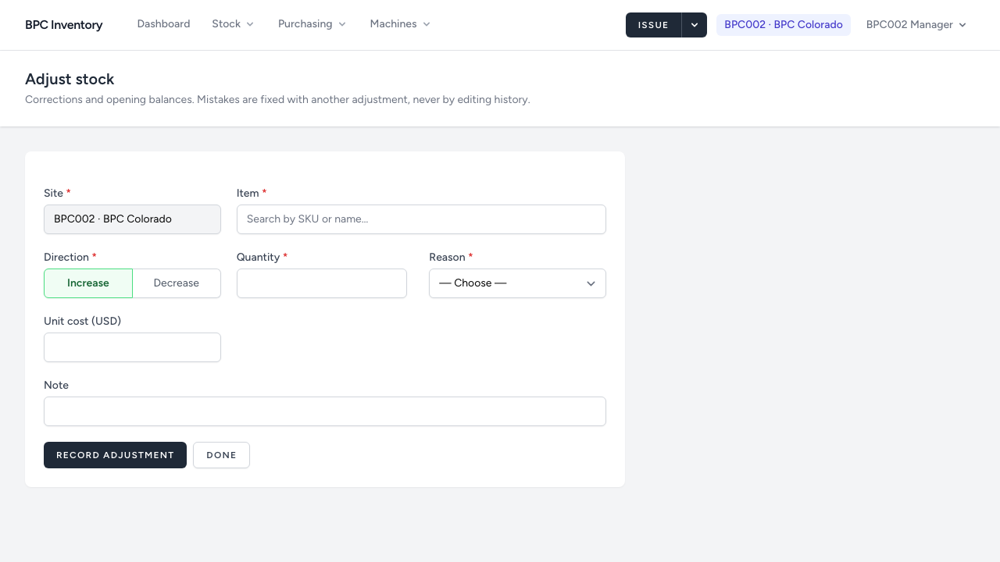

# 5. Issuing, transfers and adjustments

[← Back to README](../../README.md)

These three are the only ways stock changes outside purchase orders and counts. They are for **managers at their own site** and administrators. Every one of them is recorded permanently with who, when and why.

## Issuing stock

**Issue** (dark button in the header). Three steps:

1. **Item**: type at least two characters of the SKU, name or manufacturer part number and pick from the list.
2. **Destination**:
   - **Machine**: choose one of the machines at your site. Use this whenever the part goes into or onto a machine.
   - **General use**: workshop, building, samples. Choose the reason; *Other, see note* needs a note.
3. **Quantity**, in the item's unit. A note is optional (e.g. work order, shift).

Before you save, the grey line shows stock now → after, and the location. If there is not enough, it turns red.

After **Issue**, the form stays open with the same machine, ready for the next part. **Done** returns to the inventory.

**Fastest path from the machine:** open the machine page (Machines → 004C) and click **Issue** next to the part on the parts list.

**Why every issue matters.** Each issue records quantity and cost per machine. That consumption is what will replace the guessed minimum levels with measured ones, and it shows which machines cost most to keep running.

## Transfer in from the other site

When goods arrive from the other site, the **receiving** manager records them: **Issue ▾ → Transfer in**.

- **From**: the sending site. **To** is your own site.
- Both sites change at once: the sender goes down, you go up. There is no "in transit" state, so record the transfer **when the goods are physically here**, not when they are shipped.
- The goods arrive at the sender's average cost, which then feeds your site's average.
- If the sender has recorded less than what arrived, the transfer is refused: the sending site must first correct its own stock with an adjustment. Call them; you cannot change another site's stock.

## Adjusting stock

**Issue ▾ → Adjust stock**, or **Adjust** on the item page next to your site.

Use an adjustment when stock on the shelf differs from the system for a reason other than an issue, receipt or transfer:

| Reason | When |
|---|---|
| Opening balance | first stock entry at go-live (see chapter 7) |
| Found, not recorded | more on the shelf than recorded |
| Lost or missing | less on the shelf, cause unknown |
| Damaged / Scrapped | unusable parts taken out |
| Cycle count correction | posted automatically by stock counts |

- **Direction**: Increase or Decrease. Quantities are always positive.
- **Unit cost** (increases only): leave empty to add at the current average cost. Enter a cost when the item has none yet at this site (the form asks for it), or when you want the added quantity valued differently. A cost entered here moves the average.
- After saving, the form keeps site, reason and direction, so a series of corrections goes quickly.

**Correcting a mistake.** A wrong issue or adjustment is not deleted; record the opposite adjustment with a note, e.g. *Increase 1, Found, not recorded: issue of 9 Oct entered twice*.
