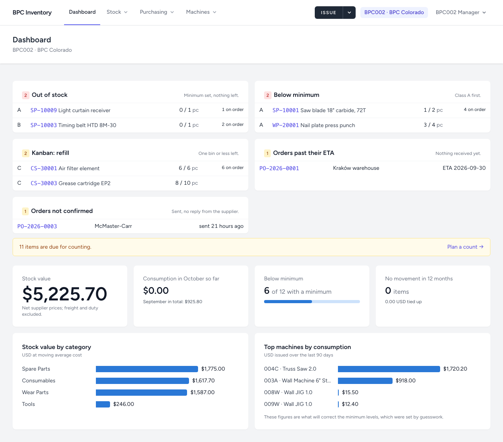
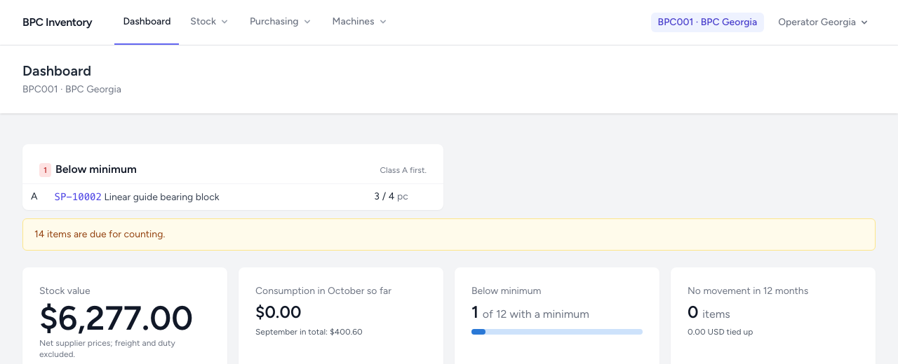

# 8. Dashboard and daily digest

[← Back to README](../../README.md)

## Dashboard

The first page after login, for your site. Administrators can switch to **All sites**, where every row shows its site.

### Alerts (top)

Only shown when something needs attention; otherwise a single line says so.

| Alert | Meaning | Usual action |
|---|---|---|
| **Out of stock** | A minimum is set and nothing is left | Transfer from the other site or order |
| **Below minimum** | Below the minimum, class A first | Check *on order*; transfer or order |
| **Kanban: refill** | One bin or less left | Reorder the bin |
| **Orders past their ETA** | Confirmed delivery date passed, nothing received | Chase the supplier, check tracking or customs |
| **Orders not confirmed** | Sent, no reply from the supplier | Ask for confirmation and a date |
| **Partly received for over 30 days** | Part delivered, rest overdue | Chase, or close the rest short |
| **Items due for counting** | By the suggested frequency | Plan a count |

### Figures

- **Stock value**: quantity × average cost at the site, net supplier prices, freight and duty excluded.
- **Consumption this month so far**, with last month's total.
- **Below minimum** out of the items that have a minimum.
- **No movement in 12 months**: stock that may not need to be held.
- **Stock value by category** and **top machines by consumption** over 90 days. Hover a bar for details; click a machine to open it.

Operators see the same dashboard for their site, without action links:

## Daily digest by email

One email a day with what needs attention: items below minimum, kanban refills, orders past their ETA, orders never confirmed.

- Sent at the site's **digest hour** (default 07:00 local time), set by an administrator per site.
- **Only when something needs attention.** No email means nothing to report.
- Only to users who switched it on: **Your name ▾ → Profile → Send me the daily low-stock digest**. Administrators can switch it for anyone.
- Administrators get **one email for all sites**, by default at 07:00 New York time.
