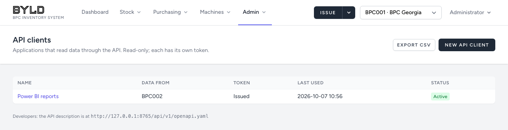
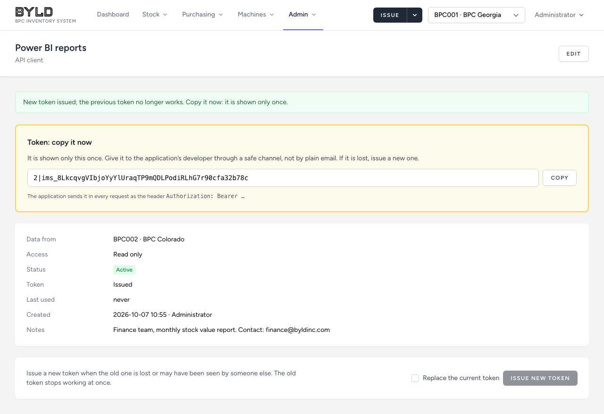

# 9. Administration

[← Back to the user guide](../USER-GUIDE.md)

**Admin ▾** is visible to administrators only.

## Users

**Admin → Users → New user**: name, email (the login), role, site (not for administrators), password, daily digest.

- Hand the password over in person, or open the user and use **Email a password reset link** so they choose their own.
- **Leaving the password empty** when editing keeps the current one.
- **Deactivate** instead of deleting: untick *Active*. The person is logged out on their next click and cannot log in again, but their recorded work stays attributed to them.
- You cannot remove your own administrator access, and the last active administrator cannot be removed.
- In production, passwords need at least 12 characters with letters and digits.

## Sites

**Admin → Sites**: name, state, time zone and **daily digest hour** per site. A new site can be added; its code is fixed once created.

A site that still has stock, active machines or active users cannot be deactivated.

## Reason codes

**Admin → Reason codes**: the reasons offered for adjustments and general issues. Add new ones (code in capitals, e.g. `WATER_DAMAGE`) or deactivate ones no longer used. **COUNT** and **OPENING** are marked *system*: the application posts them itself, so only their label can change.

## Machine register

Registering, editing and relocating machines is for administrators: see [chapter 3](03-machines-and-parts-lists.md).

## Audit log

**Admin → Audit log**: every change to master data (items, categories, suppliers and their items, machine types, parts lists, machines, stock settings, users, sites, reason codes), with who, when, and each changed field before → after. Filter by record type, record id, person and dates; **Export CSV**.

Stock movements are not in the audit log; they are in each item's movement history. Passwords are never recorded.

## API clients

**Admin → API clients**: applications that read the inventory through the API (reports, other company systems). They can only read; nothing can be changed through the API.

- **New API client**: a name, **Data from** (one site, or all sites) and notes. **Create and show token** shows the token **once**: copy it and hand it to the application's developer through a safe channel. The developer guide is [API.md](../API.md).
- **Issue new token** (after ticking **Replace the current token**) when a token is lost or may have been seen by someone else. The old token stops working at once.
- **Deactivate** with **Edit** → untick **Active (the token works)**. The application is refused from its next request.
- **Last used** shows when the application last read data. Creating and changing API clients is recorded in the audit log.

